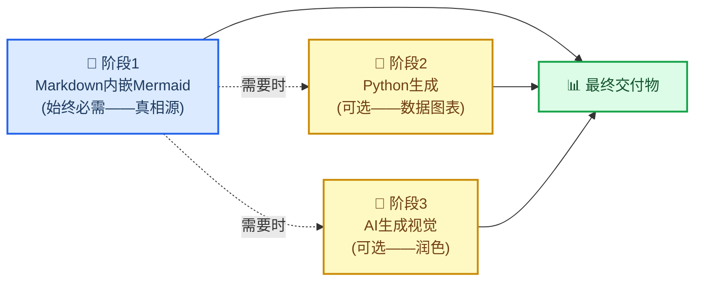
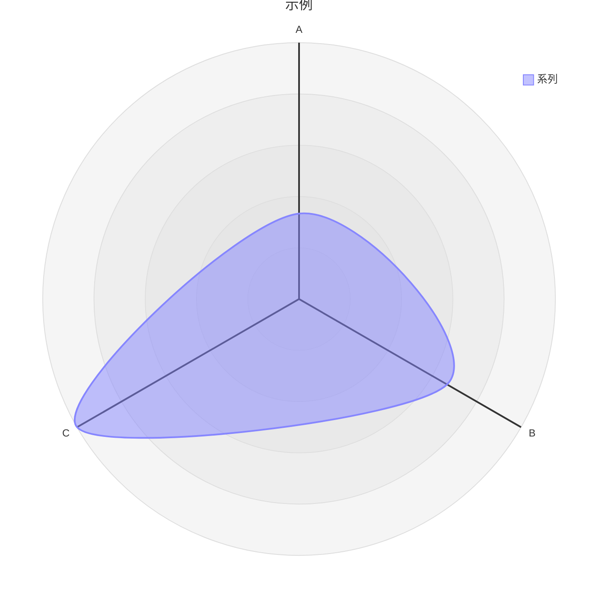

# Markdown与Mermaid编写

## 概述

本技能教授并强制执行一个标准：使用**嵌入Mermaid图表的Markdown作为默认规范格式**来创建科学文档。

核心观点：在`.md`文件中以Mermaid图表表达的关系比任何图像更有价值。它是文本，因此在git中可清晰比对差异；无需构建步骤；在GitHub、GitLab、Notion、VS Code和任何Markdown查看器中原生渲染；相比相同关系的文字描述更节省token；且始终可转换为精美图像——但文本版本始终是唯一真相源。

> "将报告和文件以.md格式保存为纯文本（Mermaid也是简单的'脚本语言'），这有助于下游渲染，尤其是AI生成图像（用Mermaid描述关系比长文本更省token）。此外，Mermaid可与Markdown一同渲染，便于人类或AI在任何场景使用。"
>
> — Clayton Young (@borealBytes), K-Dense Discord, 2026-02-19

## 何时使用本技能

在以下场景使用本技能：
- 创建**任何科学文档**——报告、分析、手稿、方法章节
- 编写**任何文档**——README、操作指南、决策记录、项目文档
- 制作**任何图表**——工作流、数据管道、架构、时间线、关系图
- 生成**需版本控制的输出**——若内容将存入git，则必须使用Markdown
- 配合**其他技能工作**——本技能定义了封装所有输出的文档层
- 当被要求"添加图表"或"可视化关系"时——始终优先使用Mermaid

对于结构或关系图，**切勿**从Python matplotlib、seaborn或AI图像生成开始。这些属于阶段2和阶段3——仅当Mermaid无法满足需求时使用（例如含真实数据的散点图、逼真图像）。

## 🎨 源格式哲学

### 为何文本图表胜出

| 关键因素          | Markdown中的Mermaid | Python/AI图像 |
| ----------------- | :-----------------: | :-----------: |
| Git差异可读性     | ✅                  | ❌ 二进制文件 |
| 无需重新生成即可编辑 | ✅                  | ❌            |
| 相比文字更省token | ✅ 更小             | ❌ 更大       |
| 无需构建步骤即可渲染 | ✅                  | ❌ 需托管     |
| AI无需视觉即可解析 | ✅                  | ❌            |
| 兼容GitHub/GitLab/Notion | ✅       | ⚠️ 需托管    |
| 无障碍性（屏幕阅读器） | ✅ accTitle/accDescr | ⚠️ 需替代文本 |
| 后期可转换为图像   | ✅ 随时             | — 已是图像   |

### 三阶段工作流



**阶段1是强制的。** 即使进入阶段2或3，Mermaid源码仍需提交。

### Mermaid可表达的图表

Mermaid覆盖24种图表类型。几乎所有科学关系都适用：

| 用例                         | 图表类型       | 文件路径                                  |
| ---------------------------- | -------------- | ----------------------------------------- |
| 实验流程/决策逻辑            | 流程图         | `references/diagrams/flowchart.md`        |
| 服务交互/API调用/消息传递    | 序列图         | `references/diagrams/sequence.md`         |
| 数据模型/模式                | ER图           | `references/diagrams/er.md`               |
| 状态机/生命周期              | 状态图         | `references/diagrams/state.md`            |
| 项目时间线/路线图            | 甘特图         | `references/diagrams/gantt.md`            |
| 比例/构成                    | 饼图           | `references/diagrams/pie.md`              |
| 系统架构（缩放层级）         | C4图           | `references/diagrams/c4.md`               |
| 概念层次/头脑风暴            | 思维导图       | `references/diagrams/mindmap.md`          |
| 时间事件/历史                | 时间线         | `references/diagrams/timeline.md`         |
| 类层次/类型关系              | 类图           | `references/diagrams/class.md`            |
| 用户旅程/满意度地图          | 用户旅程图     | `references/diagrams/user_journey.md`     |
| 双轴比较/优先级排序          | 四象限图       | `references/diagrams/quadrant.md`         |
| 需求追溯                     | 需求图         | `references/diagrams/requirement.md`      |
| 流量大小/资源分布            | 桑基图         | `references/diagrams/sankey.md`           |
| 数值趋势/条形+折线图         | XY图表         | `references/diagrams/xy_chart.md`         |
| 组件布局/空间排列            | 块图           | `references/diagrams/block.md`            |
| 工作项状态/任务列            | 看板图         | `references/diagrams/kanban.md`           |
| 云基础设施/服务拓扑          | 架构图         | `references/diagrams/architecture.md`     |
| 多维度比较/技能雷达          | 雷达图         | `references/diagrams/radar.md`            |
| 分层比例/预算                | 矩形树图       | `references/diagrams/treemap.md`          |
| 二进制协议/数据格式          | 数据包图       | `references/diagrams/packet.md`           |
| Git分支/合并策略             | Git图          | `references/diagrams/git_graph.md`        |
| 代码风格序列（编程语法）     | ZenUML图       | `references/diagrams/zenuml.md`           |
| 多图表组合模式               | 复杂示例       | `references/diagrams/complex_examples.md` |

> 💡 **选择正确类型，而非简单类型。** 勿对所有场景默认使用流程图。
> 时间事件用时间线优于流程图；服务交互用序列图优于流程图。请查表匹配。

---

## 🔧 核心工作流

### 步骤1：确定文档类型

从零编写前先检查模板：

| 文档类型               | 模板路径                      |
| ---------------------- | ----------------------------- |
| 拉取请求记录           | `templates/pull_request.md`   |
| 问题/缺陷/功能请求     | `templates/issue.md`          |
| 冲刺/项目看板          | `templates/kanban.md`         |
| 架构决策(ADR)          | `templates/decision_record.md`|
| 演示/简报              | `templates/presentation.md`   |
| 研究论文/分析          | `templates/research_paper.md` |
| 项目文档               | `templates/project_documentation.md` |
| 操作指南/教程          | `templates/how_to_guide.md`   |
| 状态报告               | `templates/status_report.md`  |

### 步骤2：阅读样式指南

编写任何`.md`文件前阅读`references/markdown_style_guide.md`。

需内化的关键规则：
- **每文档仅一个H1标题**——即文档标题，禁止多个
- **仅H2标题使用表情符号**——每个H2一个表情，H3/H4禁用
- **引用所有内容**——每个外部声明需用脚注`[^N]`标注完整URL
- **慎用粗体**——每段落最多2-3个粗体词，禁止整句加粗
- **每个`</details>`后加水平分隔线**——强制要求
- **用表格替代文字**——适用于比较、配置、结构化数据
- **用图表替代文字墙**——若描述流程、结构或关系，请添加Mermaid

### 步骤3：选择图表类型并阅读指南

创建Mermaid图表前：
1. 阅读`references/mermaid_style_guide.md`
2. 打开具体类型文件（如`references/diagrams/flowchart.md`）查看范例、技巧和复制模板

所有图表强制规则：
```
accTitle: 短名称（3-8词）
accDescr: 解释图表内容的一两句话。
```
- **禁用`%%{init}`指令**——会破坏GitHub深色模式
- **禁用行内`style`**——仅用`classDef`
- **每个节点最多一个表情符号**——置于标签开头
- **节点ID用`snake_case`**——与标签匹配

### 步骤4：编写文档

从模板开始，应用Markdown样式指南。将图表内联在相关文字旁——勿单独放在"图表"章节。

### 步骤5：以文本形式提交

含内嵌Mermaid的`.md`文件是提交对象。若额外生成PNG或AI图像，它们仅为补充——Markdown才是源码。

---

## ⚠️ 常见陷阱

### 雷达图语法 (`radar-beta`)

**错误示例：**
```mermaid
radar
title 示例
x-axis ["A", "B", "C"]
"系列" : [1, 2, 3]
```

**正确示例：**

- **用`radar-beta`**而非`radar`（裸关键字无效）
- **用`axis`定义维度**——非`x-axis`
- **用`curve`定义数据系列**——非引号标签加冒号
- **无`accTitle`/`accDescr`**——radar-beta不支持无障碍标注；需在图表上方添加描述性斜体段落

### XY图表与雷达图混淆

| 图表       | 关键字         | 轴语法                 | 数据语法               |
| ---------- | -------------- | ---------------------- | ---------------------- |
| **XY图表** (条形/折线) | `xychart-beta` | `x-axis ["标签1","标签2"]` | `bar [10,20]` 或 `line [10,20]` |
| **雷达图** (蛛网图)    | `radar-beta`   | `axis id["标签"]`      | `curve id["标签"]{10,20}` |

### 在支持类型中遗漏`accTitle`/`accDescr`

仅部分图表类型支持`accTitle`/`accDescr`。对于不支持的图表，必须在代码块上方添加描述性斜体段落：

> _比较三种方法在五个性能维度的雷达图。注：雷达图不支持accTitle/accDescr。_


---

## 🔗 与其他技能的集成

### 与`scientific-schematics`集成

`scientific-schematics`生成AI驱动的出版级图像(PNG)。将Mermaid图表作为示意图的**简报**：

```
工作流：
1. 在.md中用Mermaid创建概念（本技能——阶段1）
2. 向scientific-schematics描述相同概念以生成精美PNG（阶段3）
3. 同时提交——.md作为源码，PNG作为补充图表
```

### 与`scientific-writing`集成

当`scientific-writing`生成手稿时，所有图表和结构图应遵循本技能标准。写作技能处理文字和引用；本技能处理视觉结构。

```
工作流：
1. 用scientific-writing起草手稿
2. 对每个展示工作流、架构或关系的图表：
   - 用遵循本技能指南的Mermaid图替换占位符
3. 仅对真正需要逼真/复杂渲染的图表使用scientific-schematics
```

### 与`literature-review`集成

文献综述生成含大量关系数据的摘要。使用本技能可：
- 创建文献脉络的概念图（思维导图）
- 展示发表时间线（时间线或甘特图）
- 比较方法论（四象限图或雷达图）
- 绘制论文描述的数据流（序列图或流程图）

### 与任何生成输出文档的技能集成

在最终定稿前，应用本技能检查清单：
- [ ] 文档是否使用模板？若使用，是否选对模板？
- [ ] 所有图表是否使用带`accTitle`+`accDescr`的Mermaid？
- [ ] 是否禁用`%%{init}`和行内`style`，仅用`classDef`？
- [ ] 所有外部声明是否用`[^N]`引用？
- [ ] 是否仅一个H1标题，且表情符号仅用于H2？
- [ ] 每个`</details>`后是否添加水平分隔线？

---

## 📚 参考索引

### 样式指南

| 指南名称             | 路径                                  | 行数  | 覆盖内容                                                                 |
| -------------------- | ------------------------------------- | ----- | ------------------------------------------------------------------------ |
| Markdown样式指南     | `references/markdown_style_guide.md`  | ~733  | 标题、格式化、引用、表格、Mermaid集成、模板、质量检查清单                |
| Mermaid样式指南      | `references/mermaid_style_guide.md`   | ~458  | 无障碍性、表情符号集、颜色类、主题中立性、类型选择、复杂度分级          |

### 图表类型指南（24种）

每个文件包含：生产级范例、类型特定技巧和复制模板。

`references/diagrams/` —— architecture, block, c4, class, complex_examples, er, flowchart, gantt, git_graph, kanban, mindmap, packet, pie, quadrant, radar, requirement, sankey, sequence, state, timeline, treemap, user_journey, xy_chart, zenuml

### 文档模板（9种）

`templates/` —— decision_record, how_to_guide, issue, kanban, presentation, project_documentation, pull_request, research_paper, status_report

### 示例

`assets/examples/example-research-report.md` —— 完整科研报告范例，展示正确标题层级、多种图表类型（流程图/序列图/甘特图）、表格、脚注引用、可折叠章节及所有样式规则应用。

---

## 📝 署名

本技能中所有样式指南、图表类型指南和文档模板均移植自`SuperiorByteWorks-LLC/agent-project`仓库，遵循Apache-2.0许可。

- **源码**: https://github.com/SuperiorByteWorks-LLC/agent-project
- **作者**: Clayton Young / Superior Byte Works, LLC (@borealBytes)
- **许可**: Apache-2.0

本技能（作为scientific-agent-skills的一部分）遵循MIT许可分发。包含的Apache-2.0内容在保留署名前提下可下游使用，本技能所有文件头部均保留此信息。

---

[^1]: GitHub Blog. (2022). "用Mermaid在Markdown文件中嵌入图表" https://github.blog/2022-02-14-include-diagrams-markdown-files-mermaid/

[^2]: Mermaid. "Mermaid图表工具" https://mermaid.js.org/
