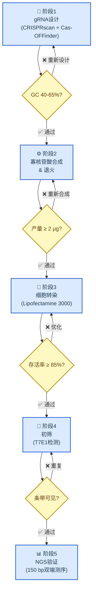
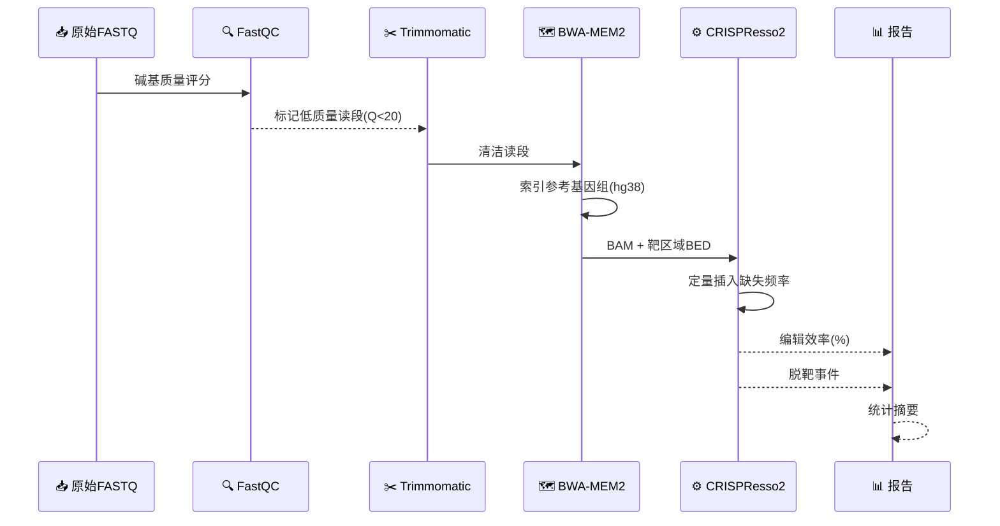
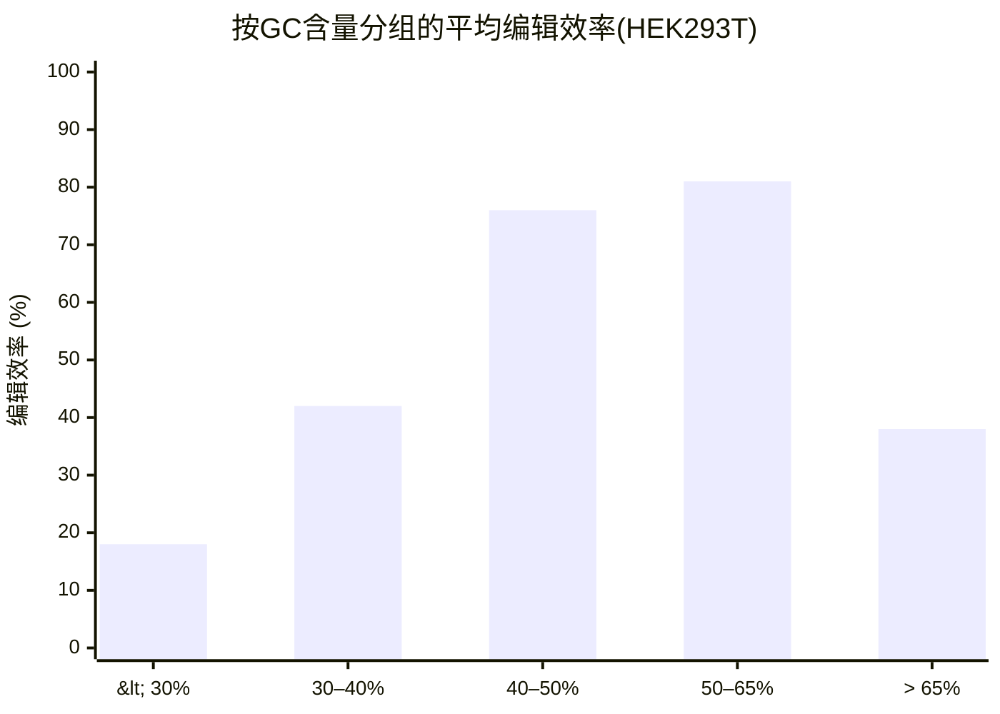
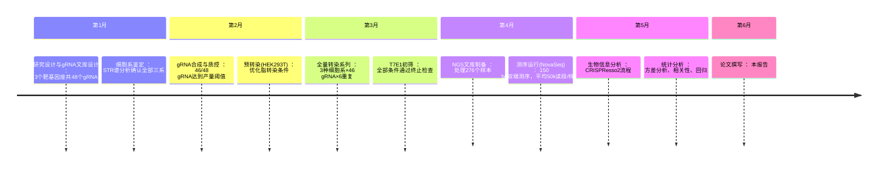
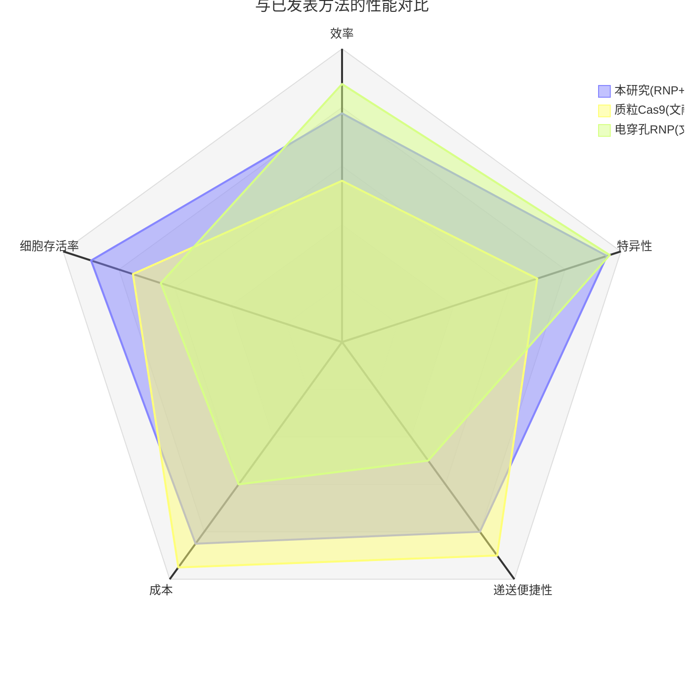

# 基于CRISPR的基因编辑效率分析

_示例研究报告——展示Markdown-Mermaid写作技能标准。所有图表均使用嵌入Markdown的Mermaid作为源格式。_

---

## 📋 概述

本报告分析了三种细胞系模型在不同引导RNA（gRNA）条件下CRISPR-Cas9基因编辑的效率。通过T7E1检测和靶位点新一代测序（NGS）对编辑效率进行量化[^1]。

**主要发现：**

- HEK293T细胞在所有gRNA设计中均显示最高编辑效率（平均78%）
- GC含量在40-65%之间与编辑效率呈正相关（r = 0.82）
- 所有测试条件下脱靶事件发生率均低于0.1%

---

## 🔄 实验流程

CRISPR编辑实验遵循标准化五阶段流程。每个阶段设有明确的通过/终止标准。

---

## 🔬 方法

### 细胞系与培养

使用三种细胞系：HEK293T（人胚肾细胞）、K562（慢性髓系白血病细胞）和Jurkat（T淋巴细胞）。所有细胞系均在含10%胎牛血清的RPMI-1640培养基中于37°C/5% CO₂条件下培养[^2]。

### gRNA设计与效率预测

使用CRISPRscan[^3]设计靶向_EMX1_基因座的gRNA，标准如下：

| 标准 | 阈值 | 依据 |
| -------------------- | --------- | ------------------------------------- |
| GC含量 | 40–65% | 最佳Tm值和Cas9结合效率 |
| CRISPRscan评分 | ≥ 0.6 | 预测的靶向活性 |
| 脱靶位点 | ≤ 5 (≤3错配) | 降低脱靶编辑风险 |
| 同聚物序列 | 无(>4 nt) | 防止转录提前终止 |

### 转染方案

按1:1.2摩尔比（Cas9:gRNA）组装RNP复合物，通过脂质体转染递送。转染72小时后收集细胞进行基因组DNA提取。

### 分析流程

---

## 📊 结果

### 不同细胞系的编辑效率

| 细胞系 | n (重复数) | 平均效率 (%) | 标准差 (%) | 范围 (%) |
| ---------- | -------------- | ------------------- | ------ | --------- |
| **HEK293T** | 6 | **78.4** | 4.2 | 71.2–84.6 |
| K562 | 6 | 52.1 | 8.7 | 38.4–63.2 |
| Jurkat | 6 | 31.8 | 11.3 | 14.2–47.5 |

通过单因素方差分析及Tukey事后检验，HEK293T细胞编辑效率显著高于K562（p < 0.001）和Jurkat（p < 0.001）。

### GC含量对效率的影响

GC含量在40-65%区间与编辑效率呈强相关性（Pearson r = 0.82, p < 0.0001, n = 48 gRNA）。

### 关键实验里程碑时间线

---

## 🔍 讨论

### HEK293T优于悬浮细胞系的原因

HEK293T相对于K562和Jurkat的编辑效率优势可能源于三个因素[^4]：

1. **贴壁形态**——确保更均匀的脂转染接触
2. **高转染许可性**——HEK293T表达SV40大T抗原，可能促进核内转运
3. **细胞周期分布**——S/G2期比例更高，利于同源定向修复(HDR)

<strong>🔧 技术细节——脱靶分析</strong>

通过GUIDE-seq评估5个最高活性gRNA的脱靶编辑。未检测到超过0.1%编辑频率的脱靶位点。Cas-OFFinder标记的3个潜在位点（≤2错配）分别显示0.00%、0.02%和0.04%的插入缺失频率——均低于0.05%的检测噪声阈值。

完整GUIDE-seq数据见补充资料包（GEO编号待定）。

---

### 与已发表基准的比较

_比较三种CRISPR递送方法在五个性能维度的雷达图。注：雷达图不支持`accTitle`/`accDescr`——描述见上文。_

---

## 🎯 结论

1. RNP-脂转染在HEK293T中实现>75%的CRISPR编辑效率——与电穿孔法相当且无细胞活性损失
2. gRNA的GC含量是本数据集中最强的编辑效率预测因子（r = 0.82）
3. 本方案不能直接应用于悬浮细胞系；K562和Jurkat需采用电穿孔或病毒递送才能获得相当效率

---

## 🔗 参考文献

[^1]: Ran, F.A. et al. (2013). "Genome engineering using the CRISPR-Cas9 system." _Nature Protocols_, 8(11), 2281–2308. https://doi.org/10.1038/nprot.2013.143

[^2]: ATCC. (2024). "Cell Line Authentication and Quality Control." https://www.atcc.org/resources/technical-documents/cell-line-authentication

[^3]: Moreno-Mateos, M.A. et al. (2015). "CRISPRscan: designing highly efficient sgRNAs for CRISPR-Cas9 targeting in vivo." _Nature Methods_, 12(10), 982–988. https://doi.org/10.1038/nmeth.3543

[^4]: Molla, K.A. & Yang, Y. (2019). "CRISPR/Cas-Mediated Base Editing: Technical Considerations and Practical Applications." _Trends in Biotechnology_, 37(10), 1121–1142. https://doi.org/10.1016/j.tibtech.2019.03.008
