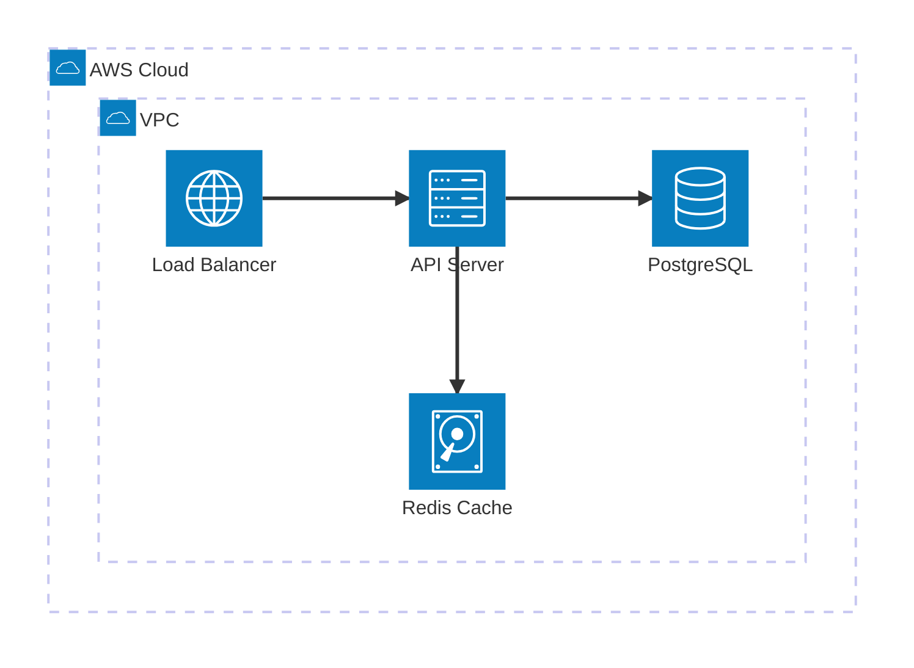
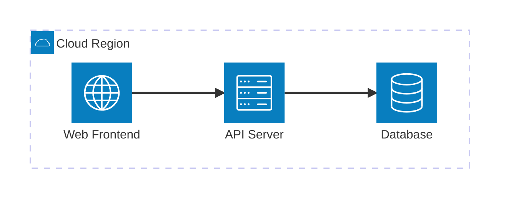
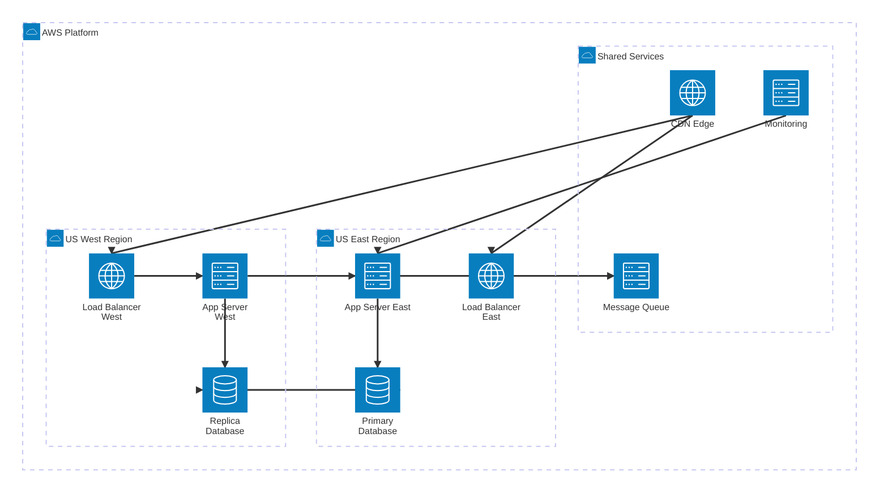

<!-- 来源：https://github.com/SuperiorByteWorks-LLC/agent-project | 许可证：Apache-2.0 | 作者：Clayton Young / Superior Byte Works, LLC (Boreal Bytes) -->

# 架构图

> **返回[样式指南](../mermaid_style_guide.md)** — 请先阅读样式指南了解表情符号、颜色和无障碍规则。

**语法关键字：** `architecture-beta`  
**最佳适用场景：** 云基础设施、服务拓扑、部署架构、网络布局  
**不适用场景：** 逻辑系统边界（使用[C4](c4.md)），无云语义的组件布局（使用[块图](block.md)）

> ⚠️ **无障碍说明：** 架构图**不支持** `accTitle`/`accDescr`。始终在代码块上方添加描述性*斜体*Markdown段落。

---

## 示例图

*展示云托管Web应用的架构图，包含部署在VPC内的负载均衡器、API服务器、数据库和缓存：*

---

## 技巧

- 使用`group`定义逻辑边界（VPC、区域、集群、可用区）
- 使用`service`表示独立组件
- 连接方向标注：`:L`（左）、`:R`（右）、`:T`（上）、`:B`（下）
- 内置图标类型：`cloud`、`server`、`database`、`internet`、`disk`
- 通过`in parent_group`嵌套分组
- **标签必须为纯文本** — `[]`标签内禁用表情符号和连字符（解析器将`-`视为边操作符）
- 使用`-->`表示有向箭头，`--`表示无向边
- 每张图限制在**6-8个服务**
- **始终**在代码块上方添加Markdown文本描述以支持屏幕阅读器

---

## 模板

*基础设施拓扑与核心组件描述：*

---

## 复杂案例

*多区域云部署示意图，包含3个嵌套分组（2个区域集群+共享服务）、9个服务、跨区域数据库复制、CDN分发和集中监控。展示嵌套`group`+`in`语法如何清晰定义基础设施边界：*

### 设计优势解析

- **嵌套分组映射真实架构** — 云平台>区域>服务的层级完全符合多区域部署的团队认知，嵌套结构清晰界定故障影响范围
- **纯文本标签保障可解析性** — 架构图在`[]`标签中使用表情符号会导致解析失败，所有视觉区分均通过分组嵌套和图标类型（`internet`/`server`/`database`）实现
- **方向标注避免重叠** — `:B --> T:`（自下而上）、`:R --> L:`（从右至左）精确控制连接点位置，避免Mermaid自动堆叠边线
- **跨区域复制显式表达** — `db_primary:R --> L:db_replica`边线作为核心基础设施细节，明确呈现为跨区域水平连接
