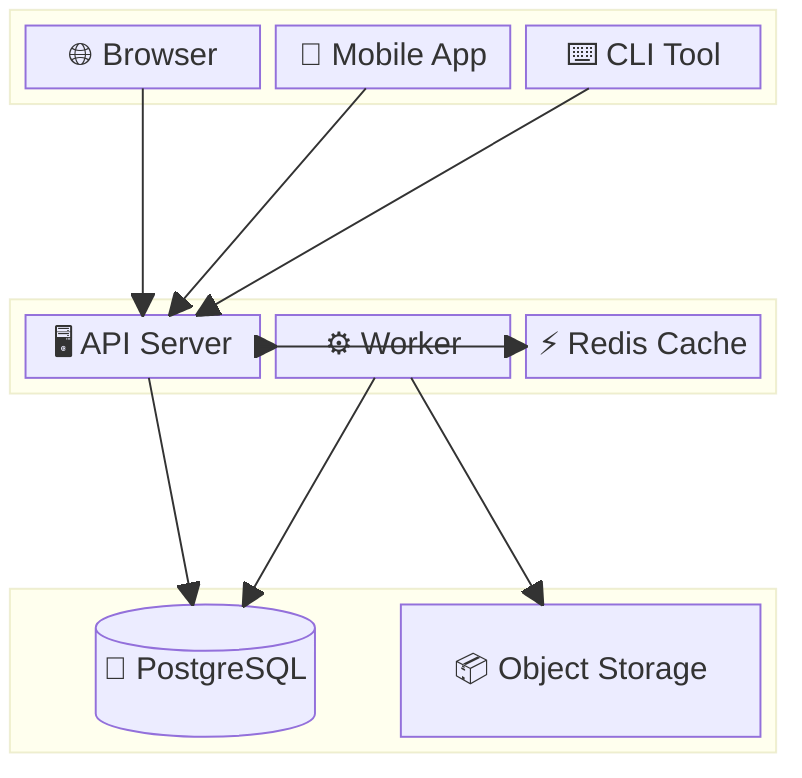
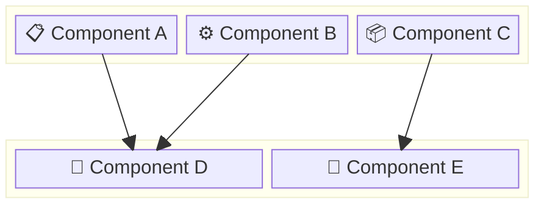
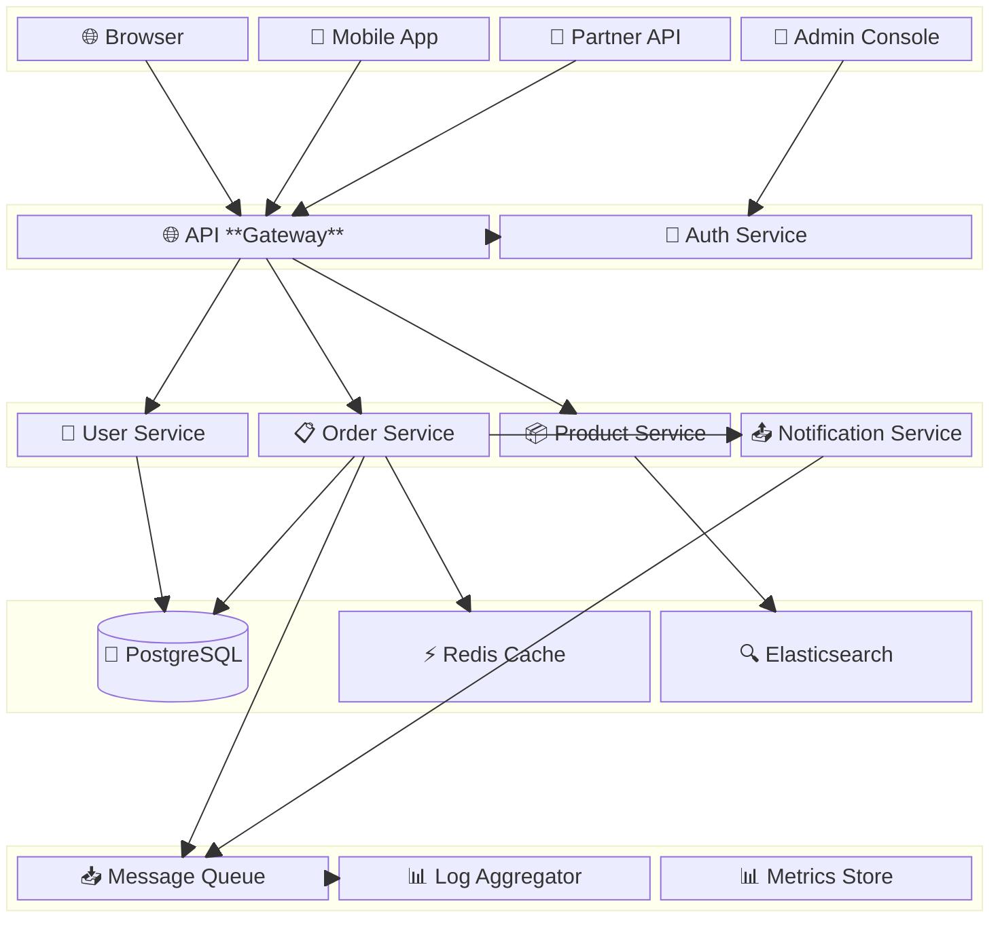

<!-- Source: https://github.com/SuperiorByteWorks-LLC/agent-project | License: Apache-2.0 | Author: Clayton Young / Superior Byte Works, LLC (Boreal Bytes) -->

# 框图

> **返回[样式指南](../mermaid_style_guide.md)** — 请先阅读样式指南了解表情符号、颜色和无障碍规则。

**语法关键词：** `block-beta`  
**最佳适用场景：** 系统模块组合、分层架构、空间布局重要的组件拓扑  
**不适用场景：** 流程处理（使用[流程图](flowchart.md)），含云图标的基建（使用[架构图](architecture.md)）

> ⚠️ **无障碍说明：** 框图**不支持** `accTitle`/`accDescr`。务必在代码块上方添加描述性*斜体*Markdown段落。

---

## 示例图

_展示三层Web应用架构的框图，从客户端接口经应用服务到数据存储，表情符号标签标识组件类型：_

---

## 技巧

- 使用 `columns N` 控制布局网格
- 用 `space:N` 创建空单元格（对齐/间距）
- 嵌套 `block:name:span { ... }` 实现分组
- 用 `-->` 箭头连接模块
- 标签中**使用表情符号** `["🔧 组件"]` 增强视觉区分
- 在块内用圆柱语法 `("文本")` 表示数据库
- 保持 **3–4行** × **3–4列** 确保可读性
- **始终**在上方添加Markdown文本描述以支持屏幕阅读器

---

## 模板

_描述系统层级及组件连接方式：_

---

## 复杂案例

_企业级平台架构的五层框图，含15个组件。每层为跨全宽的区块组，内部列控制组件布局。连接线展示层级间主要数据流路径：_

### 设计解析

- **五层自上而下**如网络拓扑：客户端→网关→服务→数据→基础设施。每层为跨全宽区块，含独立列布局
- **`space:4` 创建视觉分隔**：避免冗余线条边框，保持图表简洁易扫读
- **圆柱语法 `("文本")` 表示数据库**：PostgreSQL呈现为圆柱体，直观识别数据存储
- **连接线展示真实数据路径**：仅显示主要流径（非全连接）。全连接会导致可读性差，此设计突出工程师调试时的关键路径
