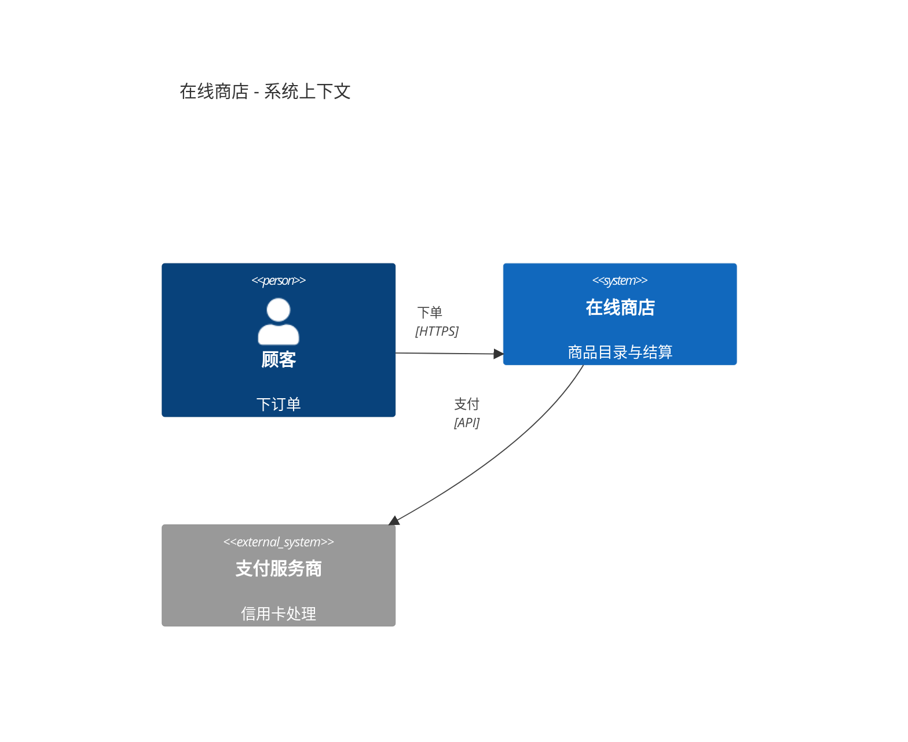
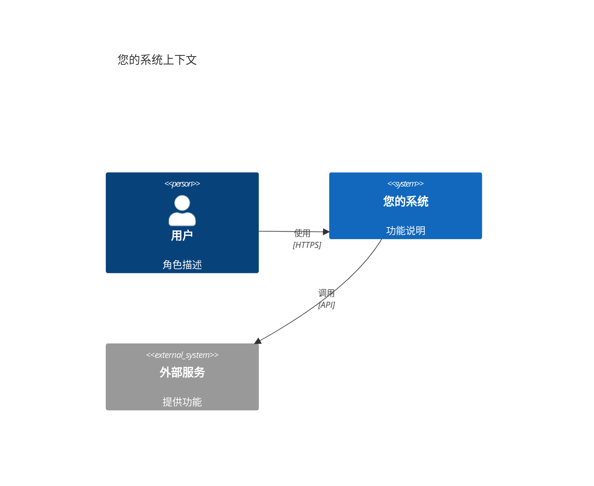
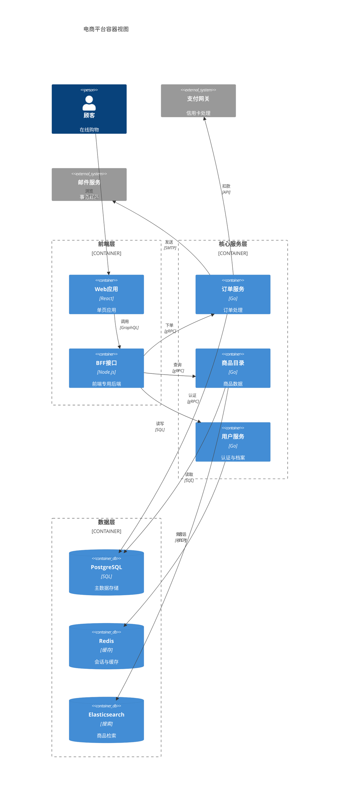

<!-- 来源：https://github.com/SuperiorByteWorks-LLC/agent-project | 许可证：Apache-2.0 | 作者：Clayton Young / Superior Byte Works, LLC (Boreal Bytes) -->

# C4 架构图

> **返回[样式指南](../mermaid_style_guide.md)** — 请先阅读样式指南了解表情符号、颜色和无障碍规则

**语法关键字：** `C4Context`, `C4Container`, `C4Component`  
**最佳适用场景：** 多层级系统架构 —— 上下文、容器、组件  
**不适用场景：** 基础设施拓扑（使用[架构图](architecture.md)），运行时序列（使用[序列图](sequence.md)）

---

## 示例图 —— 系统上下文

---

## C4 缩放层级

| 层级          | 关键字         | 展示内容                          | 受众群体       |
| ------------- | ------------- | --------------------------------- | -------------- |
| **上下文**    | `C4Context`   | 系统 + 外部参与者                 | 全体人员       |
| **容器**      | `C4Container` | 系统内的应用/数据库/队列          | 技术负责人     |
| **组件**      | `C4Component` | 容器内部的模块                    | 开发人员       |

## 技巧

- 使用 `Person()` 表示人员角色
- 内部系统用 `System()`，外部系统用 `System_Ext()`
- 容器层使用 `Container()`, `ContainerDb()`, `ContainerQueue()`
- 用**动词**和**协议**标注关系：`"读取数据", "SQL/TLS"`
- 使用 `Container_Boundary(id, "名称") { ... }` 分组容器
- **保持描述简洁** —— 长文本会导致标签重叠
- **上下文层限制在4-5个元素** 避免拥挤
- **C4标签中避免使用表情符号** —— C4渲染器自带样式处理
- 出现重叠时用 `UpdateRelStyle()` 调整标签位置

---

## 模板

---

## 复杂示例

某电商平台的C4容器图，包含3个`Container_Boundary`分组、10个容器和2个外部系统。展示如何通过边界按层级组织服务，并利用`UpdateRelStyle`偏移量防止标签重叠。

### 设计要点

- **容器边界对应部署单元** —— 前端层、核心服务层、数据层分别映射真实基础设施边界（CDN/Kubernetes命名空间/托管数据库）
- **每个`Rel`都配置`UpdateRelStyle`** —— C4自动布局默认会堆叠标签，必须为每个关系设置偏移量（后续新增元素会导致位移）
- **描述控制在1-3个词** —— "信用卡处理"、"会话与缓存"、"认证与档案"。长描述是C4渲染问题的首要原因
- **容器类型语义明确** —— `ContainerDb`使数据库显示为圆柱图标，`Container`表示服务。C4渲染器自动提供视觉区分
