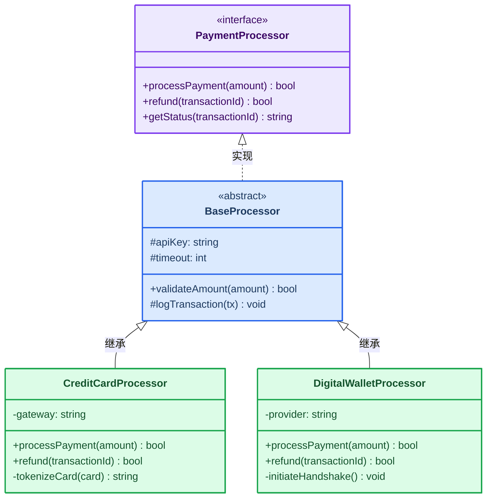
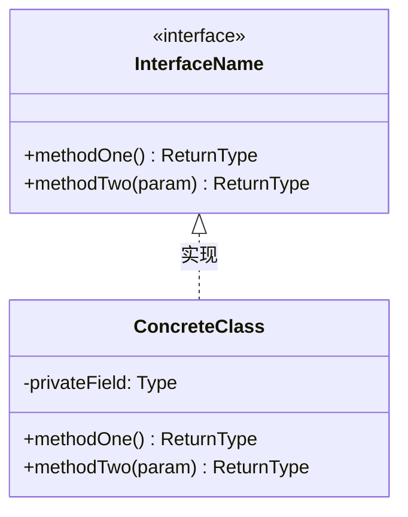
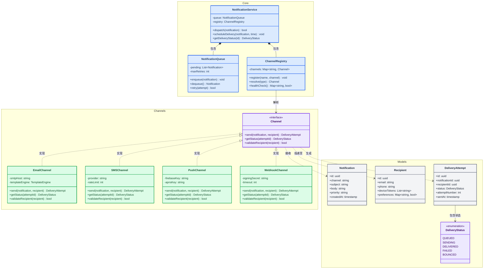

<!-- Source: https://github.com/SuperiorByteWorks-LLC/agent-project | License: Apache-2.0 | Author: Clayton Young / Superior Byte Works, LLC (Boreal Bytes) -->

# 类图

> **返回[样式指南](../mermaid_style_guide.md)** — 请先阅读样式指南了解表情符号、颜色和无障碍规则。

**语法关键字：** `classDiagram`  
**最佳适用场景：** 面向对象设计、类型层次结构、接口契约、领域模型  
**不适用场景：** 数据库模式（请使用[ER图](er.md)）、运行时行为（请使用[序列图](sequence.md)）

---

## 示例图

---

## 技巧

- 使用 `<<interface>>` 和 `<<abstract>>` 构造型增强清晰度
- 显示可见性：`+` 公有，`-` 私有，`#` 受保护
- 每张图保持 **4–6 个类** — 大型层次结构请拆分
- 使用 `style ClassName fill:...,stroke:...,color:...` 实现轻量语义着色：
  - 🟣 紫色表示接口/抽象
  - 🔵 蓝色表示基类/抽象类
  - 🟢 绿色表示具体实现
- 关系箭头：
  - `<|--` 继承（extends）
  - `<|..` 实现（implements）
  - `*--` 组合 · `o--` 聚合 · `-->` 依赖

---

## 模板

---

## 复杂示例

包含11个类的事件驱动通知平台，按3个`namespace`分组（核心编排层、传输通道层、数据模型层）。展示跨层的接口实现、组合和依赖关系。

### 设计解析

- **三层命名空间对应架构层级** — 核心层（编排）、通道层（传输实现）、模型层（数据）。开发者可独立阅读各命名空间
- **颜色编码角色** — 紫色接口/枚举、蓝色核心服务、绿色具体实现、灰色数据模型。模式一目了然
- **关系类型精准定义** — 组合（`*--`）表示"拥有并管理"、实现（`<|..`）表示"履行契约"、依赖（`..>`）表示"运行时使用"。每种箭头均有语义含义
