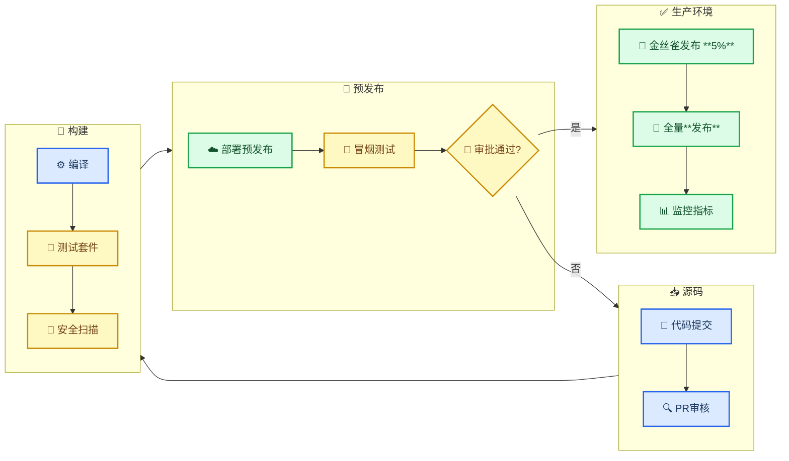
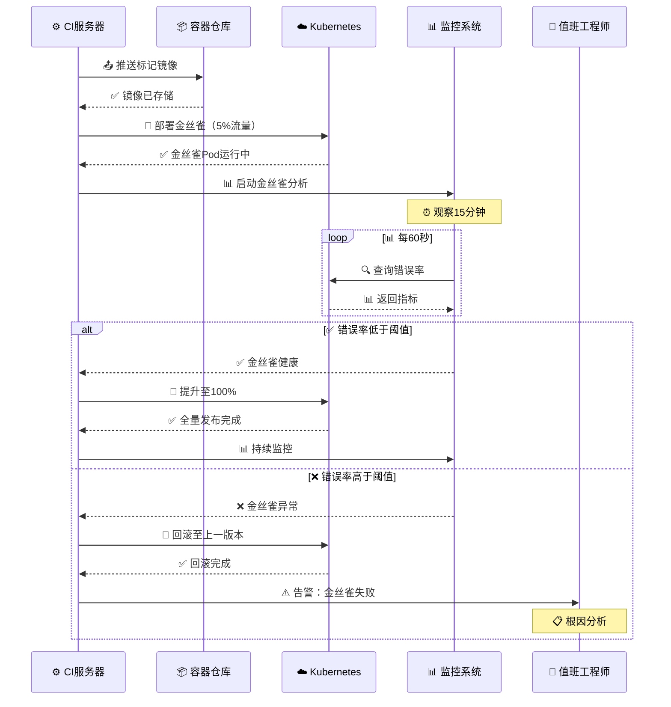
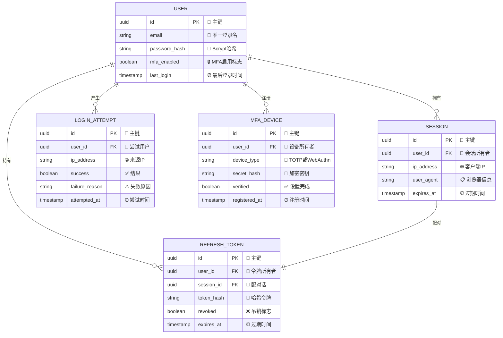
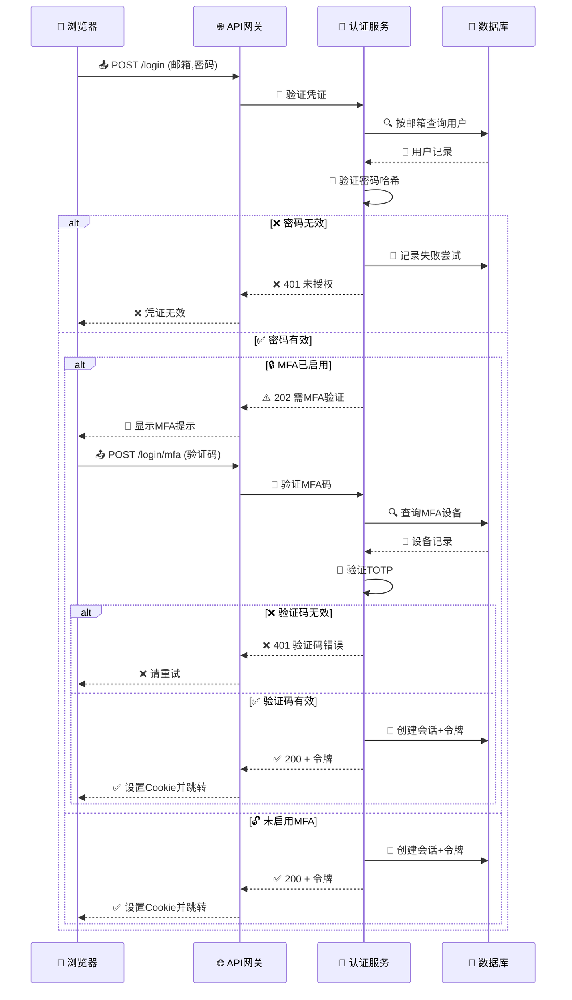
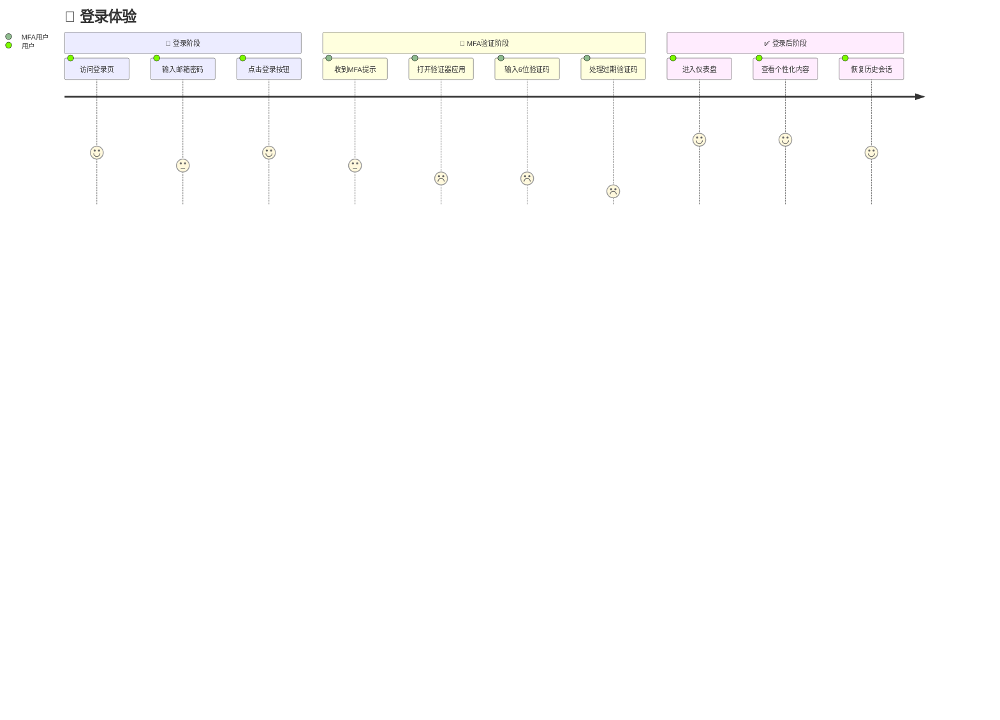
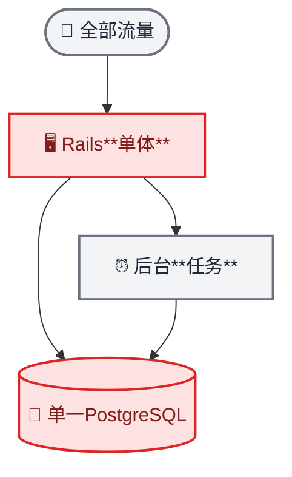
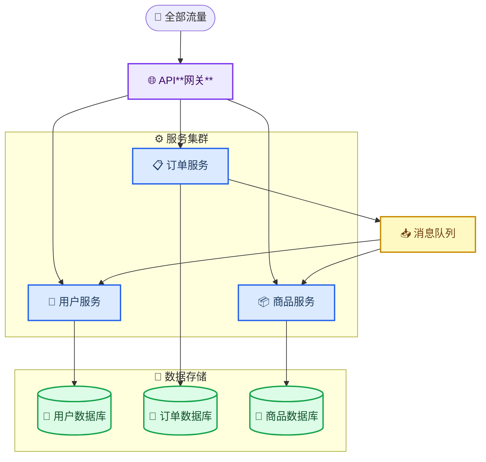

<!-- Source: https://github.com/SuperiorByteWorks-LLC/agent-project | License: Apache-2.0 | Author: Clayton Young / Superior Byte Works, LLC (Boreal Bytes) -->

# 构建复杂图表体系

> **返回[样式指南](../mermaid_style_guide.md)** — 本文档介绍如何组合多种图表类型来全面记录复杂系统。

**目的：** 单一图表仅能呈现单一视角。实际文档常需多种图表协同工作——概览流程图链接详细时序图，ER模型搭配展示实体生命周期的状态机，甘特图辅以架构前后对比视图。本文档将指导您何时及如何组合图表以实现最佳清晰度。

---

## 何时组合多张图表

| 记录对象                | 图表组合                                                                 | 优势分析                                                                         |
| ----------------------- | ------------------------------------------------------------------------ | -------------------------------------------------------------------------------- |
| 完整系统架构            | C4上下文图 + 架构图 + 核心流程时序图                                     | 面向利益相关者的上下文，面向运维的基础设施，面向开发者的交互流程                 |
| API设计文档             | ER模型（数据结构） + 请求流时序图 + 实体生命周期状态图                   | 数据库团队需结构模型，后端需交互逻辑，业务逻辑需状态流转                         |
| 功能规范                | 主流程流程图 + 服务交互时序图 + 用户体验旅程图                           | 产品经理看流程，工程师看实现，设计师看体验                                       |
| 迁移项目                | 甘特图（时间线） + 架构对比图（前后状态） + 迁移过程流程图               | 管理层看进度，基础设施团队看拓扑，迁移团队看步骤                                 |
| 入职文档                | 用户旅程图 + 设置步骤流程图 + 首次API调用时序图                          | 产品团队看体验地图，新员工看检查清单，开发者看技术指引                           |
| 事件响应                | 告警生命周期状态图 + 升级流程时序图 + 决策树流程图                       | 值班人员跟踪状态，管理层看沟通流程，响应人员按决策树处置                         |

---

## 模式一：概览图+细节图

**适用场景：** 需同时呈现全局框架与具体细节。管理层查看概览，工程师深入细节。

概览图展示高层级阶段或组件，细节图聚焦特定阶段呈现内部交互。

### 概览图——发布流水线

_生产部署阶段涉及多服务交互，金丝雀发布流程详见下方时序图。_

### 细节图——金丝雀发布时序

### 衔接方式

- **概览流程图**展示子图间连接的全流程——管理层借此理解发布过程
- **细节时序图**聚焦生产环境子图中的"金丝雀5%→全量发布"，呈现工程师需调试的实际服务交互
- **命名一致性**——"金丝雀"和"监控指标"在两张图表中统一出现，建立清晰的衔接桥梁

---

## 模式二：多视角文档

**适用场景：** 同一系统需为不同受众（数据库团队、后端工程师、产品经理）提供差异化视图。

本例从三个视角记录**用户认证**功能。

### 数据模型——面向数据库团队

### 认证流程——面向后端团队

### 登录体验——面向产品团队

### 衔接方式

- **相同实体，差异视角**——"用户"、"会话"、"MFA设备"在ER图中为表结构，在时序图中为参与者/操作，在旅程图中为体验触点
- **各受众获取可操作信息**——数据库团队关注索引与基数，后端团队关注API契约与错误码，产品团队关注满意度与摩擦点
- **旅程图揭示时序图未显信息**——时序图中MFA是清晰的条件分支，但旅程图显示其UX评分最低（1-2分）。这驱动产品决策投资WebAuthn/通行密钥

---

## 模式三：架构前后对比

**适用场景：** 迁移文档需向利益相关者展示当前状态、目标状态及转型过程。

### 当前状态——单体架构

> ⚠️ **问题：** 单一数据库成瓶颈。单体无法水平扩展。部署需全局重启。

### 目标状态——微服务架构

> ✅ **成效：** 各服务独立扩展。专属数据库消除共享瓶颈。异步消息解耦服务依赖。

### 衔接方式

- **相同布局，差异复杂度**——均采用`flowchart TB`布局使结构转型直观可见。单体架构4节点，目标架构11节点含子图
- **色彩叙事**——单体架构用红色（危险）标注瓶颈组件，目标架构用蓝/绿/紫展示健康分治组件
- **文字衔接图表**——⚠️问题标注与✅成效标注解释架构变更动因，而非仅展示变化

---

## 文档中的图表衔接实践

组合图表时遵循以下准则：

| 实践要点               | 示例                                                                                                 |
| ---------------------- | ---------------------------------------------------------------------------------------------------- |
| **标题锚点定位**       | `完整登录流程见[认证流程](#认证流程——面向后端团队)`                                                  |
| **引用特定节点**       | "概览图中的**API网关**连接至下文详述的服务"                                                          |
| **命名一致性**         | 相同实体在所有图表中名称统一（如"用户服务"，而非此处用"User Svc"，彼处用"Users API"）                |
| **相邻排布**           | 相关图表置于连续章节，避免分散                                                                       |
| **衔接说明**

classDef result fill:#dbeafe,stroke:#2563eb,stroke-width:2px,color:#1e3a5f
    classDef start_style fill:#ede9fe,stroke:#7c3aed,stroke-width:2px,color:#3b0764

    class audience,depth,change decision
    class perspectives,overview,before_after,single result
    class start start_style
