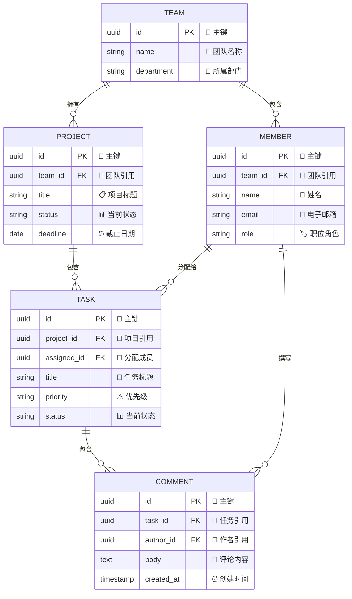
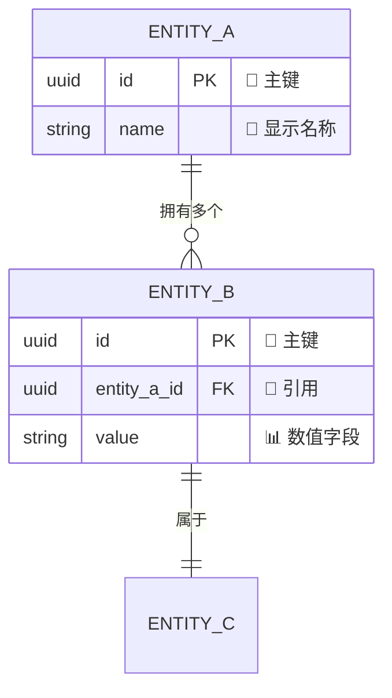
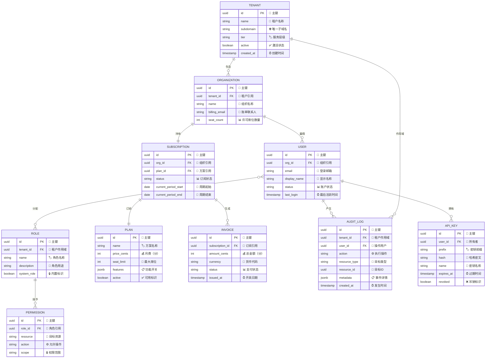

<!-- 来源：https://github.com/SuperiorByteWorks-LLC/agent-project | 许可证：Apache-2.0 | 作者：Clayton Young / Superior Byte Works, LLC (Boreal Bytes) -->

# 实体关系（ER）图

> **返回[样式指南](../mermaid_style_guide.md)** — 请先阅读样式指南了解表情符号、颜色和无障碍规则。

**语法关键字：** `erDiagram`  
**最佳适用场景：** 数据库模式、数据模型、实体关系、API数据结构  
**不适用场景：** 包含方法的类层次结构（使用[类图](class.md)）、流程设计（使用[流程图](flowchart.md)）

---

## 示例图

---

## 设计建议

- 包含数据类型、`PK`/`FK`标注及带表情符号的**注释文本**  
- 使用明确的动词短语关系标签：`"拥有"`、`"包含"`、`"分配给"`  
- 基数表示法：  
  - `||--o{` 一对多  
  - `||--||` 一对一  
  - `}o--o{` 多对多  
  - `o` = 零或多个，`|` = 严格一个  
- 每图限制 **5–7 个实体** — 大型模式按领域拆分  
- 实体命名：`大写字母`（遵循 SQL 惯例）  

---

## 模板

---

## 复杂案例

包含 10 个实体的多租户 SaaS 平台模式，覆盖身份认证、计费订阅和安全审计三大领域。关系线完整呈现了从租户隔离到用户权限再到账单生成的基数约束。

### 设计优势

- **10 个实体按领域组织** — 身份（租户、组织、用户、角色、权限）、计费（方案、订阅、账单）、安全（审计日志、API密钥）。关系线自然聚类相关实体  
- **完整基数体现业务规则** — `||--||`（一对一）表示组织-订阅关系（每组织单订阅）。`}o--o{`（多对多）实现灵活RBAC用户-角色分配。每个关系符号编码一种约束  
- **字段含类型/标注/用途说明** — PK/FK 支持模式生成，表情注释便于人工扫描。开发者可直接根据此图编写迁移脚本
