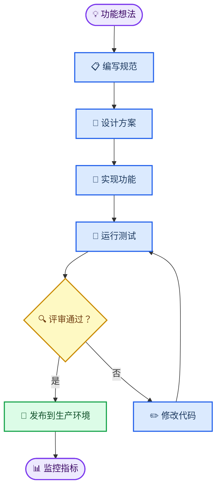
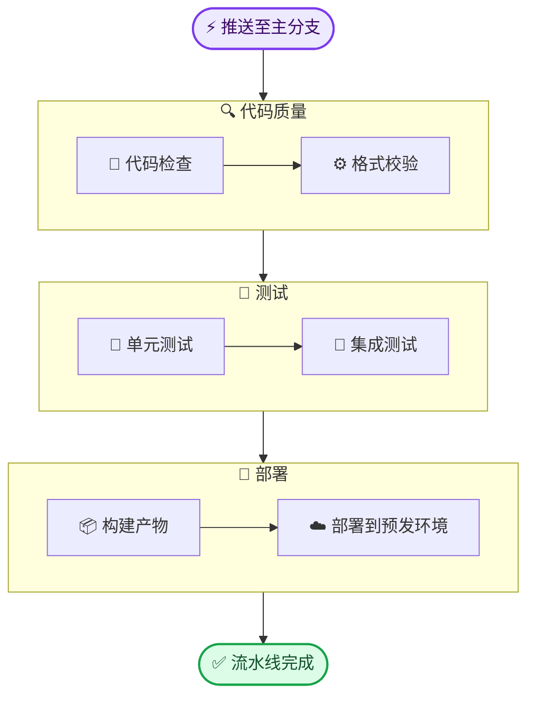
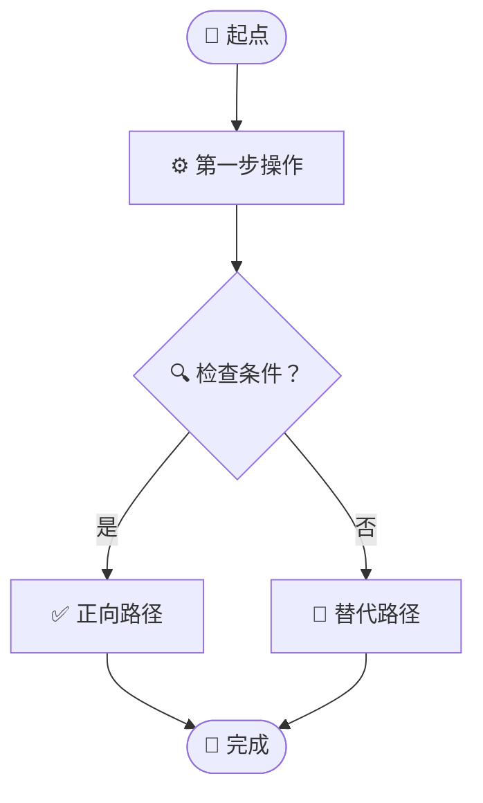
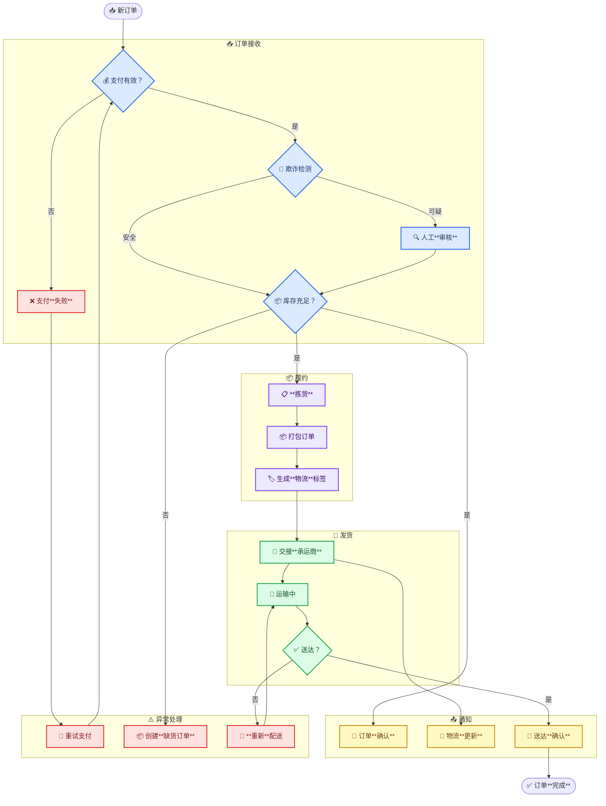

<!-- 来源：https://github.com/SuperiorByteWorks-LLC/agent-project | 许可证：Apache-2.0 | 作者：Clayton Young / Superior Byte Works, LLC (Boreal Bytes) -->

# 流程图

> **返回[样式指南](../mermaid_style_guide.md)** — 请先阅读样式指南了解表情符号、颜色和无障碍规则

**语法关键词：** `flowchart`  
**最佳适用场景：** 顺序流程、工作流、决策逻辑、故障排查树  
**不适用场景：** 多角色复杂时序（使用[时序图](sequence.md)）、状态机（使用[状态图](state.md)）

---

## 示例图

---

## 设计技巧

- 流程使用 `TB`（自上而下），流水线使用 `LR`（从左到右）
- 圆角矩形 `([文本])` 表示起点/终点，菱形 `{文本}` 表示决策点
- 节点上限 10 个——大型流程拆分为"阶段1"/"阶段2"子图
- 单图决策点不超过 3 个
- 连接线标签保持 1-4 个词：`-->|是|`，`-->|全部通过|`
- 使用 `classDef` 实现**语义化**着色——决策用琥珀色、成功用绿色、操作步骤用蓝色

## 子图模式

需要分组阶段时：

---

## 模板

---

## 复杂案例

20+节点的电商订单流水线，划分为5个代表处理阶段的子图。子图通过内部节点连接，决策点将订单路由至异常处理，颜色类别实现阶段快速识别。

### 设计优势

- **5个子图对应实际业务阶段**——接收、履约、发货、通知和异常处理符合运营团队的真实工作逻辑
- **异常处理独立成子图**——避免分散在各阶段，代理和读者可集中查看所有失败路径
- **颜色类别强化结构**——蓝色接收、紫色履约、绿色发货、琥珀色通知、红色异常。即使不读标签，色彩模式也能标识当前阶段
- **决策点连接子图**——菱形节点（`{支付有效？}`, `{库存充足？}`, `{送达？}`）是流程分支枢纽，每条分支指向清晰标记的目标
