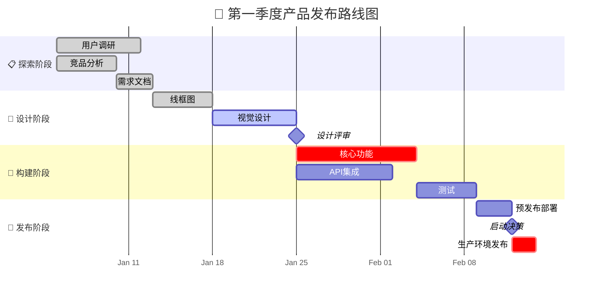
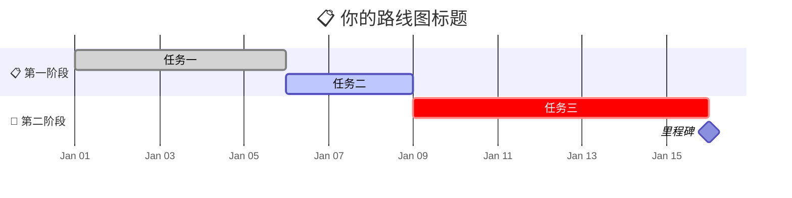
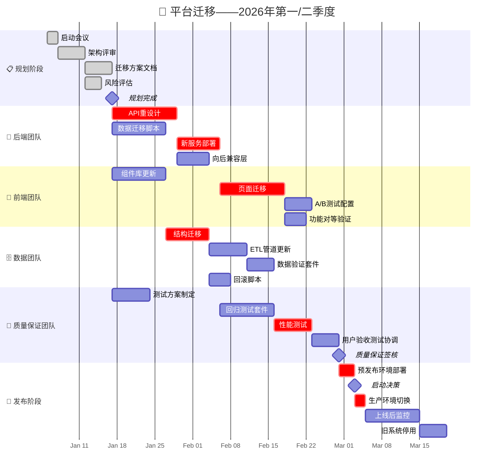

<!-- 来源：https://github.com/SuperiorByteWorks-LLC/agent-project | 许可证：Apache-2.0 | 作者：Clayton Young / Superior Byte Works, LLC (Boreal Bytes) -->

# 甘特图

> **返回[样式指南](../mermaid_style_guide.md)** — 请先阅读样式指南了解表情符号、颜色和无障碍规则

**语法关键字：** `gantt`  
**最佳适用场景：** 项目时间线、路线图、阶段规划、里程碑跟踪、任务依赖关系  
**不适用场景：** 简单时序事件（使用[时间线](timeline.md)）、流程逻辑（使用[流程图](flowchart.md)）

---

## 示例图表

---

## 使用技巧

- 使用带表情符号前缀的 `section` 按阶段或团队分组
- 用 `:milestone` 和 `0d` 时长标记里程碑——前缀添加 🏁
- 状态标签：`:done`（已完成）、`:active`（进行中）、`:crit`（关键路径，高亮显示）
- 使用 `after taskId` 建立任务依赖关系
- 保持总时间线**在3个月内**以确保可读性
- 使用 `axisFormat` 控制日期显示（`%b %d` = "1月05日"，`%m/%d` = "01/05"）

---

## 模板

---

## 复杂案例

跨团队平台迁移项目，历时4个月，包含6个阶段、24项任务和3个里程碑。展示团队间依赖（后端迁移阻塞前端迁移）、关键路径任务，以及从规划到上线监控的全生命周期。

### 设计优势解析

- **6个阶段对应实际团队**——各团队可快速定位工作流。通过`after taskId`显式标注跨团队依赖（前端等待后端API，质量保证等待后端部署）
- **`:crit`标记关键路径**——决定项目总时长的任务链。任何关键任务延误都将导致发布日期推迟，Mermaid会将其标红突出
- **3个里程碑作为决策关卡**——规划完成、质量保证签核、启动决策。这些是利益相关方进行实质性决策的节点，而非单纯进度更新
- **4个月跨度24项任务仍具可读性**——按团队分组展示。若无阶段划分，将形成难以阅读的任务墙
