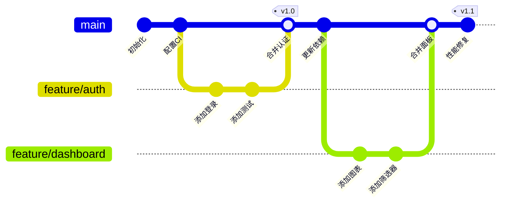

<!-- 来源：https://github.com/SuperiorByteWorks-LLC/agent-project | 许可证：Apache-2.0 | 作者：Clayton Young / Superior Byte Works, LLC (Boreal Bytes) -->

# Git 图谱

> **返回 [样式指南](../mermaid_style_guide.md)** — 请先阅读样式指南了解表情符号、颜色和无障碍规则

**语法关键字：** `gitGraph`  
**最佳适用场景：** 分支策略、合并工作流、发布流程、git-flow 可视化  
**不适用场景：** 通用流程（使用[流程图](flowchart.md)）、项目时间线（使用[甘特图](gantt.md)）

---

## 示例图

---

## 提示

- 为提交点使用描述性 `id:` 标签
- 通过 `tag:` 标记发布版本
- 分支名称需匹配实际规范（如 `feature/`, `fix/`, `release/`）
- 展示**理想**工作流 —— 这是规范性而非描述性
- 关键合并提交使用 `type: HIGHLIGHT` 高亮
- 保持 **10–15 个提交点** 以保证可读性

---

## 模板

