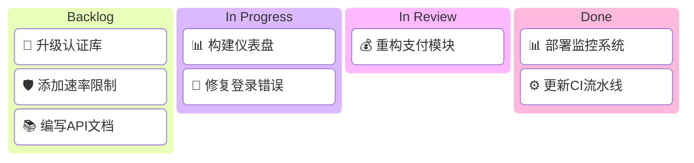
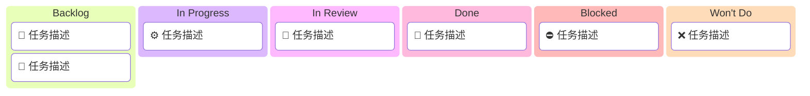
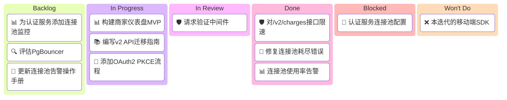

<!-- 来源：https://github.com/SuperiorByteWorks-LLC/agent-project | 许可证：Apache-2.0 | 作者：Clayton Young / Superior Byte Works, LLC (Boreal Bytes) -->

# 看板（Kanban）

> **返回 [样式指南](../mermaid_style_guide.md)** — 请先阅读样式指南以了解表情符号、颜色和无障碍规则。

**语法关键字：** `kanban`  
**最佳适用场景：** 任务状态板、工作流列、在制品可视化、迭代状态  
**不适用场景：** 任务时间线/依赖关系（使用 [甘特图](gantt.md)）、流程逻辑（使用 [流程图](flowchart.md)）

> ⚠️ **无障碍性：** 看板 **不支持** `accTitle`/`accDescr`。始终在代码块上方添加描述性的*斜体*Markdown段落。

---

## 示例图

*展示当前迭代工作项在四个工作流列中分布的看板，表情符号表示列状态：*

> ⚠️ **提示：** 每个任务开头使用 **一个领域表情符号** — 这是分类的主要视觉信号。列表情符号表示工作流状态。

---

## 技巧

- 用 **状态表情符号** 命名列以实现快速视觉扫描
- 为任务添加 **领域表情符号** 以便快速分类
- 保持 **3–5列**
- 每列限制 **3–4个条目**（代表性展示，非完整列表）
- 条目使用简洁的文本描述
- 适合文档中的迭代快照
- **始终** 在上方搭配Markdown文本描述以支持屏幕阅读器

---

## 模板

*描述工作流列及看板含义。始终展示全部6列：*

> ⚠️ 始终包含全部6列 — Backlog（待办）、In Progress（进行中）、In Review（评审中）、Done（已完成）、Blocked（阻塞）、Won't Do（不做）。即使某列为空，也需添加占位条目如[暂无任务]以明确结构。

---

## 复杂示例

*支付团队第W07迭代看板，展示六列中工作项的实际分布（含阻塞项）：*

复杂看板技巧：

- 添加Blocked列暴露停滞工作 — 这是看板中信号最强的列
- 复杂看板中每列仍保持最多 **3–4个条目** — 图表是摘要而非完整清单
- 跨列使用相同领域表情符号实现视觉追踪（📊=仪表盘, 🛡️=安全, 🐛=缺陷）
- **始终** 展示全部6列 — 空列使用占位条目如[暂无任务]
