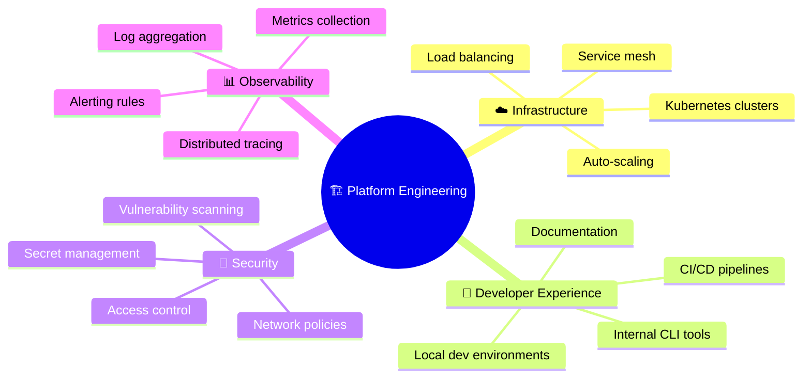
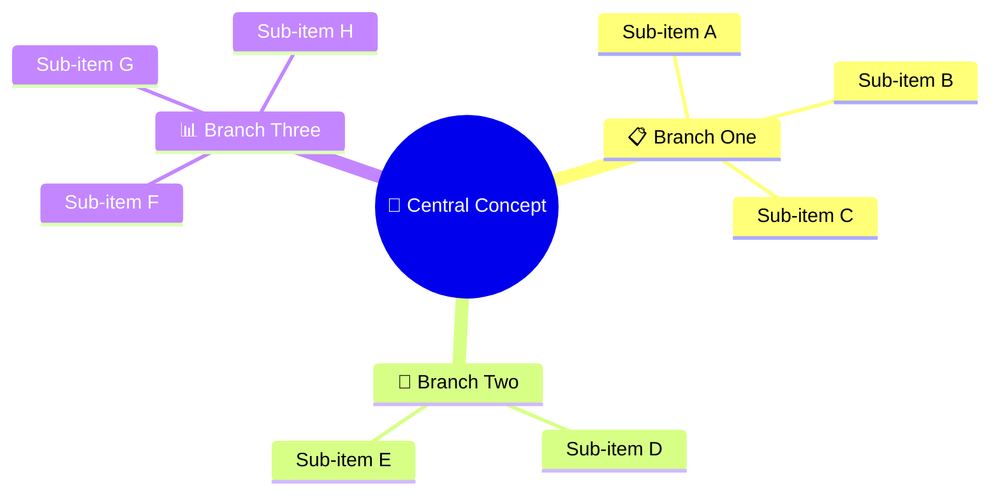

<!-- Source: https://github.com/SuperiorByteWorks-LLC/agent-project | License: Apache-2.0 | Author: Clayton Young / Superior Byte Works, LLC (Boreal Bytes) -->

# 思维导图

> **返回[样式指南](../mermaid_style_guide.md)** — 请先阅读样式指南了解表情符号、颜色和无障碍规则。

**语法关键词：** `mindmap`  
**最佳适用场景：** 头脑风暴、概念整理、知识体系构建、主题分解  
**不适用场景：** 顺序流程（使用[流程图](flowchart.md)）、时间线（使用[时间线](timeline.md)）

> ⚠️ **无障碍说明：** 思维导图**不支持** `accTitle`/`accDescr`。务必在代码块上方直接添加描述性*斜体*Markdown段落。

---

## 示例图

*展示平台工程团队核心职责领域的思维导图，分为基础设施、开发者体验、安全性和可观测性四大领域：*

---

## 使用技巧

- 保持 **3–4个主分支**，每个主分支含 **3–5个子项**
- 在分支标题使用表情符号增强视觉区分度
- 嵌套层级不超过3层
- 根节点采用 `(( ))` 圆形样式
- **务必**在上方添加Markdown文本描述以支持屏幕阅读器

---

## 模板

*描述本思维导图展示的核心概念及其涵盖的关键类别：*

