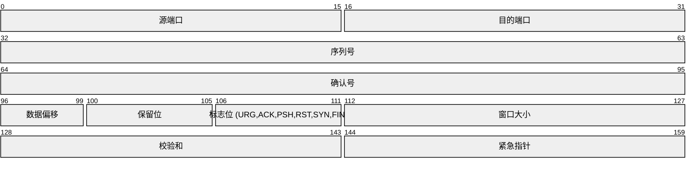
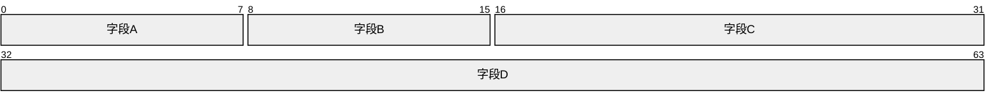

<!-- Source: https://github.com/SuperiorByteWorks-LLC/agent-project | License: Apache-2.0 | Author: Clayton Young / Superior Byte Works, LLC (Boreal Bytes) -->

# 数据包结构图

> **返回[样式指南](../mermaid_style_guide.md)** — 请先阅读样式指南了解表情符号、颜色和无障碍规则。

**语法关键字：** `packet-beta`  
**最佳适用场景：** 网络协议头、数据结构布局、二进制格式文档、比特级规范  
**不适用场景：** 通用数据模型（使用[ER图](er.md)）、系统架构（使用[C4图](c4.md)或[架构图](architecture.md)）

> ⚠️ **无障碍说明：** 数据包图**不支持** `accTitle`/`accDescr`。务必在代码块上方直接添加描述性的*斜体*Markdown段落。

---

## 示例图

*展示简化版TCP头部结构的数据包图（字段大小为比特）：*

---

## 使用技巧

- 比特范围格式为 `起始-结束:`（0起始索引）
- 字段标签需简洁——必要时使用缩写
- 适用于所有固定宽度的二进制格式，不限于网络数据包
- 默认行宽为32比特——字段自动换行
- **必须**在代码块上方添加Markdown文本描述以支持屏幕阅读器

---

## 模板

*协议或数据格式及其字段结构的描述：*

