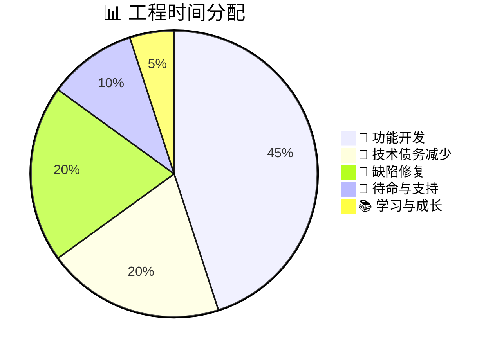
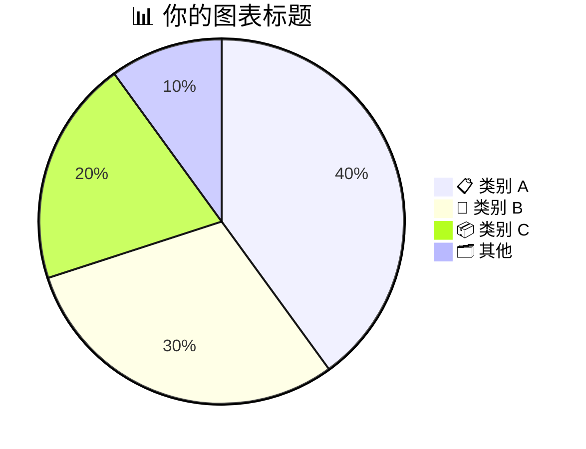

<!-- Source: https://github.com/SuperiorByteWorks-LLC/agent-project | License: Apache-2.0 | Author: Clayton Young / Superior Byte Works, LLC (Boreal Bytes) -->

# 饼图

> **返回 [样式指南](../mermaid_style_guide.md)** — 请先阅读样式指南了解表情符号、颜色和无障碍规则。

**语法关键字：** `pie`  
**最佳适用场景：** 简单比例分析、预算分配、构成比例、调查结果  
**不适用场景：** 时间趋势（使用 [XY 图表](xy_chart.md)）、精确比较（使用表格）、超过 7 个分类  

---

## 示例图表

---

## 技巧

- 数值为**比例关系**——总和无需等于 100  
- 使用带**表情符号前缀**的描述性标签增强视觉区分度  
- 最多限制在 **7 个扇区**——将小类合并为 "📦 其他"  
- 始终添加带相关表情符号的 `title` 标题  
- 按从大到小顺序排列扇区以提升可读性  

---

## 模板

