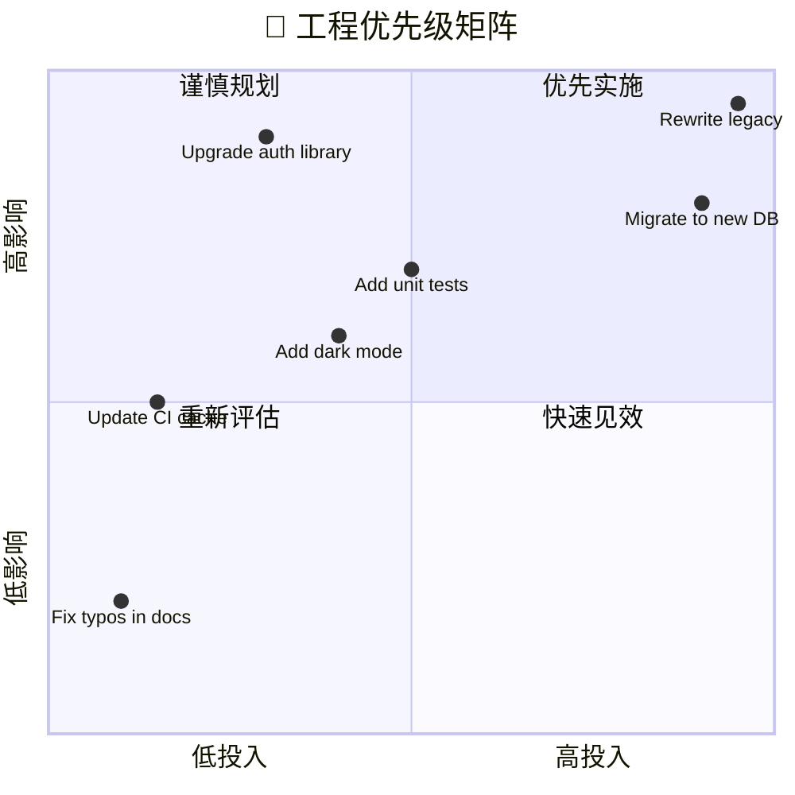
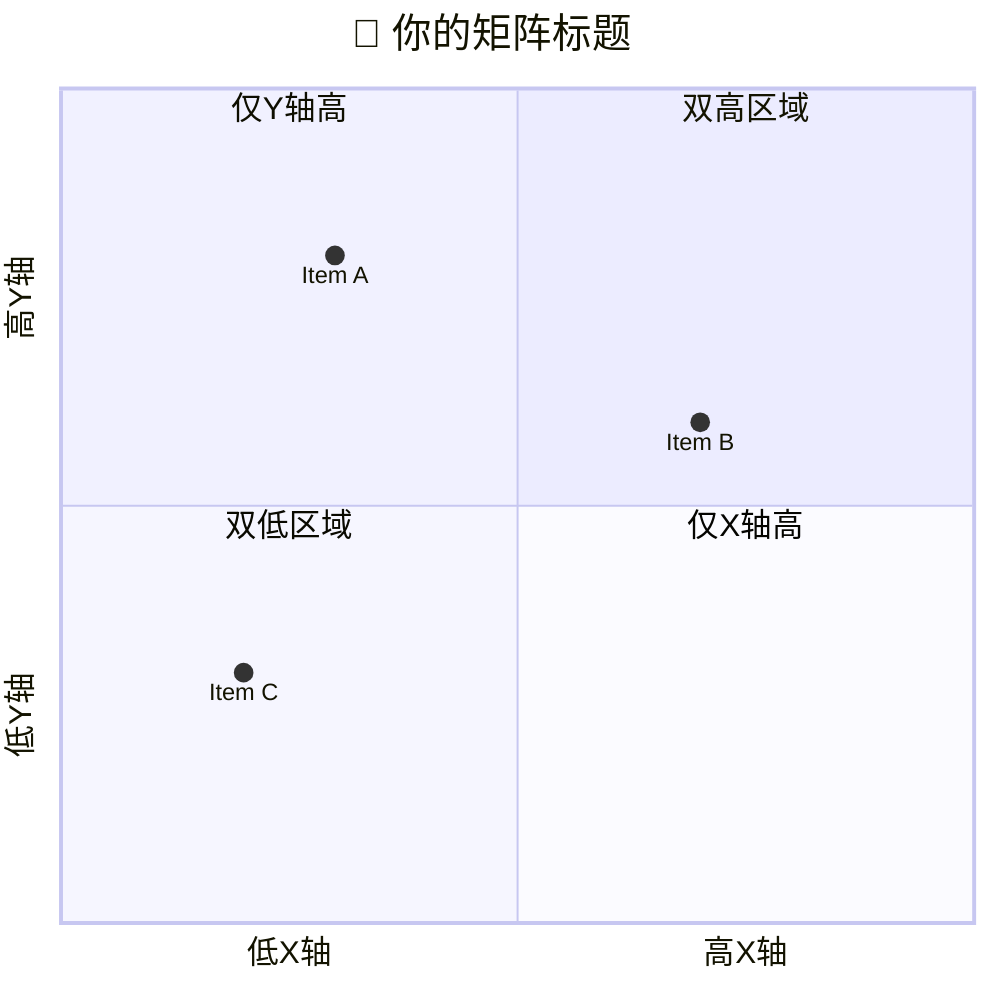

<!-- 来源：https://github.com/SuperiorByteWorks-LLC/agent-project | 许可证：Apache-2.0 | 作者：Clayton Young / Superior Byte Works, LLC (Boreal Bytes) -->

# 象限图

> **返回[样式指南](../mermaid_style_guide.md)** — 请先阅读样式指南了解表情符号、颜色和无障碍规则。

**语法关键字：** `quadrantChart`  
**最佳适用场景：** 优先级矩阵、风险评估、双轴对比、投入/影响分析  
**不适用场景：** 时间序列数据（使用[甘特图](gantt.md)或[XY图表](xy_chart.md)），简单排名（使用表格）

> ⚠️ **无障碍说明：** 象限图**不支持** `accTitle`/`accDescr`。务必在代码块上方添加描述性*斜体*Markdown段落。

---

## 示例图表

*通过需求工作量与业务影响度绘制工程计划优先级矩阵，辅助团队决策下一步开发内容：*

---

## 使用技巧

- 坐标轴标签采用`低X值 --> 高X值`格式
- 用**可操作**的标签命名全部四个象限
- 数据点格式为`名称: [x值, y值]`，取值范围0.0–1.0
- 限制在**5–10个数据点** — 过多会导致图表混乱
- 象限编号规则：1=右上，2=左上，3=左下，4=右下
- **必须**在图表上方添加Markdown文本描述供屏幕阅读器使用

---

## 模板

*描述双轴含义及象限分布意义：*

