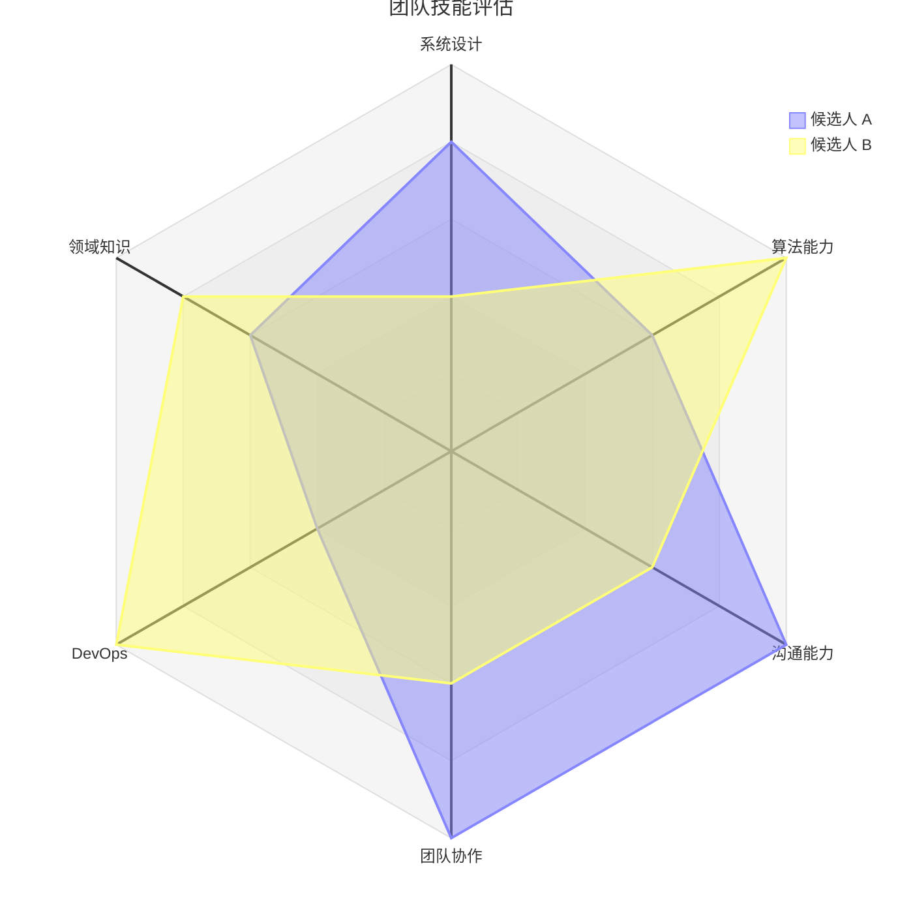
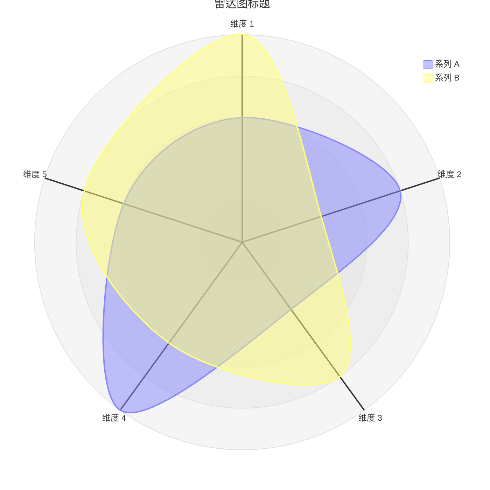

<!-- Source: https://github.com/SuperiorByteWorks-LLC/agent-project | License: Apache-2.0 | Author: Clayton Young / Superior Byte Works, LLC (Boreal Bytes) -->

# 雷达图

> **返回 [样式指南](../mermaid_style_guide.md)** — 请先阅读样式指南了解表情符号、颜色和无障碍规则。

**语法关键字：** `radar-beta`  
**Mermaid 版本：** v11.6.0+  
**最佳适用场景：** 多维比较、技能评估、绩效画像、竞品分析  
**不适用场景：** 时间序列数据（使用 [XY 图表](xy_chart.md)），简单比例（使用 [饼图](pie.md)）

> ⚠️ **无障碍说明：** 雷达图**不支持** `accTitle`/`accDescr`。请始终在代码块上方添加描述性的*斜体* Markdown 段落。

---

## 示例图表

*雷达图对比两位工程候选人在六大核心能力领域的表现，展示互补优势：*

---

## 使用技巧

- 用 `axis id["标签"]` 定义坐标轴 — 使用简短标签（1-2词）
- 用 `curve id["标签"]{值1, 值2, ...}` 定义曲线，值与坐标轴顺序匹配
- 设置 `max` 将所有值归一化到相同量程
- `graticule` 选项：`circle`（默认）或 `polygon`
- `ticks` 控制同心环数量（默认5）
- `showLegend true` 为多曲线添加图例
- 保持 **5–8个坐标轴** 和 **2–4条曲线** 以确保可读性
- **务必**在上方添加 Markdown 文本描述以支持屏幕阅读器

---

## 模板

*描述被比较的维度和实体：*

