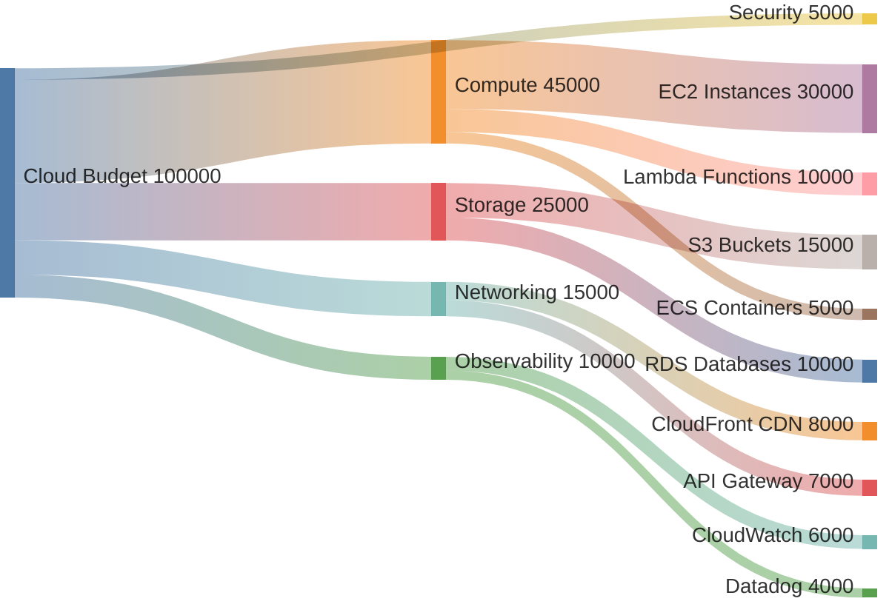
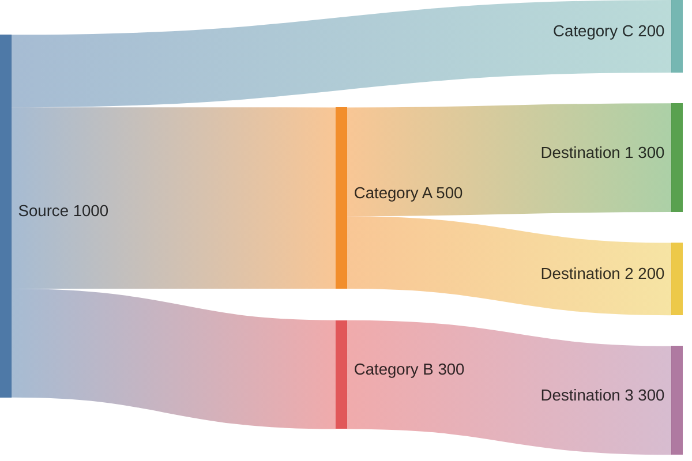

<!-- Source: https://github.com/SuperiorByteWorks-LLC/agent-project | License: Apache-2.0 | Author: Clayton Young / Superior Byte Works, LLC (Boreal Bytes) -->

# 桑基图

> **返回[样式指南](../mermaid_style_guide.md)** — 请先阅读样式指南了解表情符号、颜色和无障碍规范。

**语法关键字：** `sankey-beta`  
**最佳适用场景：** 流量可视化、资源分配、预算规划、路径分析  
**不适用场景：** 简单比例（使用[饼图](pie.md)）、流程步骤（使用[流程图](flowchart.md)）

> ⚠️ **无障碍说明：** 桑基图**不支持** `accTitle`/`accDescr`。务必在代码块上方添加描述性*斜体*Markdown段落。

---

## 示例图

*桑基图展示每月10万美元云预算如何从总分配流向服务类别（计算、存储、网络、可观测性）再到具体AWS服务，带宽与成本成正比：*

---

## 使用技巧

- 格式：`源节点,目标节点,数值` — 每行代表一个流向
- 数值决定流程带的宽度
- 最多保持**3层结构**（源→分类→终点）
- 组间空行提升源码可读性
- 适用于解答"资金流向何处？💰"类问题
- 节点名禁用表情符号（解析器限制）— 使用描述性文本
- **必须**在代码块上方添加Markdown文本描述供屏幕阅读器使用

---

## 模板

*描述资源流向及数值含义：*

