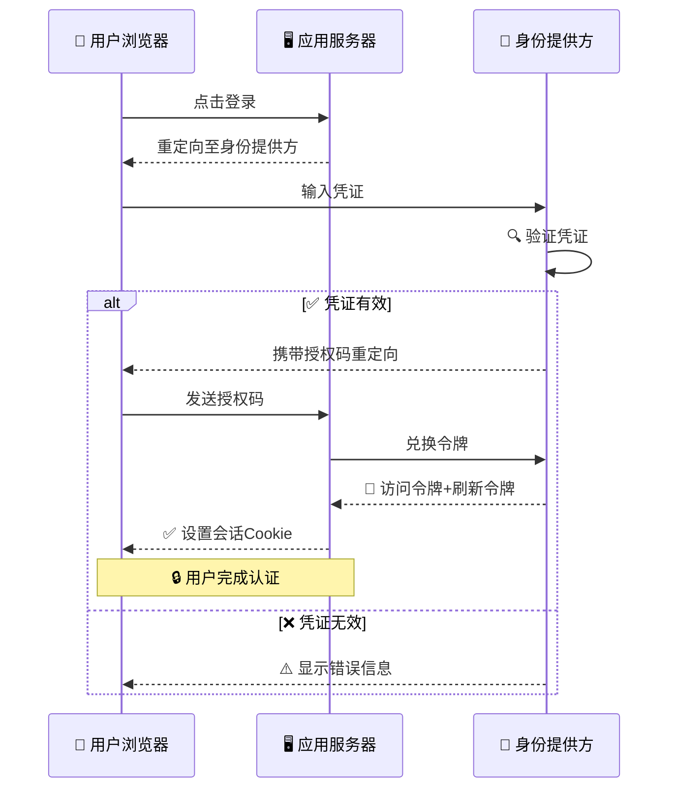
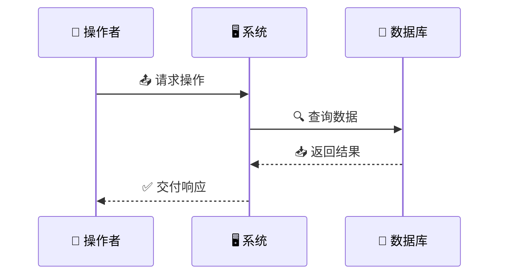
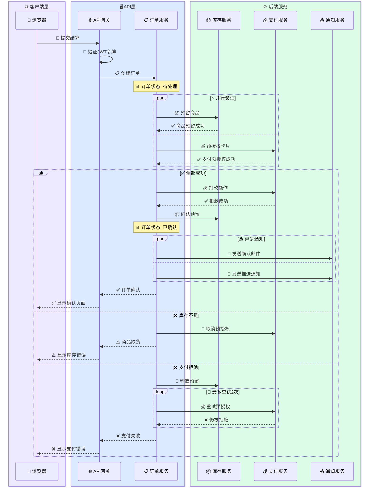

<!-- Source: https://github.com/SuperiorByteWorks-LLC/agent-project | License: Apache-2.0 | Author: Clayton Young / Superior Byte Works, LLC (Boreal Bytes) -->

# 时序图

> **返回[样式指南](../mermaid_style_guide.md)** — 请先阅读样式指南了解表情符号、颜色和无障碍规则。

**语法关键词：** `sequenceDiagram`  
**最佳适用场景：** API交互、时序流程、多角色通信、请求/响应模式  
**不适用场景：** 简单线性流程（使用[流程图](flowchart.md)）、静态关系（使用[类图](class.md)或[实体关系图](er.md)）

---

## 示例图



---

## 技巧

- 限制在**4-5个参与者** — 过多会导致可读性下降
- 实线箭头(`->>`)表示请求，虚线(`-->>`)表示响应
- 使用`alt/else/end`处理条件分支
- 使用`Note over X,Y:`添加带表情符号的上下文注释
- 使用`par/end`表示并行操作
- 使用`loop/end`表示重复交互
- **消息文本**中的表情符号能清晰标识状态(✅, ❌, ⚠️, 🔐)

## 常用模式

**并行调用：**

```
par 📥 获取用户
    A->>B: GET /user
and 📥 获取订单
    A->>C: GET /orders
end
```

**循环：**

```
loop ⏰ 每30秒
    A->>B: 健康检查
    B-->>A: ✅ 200 OK
end
```

---

## 模板



---

## 复杂示例

包含6个参与者的微服务结算流程，使用`box`区域分组。展示并行调用、条件分支、`break`错误处理、重试逻辑和上下文注释——复杂时序图的完整工具集。



### 设计优势

- **`box`分组**按架构层聚合参与者——读者立即区分客户端与后端服务
- **`par`区块**展示库存与支付检查的并行处理，符合实际结算系统的高性能需求
- **嵌套`alt/else`**覆盖成功路径和两种独立失败场景，均含清理操作（取消预授权/释放预留）
- **`loop`重试逻辑**在不干扰主流程前提下展示支付重试机制
- **消息中的表情符号**提升可读性——📦代表库存，💰代表支付，✅/❌标识结果
