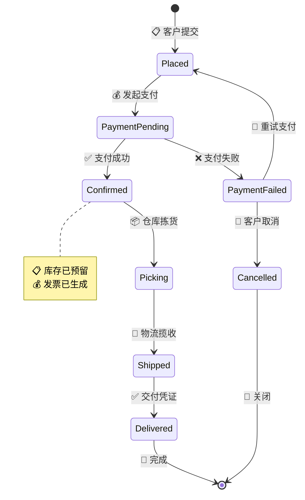
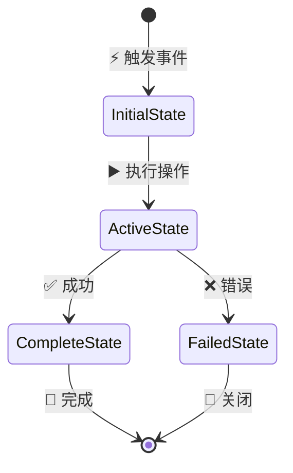
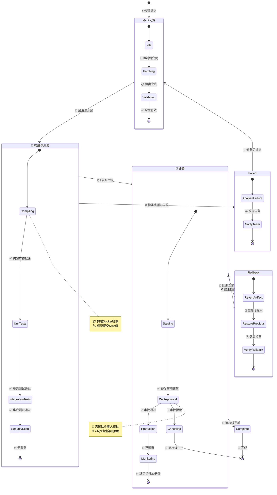

<!-- 来源：https://github.com/SuperiorByteWorks-LLC/agent-project | 许可证：Apache-2.0 | 作者：Clayton Young / Superior Byte Works, LLC (Boreal Bytes) -->

# 状态图

> **返回[样式指南](../mermaid_style_guide.md)** — 请先阅读样式指南了解表情符号、颜色和无障碍规则

**语法关键字：** `stateDiagram-v2`  
**最佳适用场景：** 状态机、生命周期流程、状态转换、对象生命周期  
**不适用场景：** 多步骤顺序流程（使用[流程图](flowchart.md)），时间敏感交互（使用[时序图](sequence.md)）

---

## 示例图

---

## 设计建议

- 始终以`[*]`（初始状态）开始，以`[*]`（终止状态）结束
- 用**表情符号+动作**标注转换以提升可读性
- 使用`note right of`/`note left of`添加上下文细节
- 状态命名：`驼峰式`（Mermaid状态图规范）
- 谨慎使用嵌套状态：`state "名称" as s1 { ... }`
- 状态数量控制在**8-10个**以内

---

## 模板

---

## 复杂示例

CI/CD流水线状态机，包含3个复合（嵌套）状态，每个状态含内部子状态。展示代码变更如何通过构建、测试、部署阶段，含故障恢复和回滚路径。

### 为何这样设计有效

- **复合状态分组流水线阶段** — 代码源、构建与测试、部署各自包含内部流程，既可独立阅读又可整体理解
- **故障和回滚作为独立状态** — 不仅是转换标签。Failed和Rollback状态含内部子状态，清晰展示恢复过程
- **关键状态注释补充操作上下文** — 审批门控含超时规则，编译步骤记录产物格式。这些是运维必需细节
- **复合状态间转换体现高层流程**（代码源→构建→部署→完成），而复合状态内部转换展示详细步骤。双重阅读层级适配不同受众
