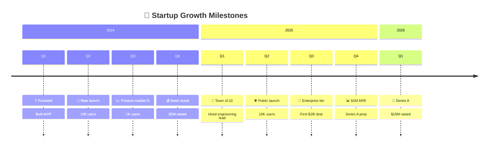
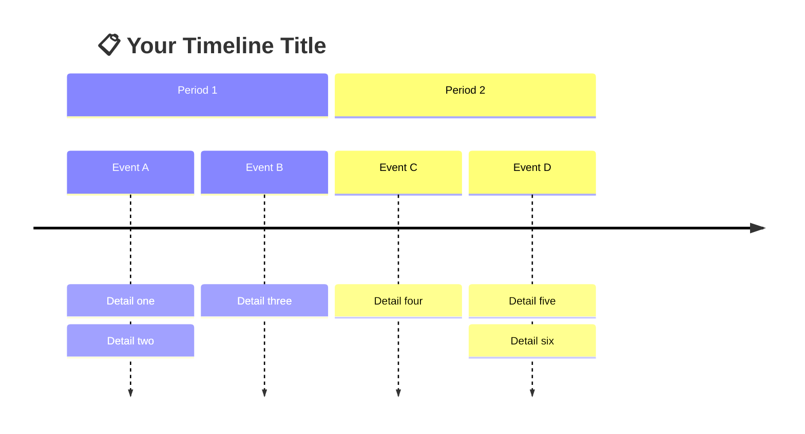
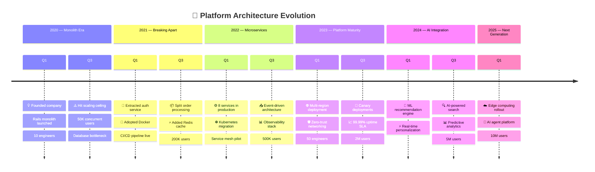

<!-- 来源：https://github.com/SuperiorByteWorks-LLC/agent-project | 许可证：Apache-2.0 | 作者：Clayton Young / Superior Byte Works, LLC (Boreal Bytes) -->

# 时间线

> **返回 [样式指南](../mermaid_style_guide.md)** — 请先阅读样式指南了解表情符号、颜色和无障碍规则。

**语法关键词：** `timeline`  
**最佳适用场景：** 时间顺序事件、历史进程、里程碑事件、版本发布历史  
**不适用场景：** 任务时长/依赖关系（使用 [甘特图](gantt.md)），详细项目计划（使用 [甘特图](gantt.md)）

> ⚠️ **无障碍说明：** 时间线 **不支持** `accTitle`/`accDescr`。务必在代码块上方添加描述性*斜体*Markdown段落。

---

## 示例图表

*初创公司从创立到A轮融资的增长里程碑时间线，按年份和季度组织：*

---

## 使用技巧

- 使用 `section` 按年份、季度或阶段分组
- 每个条目可用 `:` 分隔多个事项
- 保持事项简洁——每项2–4个词
- 关键事项开头使用表情符号实现视觉锚定
- **务必**在上方添加Markdown文本描述以支持屏幕阅读器

---

## 模板

*时间线描述及其覆盖的时间段：*

---

## 复杂案例

*追踪初创公司从单体架构到微服务再到AI驱动平台的多年度技术平台演进。六个时间段跨越2020-2025年，记录推动架构决策的关键技术里程碑与业务指标：*

### 设计解析

- **六个阶段代表技术时代** —— "单体时代"、"解耦阶段"、"微服务" 不仅说明*时间*更阐述*架构演进动因*
- **业务指标与技术里程碑并列** —— 用户规模和团队人数紧邻架构决策，体现推动演进的*压力源*（5万用户→扩展瓶颈→服务拆分）
- **单时间点多事项并列** —— 每季度通过`:`分隔2-3个事项，实现高密度信息与可读性的平衡
- **表情符号引导视觉焦点** —— 🧠机器学习、🌐多区域部署、⚡Redis等符号优先吸引视线，仅凭表情即可快速理解核心事件
