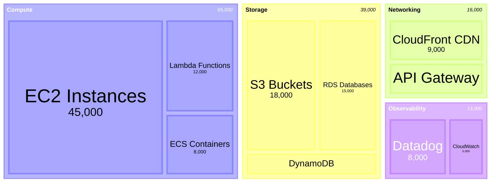
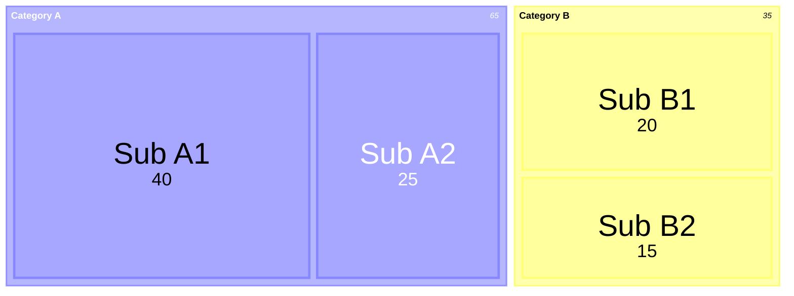

<!-- Source: https://github.com/SuperiorByteWorks-LLC/agent-project | License: Apache-2.0 | Author: Clayton Young / Superior Byte Works, LLC (Boreal Bytes) -->

# 矩形树图

> **返回[样式指南](../mermaid_style_guide.md)** — 请先阅读样式指南了解表情符号、颜色和无障碍规则。

**语法关键字：** `treemap-beta`  
**Mermaid 版本：** v11.12.0+  
**最佳适用场景：** 分层数据比例、预算分解、磁盘使用量、投资组合构成  
**不适用场景：** 简单扁平比例（使用[饼图](pie.md)）、流程型层级结构（使用[桑基图](sankey.md)）

> ⚠️ **无障碍说明：** 矩形树图**不支持** `accTitle`/`accDescr`。务必在代码块上方添加描述性*斜体*Markdown段落。  
>  
> ⚠️ **GitHub支持：** 矩形树图是新功能——使用前请确认目标GitHub版本能正常渲染。

---

## 示例图

*矩形树图展示按服务类别和具体服务细分的年度云基础设施成本，矩形面积与支出成正比：*

---

## 使用技巧

- 父节点（分区）使用引号文本：`"分区名称"`
- 叶节点添加数值：`"叶节点名称": 123`
- 层级通过**缩进**（空格或制表符）创建
- 数值决定矩形大小——值越大面积越大
- 保持**2-3层**嵌套以确保清晰度
- 使用 `classDef` 和 `:::class` 语法设置节点样式
- **始终**在上方添加Markdown文本描述以支持屏幕阅读器

---

## 模板

*描述分层数据及比例代表的含义：*

