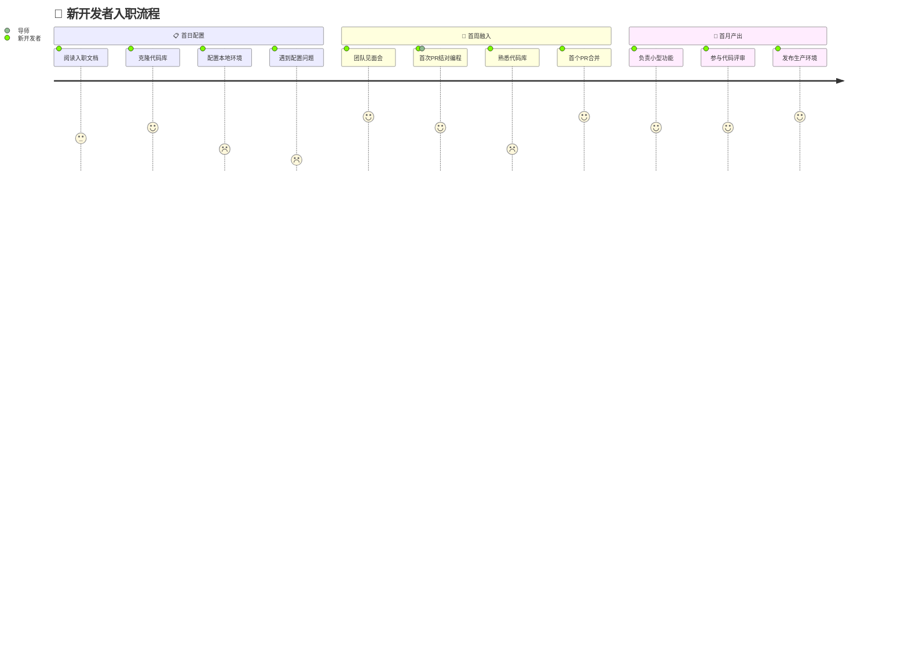
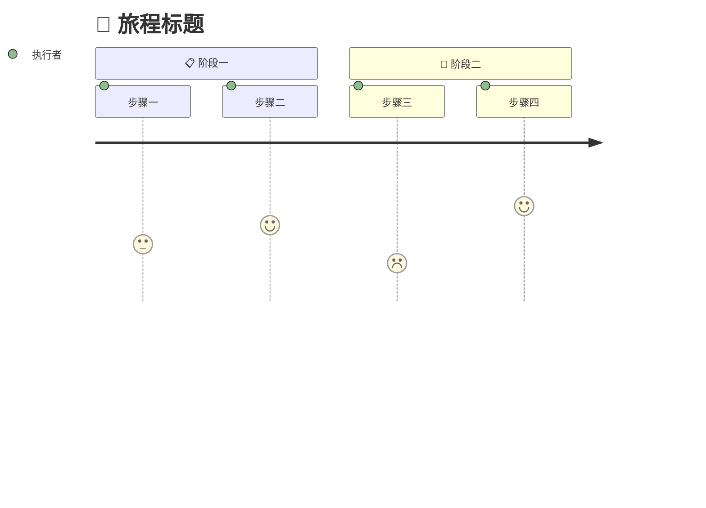
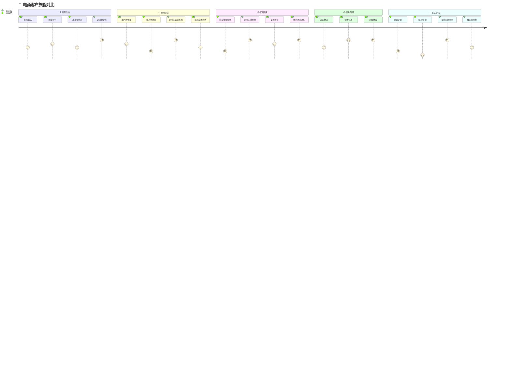

<!-- Source: https://github.com/SuperiorByteWorks-LLC/agent-project | License: Apache-2.0 | Author: Clayton Young / Superior Byte Works, LLC (Boreal Bytes) -->

# 用户旅程图

> **返回[样式指南](../mermaid_style_guide.md)** — 请先阅读样式指南了解表情符号、颜色和无障碍规则

**语法关键词：** `journey`  
**最佳适用场景：** 用户体验映射、客户旅程、流程满意度评分、入职流程  
**不适用场景：** 无满意度数据的简单流程（使用[流程图](flowchart.md)）、时序事件（使用[时间轴](timeline.md)）

---

## 示例图表

---

## 使用技巧

- 评分标准：**1**=😤沮丧, **3**=😐中立, **5**=😄欣喜
- 评分后标注执行者：`5 : 执行者1, 执行者2`
- 使用**带表情前缀**的`section`按时间段/阶段分组
- 聚焦**痛点环节**（低分项）—— 核心洞察所在
- 保持**3-4个阶段**，每阶段**3-4个步骤**

---

## 模板

---

## 复杂案例

多角色电商旅程图，对比新客户与回头客在5个阶段的体验。两种角色经历相同流程但满意度不同，精准揭示首次用户体验需优化的环节。

### 设计解析

- **双角色同图对比** —— 新客户(2-3分)与回头客(4-5分)在结算/售后阶段的满意度断层直观可见
- **5阶段符合真实漏斗** —— 发现→购物→结算→履约→售后，每个阶段揭示新用户的体验断点
- **差异化步骤设计** —— "对比替代品"仅新客户执行，"复购同款"仅回头客执行，体现旅程中的路径分叉
- **低分项即行动信号** —— 新客户在支付/优惠券/客服环节的1-2分，正是提升转化率的关键优化点
