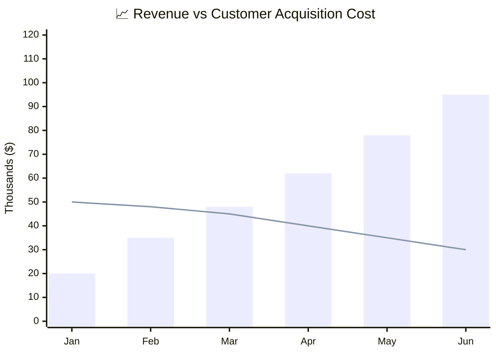
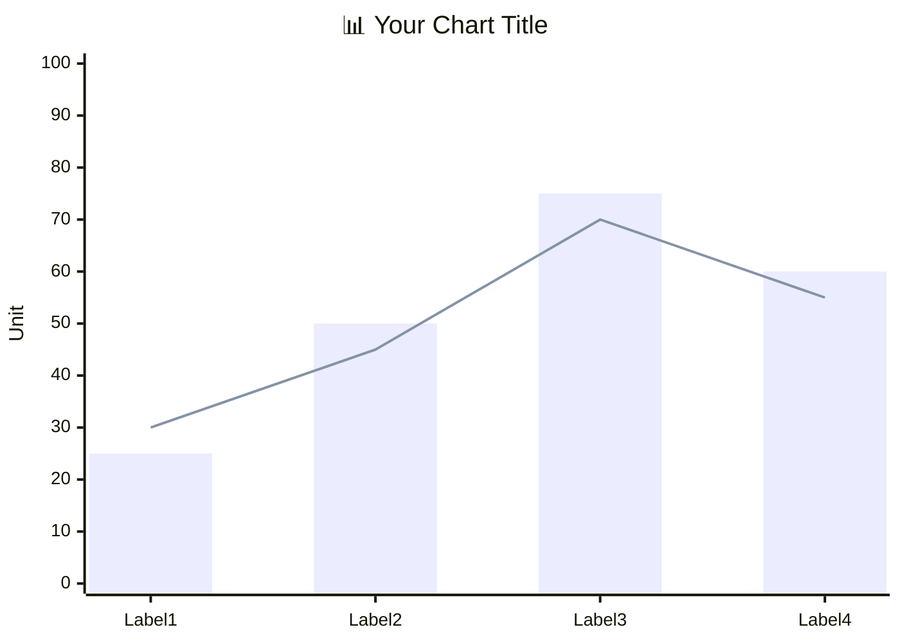

<!-- Source: https://github.com/SuperiorByteWorks-LLC/agent-project | License: Apache-2.0 | Author: Clayton Young / Superior Byte Works, LLC (Boreal Bytes) -->

# XY 图表

> **返回[样式指南](../mermaid_style_guide.md)** — 请先阅读样式指南了解表情符号、颜色和无障碍规则。

**语法关键词：** `xychart-beta`  
**最佳适用场景：** 数值数据可视化、时间趋势分析、柱状图/折线图对比、指标仪表盘  
**不适用场景：** 比例分布（使用[饼图](pie.md)）、定性比较（使用[象限图](quadrant.md)）

> ⚠️ **无障碍说明：** XY 图表**不支持** `accTitle`/`accDescr`。请始终在代码块上方添加描述性的*斜体*Markdown段落。

---

## 示例图表

*XY图表对比六个月间月收入增长（柱状）与客户获取成本（折线），显示随着收入上升而CAC持续下降的良性单位经济效益：*

---

## 使用技巧

- 组合`bar`和`line`可在同一图表展示不同指标
- 在标题中**使用表情符号**增强视觉效果：`"📈 收入增长"`
- 标题和坐标轴标签需用引号标注
- 使用`最小值 --> 最大值`定义坐标轴范围
- 数据点数量控制在**6-12个**以保证可读性
- 多个`bar`或`line`条目将创建分组序列
- **务必**在上方添加详细的Markdown文本描述以适配屏幕阅读器

---

## 模板

*描述X轴、Y轴、柱状和折线所代表的数据及核心洞察：*

