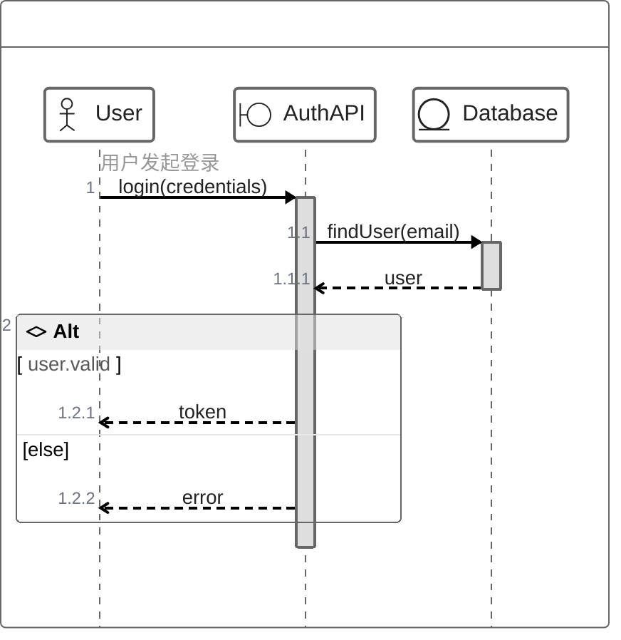
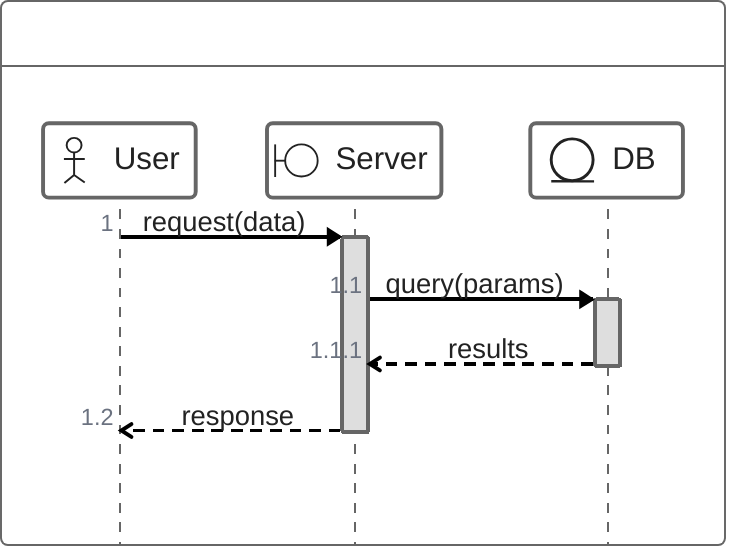

<!-- Source: https://github.com/SuperiorByteWorks-LLC/agent-project | License: Apache-2.0 | Author: Clayton Young / Superior Byte Works, LLC (Boreal Bytes) -->

# ZenUML 序列图

> **返回[样式指南](../mermaid_style_guide.md)** — 请先阅读样式指南了解表情符号、颜色和无障碍规则。

**语法关键字：** `zenuml`  
**最佳适用场景：** 类代码的序列图、方法调用式交互、熟悉编程语法的开发者  
**不适用场景：** 多数情况请优先使用标准[序列图](sequence.md)——ZenUML需外部插件且GitHub支持有限

> ⚠️ **GitHub支持：** ZenUML需`@mermaid-js/mermaid-zenuml`外部模块，**可能无法在GitHub原生渲染**。需GitHub兼容时请使用标准`sequenceDiagram`语法。
>
> ⚠️ **无障碍性：** ZenUML**不支持**`accTitle`/`accDescr`。务必在代码块上方直接添加描述性*斜体*Markdown段落。

---

## 示例图

*展示用户认证流程的ZenUML序列图，使用编程风格语法实现凭证验证与令牌生成：*

---

## 提示

- 采用**编程风格语法**：`A->B.method(args)`  
- 花括号`{}`创建自然嵌套（激活条）  
- 控制流：`if/else`, `while`, `for`, `try/catch/finally`, `par`  
- 参与者类型：`@Actor`, `@Boundary`, `@Entity`, `@Database`, `@Control`  
- `//`注释显示在消息上方  
- `return`关键字绘制返回箭头  
- **优先使用标准`sequenceDiagram`**确保GitHub兼容性  
- 仅在需要特定代码风格语法时使用ZenUML  

---

## 模板

*交互流程描述：*

