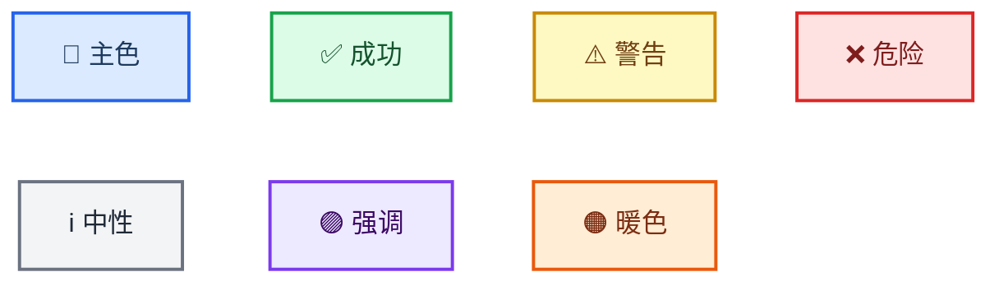

<!-- Source: https://github.com/SuperiorByteWorks-LLC/agent-project | License: Apache-2.0 | Author: Clayton Young / Superior Byte Works, LLC (Boreal Bytes) -->

# Mermaid 图表样式指南

> **AI 助手须知：** 阅读本文件掌握核心样式规则，通过[图表选择表](#choosing-the-right-diagram)确定类型后，跳转对应文件获取生产级示例、技巧和可复用的模板。
>
> **开发者须知：** 本指南及关联图表文件确保仓库中所有 Mermaid 图表均满足可访问性、专业性要求，并在 GitHub 明暗模式下清晰渲染。请将其引用至 `AGENTS.md` 或贡献指南。

**目标平台：** GitHub Markdown（议题、PR、讨论、Wiki、`.md` 文件）  
**设计目标：** 简约专业的样式，在 GitHub 明暗模式下完美渲染，支持屏幕阅读器，零视觉噪音传递清晰信息。

---

## AI 助手快速指南

1. **选择图表类型** → [选择表](#choosing-the-right-diagram)
2. **打开对应模板文件** → 复制模板并填充内容
3. **应用本文件样式** → 使用[批准的表情集](#approved-emoji-set)和[调色板](#github-compatible-color-classes)
4. **添加无障碍支持** → `accTitle` + `accDescr`（不支持的图表类型改用斜体 Markdown 段落）
5. **验证** → 确保在明暗模式和屏幕阅读器中正常渲染

---

## 核心原则

| #   | 原则                     | 规则                                                                                               |
| --- | ------------------------ | -------------------------------------------------------------------------------------------------- |
| 1   | **多尺度清晰性**         | 简单图表保持扁平化，复杂图表使用子图组，极复杂图表拆分为概览图+细节图                              |
| 2   | **强制无障碍支持**       | 每个图表必须包含 `accTitle` + `accDescr`，无例外                                                  |
| 3   | **主题中立**             | 禁用 `%%{init}` 主题指令和行内 `style`，由 GitHub 自动适配主题                                    |
| 4   | **语义明确性**           | 节点 ID 使用 `snake_case` 并与标签匹配，采用主动语态和句子首字母小写                              |
| 5   | **样式一致性**           | 相同表情符号在全项目代表相同含义，相同图形代表相同语义                                            |
| 6   | **简约专业装饰**         | 仅限表情符号点缀+关键文本加粗+可选 `classDef`，禁止过度修饰                                       |

---

## 无障碍要求

**每个图表必须包含 `accTitle` 和 `accDescr：**

```
accTitle: 3-8个单词的简短名称
accDescr: 1-2句话说明图表内容及核心洞察，需保持单行（GitHub限制）
```

- `accTitle` — 3–8个单词的纯文本图表名称
- `accDescr` — **单行**描述图表目的和关键结构（GitHub限制）

**不支持 `accTitle`/`accDescr` 的图表类型：** 思维导图、时间线、象限图、桑基图、XY图、块图、看板、包图、架构图、雷达图、树状图。对于这些类型，请在代码块上方添加描述性*斜体* Markdown 段落作为替代。

> **ZenUML 注意：** ZenUML 需额外插件且 GitHub 可能不渲染，建议改用标准 `sequenceDiagram` 语法。

---

## 主题配置

### ✅ 正确做法：无主题指令（GitHub自动适配）


### ❌ 错误做法：行内样式或自定义主题

```
%% 错误示例 — 破坏暗色模式
style A fill:#e8f5e9
%%{init: {'theme':'base'}}%%
```

---

## 批准的表情符号集

每个节点标签开头使用单个表情符号，全项目相同表情符号代表相同含义。

### 系统与基础设施

| 表情 | 含义                     | 示例                   |
| ---- | ------------------------ | ---------------------- |
| ☁️   | 云平台/托管服务          | `[☁️ AWS Lambda]`      |
| 🌐   | 网络/连接                | `[🌐 API网关]`         |
| 🖥️   | 服务器/计算设备          | `[🖥️ 应用服务器]`      |
| 💾   | 存储/数据库              | `[💾 PostgreSQL]`      |
| 🔌   | 集成/插件                | `[🔌 Webhook处理器]`   |

### 流程与操作

| 表情 | 含义                     | 示例                   |
| ---- | ------------------------ | ---------------------- |
| ⚙️   | 流程/配置引擎            | `[⚙️ 构建流水线]`      |
| 🔄   | 循环/同步                | `[🔄 重试循环]`        |
| 🚀   | 部署/发布                | `[🚀 生产环境发布]`    |
| ⚡   | 快速触发/事件            | `[⚡ Webhook触发]`     |
| 📦   | 软件包/制品              | `[📦 Docker镜像]`      |
| 🔧   | 工具/维护                | `[🔧 迁移脚本]`       |
| ⏰   | 定时任务                 | `[⏰ 夜间任务]`        |

### 人员与角色

| 表情 | 含义                     | 示例                |
| ---- | ------------------------ | ------------------- |
| 👤   | 用户/执行者              | `[👤 终端用户]`     |
| 👥   | 团队/组织                | `[👥 平台团队]`     |
| 🤖   | 机器人/自动化            | `[🤖 CI机器人]`     |
| 🧠   | 智能决策/AI              | `[🧠 ML分类器]`     |

### 状态与结果

| 表情 | 含义                     | 示例                 |
| ---- | ------------------------ | -------------------- |
| ✅   | 成功/完成                | `[✅ 测试通过]`      |
| ❌   | 失败/阻塞                | `[❌ 构建失败]`      |
| ⚠️   | 警告/风险                | `[⚠️ 频率限制]`      |
| 🔒   | 锁定/限制                | `[🔒 需管理员]`      |
| 🔐   | 安全/认证                | `[🔐 OAuth握手]`     |

### 信息与数据

| 表情 | 含义                     | 示例                |
| ---- | ------------------------ | ------------------- |
| 📊   | 分析/指标                | `[📊 使用指标]`     |
| 📋   | 清单/表单                | `[📋 需求列表]`     |
| 📝   | 文档/日志                | `[📝 审计追踪]`     |
| 📥   | 输入/接收                | `[📥 事件流]`       |
| 📤   | 输出/发送                | `[📤 通知]`         |
| 🔍   | 检查/审查                | `[🔍 代码审查]`     |
| 🏷️   | 标签/版本                | `[🏷️ v2.1.0]`       |

### 领域专用

| 表情 | 含义                     | 示例                  |
| ---- | ------------------------ | --------------------- |
| 💰   | 财务/计费                | `[💰 发票]`           |
| 🧪   | 测试/实验                | `[🧪 A/B测试]`        |
| 📚   | 文档/知识库              | `[📚 API文档]`        |
| 🎯   | 目标/指标                | `[🎯 OKR追踪]`        |
| 🗂️   | 分类/归档                | `[🗂️ 待办清单]`       |
| 🔗   | 链接/依赖                | `[🔗 外部API]`        |
| 🛡️   | 防护/策略                | `[🛡️ 限流器]`         |
| 🏁   | 起点/里程碑              | `[🏁 迭代完成]`       |
| ✏️   | 编辑/修订                | `[✏️ 处理反馈]`       |
| 🎨   | 设计/UI                  | `[🎨 设计评审]`       |
| 💡   | 创意/洞察                | `[💡 功能创意]`       |

### 表情符号规则

1. **置于开头：** `[🔐 认证]` 而非 `[认证 🔐]`
2. **单节点单表情** — 禁止堆叠
3. **强制一致性** — 全项目相同表情代表相同概念
4. **非必需使用** — 仅用于需视觉区分的关键节点
5. **禁用装饰性表情：** 🎉 💯 🔥 🎊 💥 ✨ — 增加噪音而非价值

---

## GitHub 兼容色彩类

仅在需要色彩编码时使用（如多角色图表/严重等级），优先采用图形+表情符号。

**批准调色板（通过 GitHub 明暗模式测试）：**

| 语义用途           | `classDef` 定义                                       | 视觉效果                                     |
| ------------------ | ----------------------------------------------------- | -------------------------------------------- |
| **主色调/操作**    | `fill:#dbeafe,stroke:#2563eb,stroke-width:2px,color:#1e3a5f` | 浅蓝填充+蓝色边框+深海军蓝文字               |
| **成功/积极**      | `fill:#dcfce7,stroke:#16a34a,stroke-width:2px,color:#14532d` | 浅绿填充+绿色边框+深森林绿文字               |
| **警告/注意**      | `fill:#fef9c3,stroke:#ca8a04,stroke-width:2px,color:#713f12` | 浅黄填充+琥珀边框+深棕文字                   |
| **危险/严重**      | `fill:#fee2e2,stroke:#dc2626,stroke-width:2px,color:#7f1d1d` | 浅红填充+红色边框+深绯红文字                 |
| **中性/信息**      | `fill:#f3f4f6,stroke:#6b7280,stroke-width:2px,color:#1f2937` | 浅灰填充+灰色边框+近黑色文字                 |
| **强调色/高亮**    | `fill:#ede9fe,stroke:#7c3aed,stroke-width:2px,color:#3b0764` | 浅紫填充+紫色边框+深紫文字                   |
| **暖色调/商业**    | `fill:#ffedd5,stroke:#ea580c,stroke-width:2px,color:#7c2d12` | 浅桃填充+橙色边框+深锈色文字                 |

**实时预览 — 七种色彩类渲染效果：**



**规则：**

1. 必须包含 `color:`（文字颜色）— 暗色模式可能隐藏默认文字
2. 使用 `classDef` + `class` — **禁用**行内 `style` 指令
3. 单图最多使用 **3–4 种色彩类**
4. **禁止纯色彩编码** — 必须搭配表情/图形/标签文字

---

## 节点命名与标签

| 规则                | ✅ 正确示例             | ❌ 错误示例             |
| ------------------- | ----------------------- | ----------------------- |
| `snake_case` ID     | `run_tests`, `deploy_prod` | `A`, `B`, `node1`       |
| ID 匹配标签         | `open_pr` → "开启PR"    | `x` → "开启PR"          |
| 具体命名            | `check_unit_tests`      | `check`                 |
| 动作使用动词        | `run_lint`, `deploy_app` | `linter`, `deployment`  |
| 状态使用名词        | `review_state`, `error` | `reviewing`, `erroring` |
| 3–6 单词标签        | `[📥 获取原始数据]`     | `[从数据源获取原始数据]` |
| 主动语态            | `[🧪 运行测试]`         | `[测试被执行]`          |
| 句子首字母小写      | `[启动流水线]`          | `[启动流水线]`          |
| 连线标签 1–4 单词   | `-->                    | 全部通过                |     |`---> | 所有测试成功通过 |     |

---

## 节点图形

通过固定图形语义传达节点类型（无需依赖色彩）：

| 图形         | 语法      | 含义               |
| ------------ | --------- | ------------------ |
| 圆角矩形     | `([文本])` | 起点/终点          |
| 矩形         | `[文本]`   | 流程/操作          |
| 菱形         | `{文本}`   | 决策/条件          |
| 子程序       | `[[文本]]` | 子流程/组合操作    |
| 圆柱         | `[(文本)]` | 数据库/存储        |
| 非对称       | `>文本]`   | 事件/外部触发      |
| 六边形       | `{{文本}}` | 准备/初始化        |

---

## 加粗文本

每个节点使用 `**加粗**` 突出 **一个** 关键词 — 即最需读者关注的词汇。

- ✅ `[🚀 **渐进式**发布]` — 突出核心特征
- ❌ `[**渐进式** **发布** **流程**]` — 全加粗等于无重点
- 单节点最多加粗 1–2 个词汇，禁止整句加粗

---

## 子图组

子图组是管理复杂图表的首要工具，通过视觉分组帮助读者快速解析结构。

```
subgraph name ["📋 描述性标题"]
    node1 --> node2
end
```

**子图组规则：**

- 带表情的引号标题：`["🔍 代码质量"]`
- 按阶段/领域/团队分层 — 选择最清晰的逻辑分组
- 每组 2–6 个节点为佳，紧密关联时上限 8 个
- 子图组间可通过内部节点连线交互
- 当确实能提升层次清晰度时可嵌套一层（如"后端"子图包含"API"和"Worker"子图），避免深度嵌套
- 使用

并非每个图表都简单，这很正常。目标是实现**各层级的清晰度**——无论是5节点的流程图还是30节点的系统图，都应一目了然。根据复杂度采用恰当策略。

### 复杂度层级

| 层级             | 节点数量   | 策略                                                                                                                                                   |
| ---------------- | ---------- | ------------------------------------------------------------------------------------------------------------------------------------------------------ |
| **简单**         | 1–10节点   | 平面图表，无需子图                                                                                                                                     |
| **中等**         | 10–20节点  | **使用子图**将相关节点分组为2–4个逻辑集群                                                                                                              |
| **复杂**         | 20–30节点  | **必须使用子图。**划分3–6个子图，每个子图需有明确标题和用途。考虑采用概览+详情的呈现方式是否更清晰。                                                   |
| **高度复杂**     | 30+节点    | **拆分为多个图表。**创建展示子图级关系的概览图，再为每个子图绘制详图。在文字描述中建立关联。                                                           |

### 何时使用子图 vs 拆分为多图

**使用子图当：**

- 组间连接对理解至关重要（拆分会导致信息丢失）
- 读者需在单一视图把握全局（如部署流水线、请求生命周期）
- 每组含2–6节点且总计3–5组

**拆分为多图当：**

- 各组基本独立（跨组连接极少）
- 单图即使使用子图仍会超过约30节点
- 不同受众需要不同视图（管理层看概览，工程师看细节）
- 图表过宽/过高导致需滚动阅读

**采用概览+详情模式当：**

- 需同时呈现全局和细节
- 概览图显示子图区块及关键连接
- 每个详图聚焦单个子图的完整内部结构
- 建立关联：_"完整扩展指南见[管理复杂度](#managing-complexity)"_

### 通用最佳实践

- **单一主流向**——层级/流程用`TB`（自上而下），流水线/时间线用`LR`（从左至右）。混合流向易造成混淆。
- **决策点**——每子图≤3个。若单子图含4+决策点，应单独绘制聚焦图表。
- **边线交叉**——通过紧密分组互联节点来最小化。若边线在子图间混乱交叉，需重组结构。
- **标签保持简洁**——无论图表大小，节点标签3–6词，边线标签1–4词。复杂度应源于结构而非冗长标签。
- **子图用途颜色编码**——复杂图表中用`classDef`类区分层级（如"数据"节点统一颜色，"API"节点另设颜色）。大型图表中最多使用3–4种颜色类。

### 组合多图表

当单图不足时——如多受众需求、概览+详情场景、迁移前后文档——参考**[复杂图表集组合指南](mermaid_diagrams/complex_examples.md)**，获取流程图、时序图、ER图等组合为连贯文档的模式及生产级案例。

---

## 选择合适图表类型

阅读"适用场景"列，点击类型文件链接查看示例图、技巧及模板。

| 需展示内容                      | 类型             | 文件                                                |
| ------------------------------- | ---------------- | --------------------------------------------------- |
| 流程步骤/决策路径               | **流程图**       | [flowchart.md](mermaid_diagrams/flowchart.md)       |
| 交互对象及时序                  | **时序图**       | [sequence.md](mermaid_diagrams/sequence.md)         |
| 类层级/类型关系                 | **类图**         | [class.md](mermaid_diagrams/class.md)               |
| 状态转换/生命周期               | **状态图**       | [state.md](mermaid_diagrams/state.md)               |
| 数据库结构/数据模型             | **ER图**         | [er.md](mermaid_diagrams/er.md)                     |
| 项目时间线/路线图               | **甘特图**       | [gantt.md](mermaid_diagrams/gantt.md)               |
| 整体构成比例                    | **饼图**         | [pie.md](mermaid_diagrams/pie.md)                   |
| Git分支/合并策略                | **Git图谱**      | [git_graph.md](mermaid_diagrams/git_graph.md)       |
| 概念层级/脑图                   | **思维导图**     | [mindmap.md](mermaid_diagrams/mindmap.md)           |
| 时间轴事件                      | **时间线图**     | [timeline.md](mermaid_diagrams/timeline.md)         |
| 用户体验/满意度地图             | **用户旅程图**   | [user_journey.md](mermaid_diagrams/user_journey.md) |
| 双轴优先级/对比                 | **象限图**       | [quadrant.md](mermaid_diagrams/quadrant.md)         |
| 需求追溯                        | **需求图**       | [requirement.md](mermaid_diagrams/requirement.md)   |
| 系统架构（缩放层级）            | **C4图**         | [c4.md](mermaid_diagrams/c4.md)                     |
| 流量强度/资源分布               | **桑基图**       | [sankey.md](mermaid_diagrams/sankey.md)             |
| 数值趋势（条形+折线图）         | **XY图表**       | [xy_chart.md](mermaid_diagrams/xy_chart.md)         |
| 组件布局/空间排列               | **区块图**       | [block.md](mermaid_diagrams/block.md)               |
| 工作项状态看板                  | **看板图**       | [kanban.md](mermaid_diagrams/kanban.md)             |
| 二进制协议/数据格式             | **数据包图**     | [packet.md](mermaid_diagrams/packet.md)             |
| 基础设施拓扑                    | **架构图**       | [architecture.md](mermaid_diagrams/architecture.md) |
| 多维对比/能力评估               | **雷达图**       | [radar.md](mermaid_diagrams/radar.md)               |
| 层级占比/预算分配               | **矩形树图**     | [treemap.md](mermaid_diagrams/treemap.md)           |
| 编程语法风格序列                | **ZenUML图**     | [zenuml.md](mermaid_diagrams/zenuml.md)             |

**选择最匹配的类型。** 勿默认使用流程图——根据内容选择专用图表类型。时序图传达服务交互的效果远胜流程图。

---

## 常见解析陷阱

这些技巧可节省调试时间：

| 图表类型       | 陷阱                                          | 解决方案                                                             |
| -------------- | --------------------------------------------- | -------------------------------------------------------------------- |
| **架构图**     | `[]`标签含表情符号导致解析错误                | 仅使用纯文本标签                                                     |
| **架构图**     | `[]`标签中连字符被解析为边线操作符            | 写作`[US East Region]`而非`[US-East Region]`                         |
| **架构图**     | `-->`箭头语法对空格要求严格                  | 严格采用`lb:R --> L:api`格式                                         |
| **需求图**     | 含连字符的`id`字段（`REQ-001`）可能失败       | 使用数字ID：`id: 1`                                                  |
| **需求图**     | 首字母大写的risk/verify值可能失败             | 使用小写：`risk: high`, `verifymethod: test`                         |
| **C4图**       | 过长描述导致标签重叠                          | 描述控制在4词内；使用`UpdateRelStyle()`调整偏移                      |
| **C4图**       | 标签含表情符号渲染异常                        | C4图中避免表情符号——渲染器自带图标                                   |
| **流程图**     | `end`关键词导致解析中断                       | 添加引号：`["End"]` 或改用`end_node`作为ID                           |
| **桑基图**     | 节点名不支持表情符号                          | 解析器不兼容——使用纯文本                                             |
| **ZenUML图**   | 需外部插件                                    | GitHub可能无法渲染——优先选用`sequenceDiagram`                       |
| **矩形树图**   | 新版功能（v11.12.0+）                         | 使用前确认GitHub支持                                                 |
| **雷达图**     | 需v11.6.0+版本                                | 使用前确认GitHub支持                                                 |

---

## 质量检查清单

### 所有图表

- [ ] 包含`accTitle`+`accDescr`（不支持的图表类型用斜体Markdown段落替代）
- [ ] 复杂度控制：≤10节点用平面图，10–30节点用子图，30+节点拆分为多图
- [ ] >10节点时使用子图（按阶段/领域/团队/层级分组）
- [ ] 每子图≤3个决策点
- [ ] 语义化`snake_case`格式ID
- [ ] 标签：3–6词，主动语态，句首大写
- [ ] 边线标签：1–4词
- [ ] 相同含义使用统一形状
- [ ] 单一主流向（`TB`或`LR`）
- [ ] 无内联`style`指令
- [ ] 最小化边线交叉（若跨子图混乱交叉需重组）

### 若使用颜色/表情/粗体

- [ ] 通过`classDef`+`class`使用核准配色
- [ ] 每个`classDef`包含文本`color:`定义
- [ ] ≤4种颜色分类
- [ ] 使用核准表情符号，每节点最多1个
- [ ] 每节点粗体标注≤1–2词
- [ ] 信息不依赖颜色单独传递

### 合并前检查

- [ ] GitHub**浅色模式**下正常渲染
- [ ] GitHub**深色模式**下正常渲染
- [ ] 全文档表情符号含义一致

---

## 测试流程

1. **GitHub：** 推送分支 → 点击头像 → 设置 → 外观 → 主题切换
2. **VS Code：** 安装"Markdown Preview Mermaid Support"扩展 → `Cmd/Ctrl + Shift + V`
3. **在线编辑器：** [mermaid.live](https://mermaid.live/) ——粘贴代码并切换主题
4. **屏幕阅读器：** 验证`accTitle`/`accDescr`可读（VoiceOver/NVDA/JAWS）

---

## 资源

- [Markdown风格指南](markdown_style_guide.md) ——图表外接Markdown的格式规范、引用及文档结构
- [Mermaid文档](https://mermaid.js.org/) · [在线编辑器](https://mermaid.live/) · [无障碍指南](https://mermaid.js.org/config/accessibility.html) · [GitHub支持说明](https://github.blog/2022-02-14-include-diagrams-markdown-files-mermaid/) · [VS Code扩展](https://marketplace.visualstudio.com/items?itemName=vstirbu.vscode-mermaid-preview)
