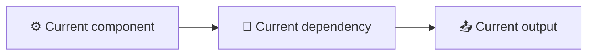
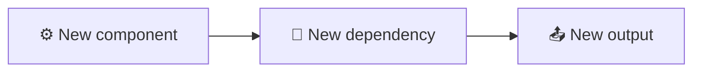

<!-- Source: https://github.com/SuperiorByteWorks-LLC/agent-project | License: Apache-2.0 | Author: Clayton Young / Superior Byte Works, LLC (Boreal Bytes) -->

# 决策记录 (ADR/RFC) 模板

> **返回 [Markdown 风格指南](../markdown_style_guide.md)** — 请先阅读风格指南了解格式、引用和表情符号规则。

**适用场景：** 架构决策记录 (ADRs)、征求意见稿 (RFCs)、技术设计文档，或任何需要记录决策背景、备选方案和理由的决策。旨在让未来团队不仅理解决策内容，更理解决策原因——并能评估该决策是否仍然适用。

**核心特点：** 结构化方案对比（明确权衡点）、决策矩阵、包含收益与风险的后果分析，以及决策生命周期的状态跟踪。

**理念：** 决策比代码更快腐化。六个月后总会有人问"当初为什么这样做？" 如果答案是"没人记得"，那决策就等同于随机选择。本模板让决策逻辑永久化、可检索、可评估，同时强制作者真正思考备选方案——如果无法清晰说明为何否决方案B，说明分析尚未到位。

---

## 使用指南

1. 复制本文件至项目 `docs/decisions/` 或 `adr/` 目录
2. 按序号命名：`001-用PostgreSQL替代MongoDB.md`
3. 替换所有 `[方括号占位符]` 为实际内容
4. **客观呈现方案**——避免设置虚假靶标进行反驳
5. 添加 [Mermaid 图表](../mermaid_style_guide.md) 用于架构对比、数据流变更或迁移路径

---

## 模板内容

以下为模板正文，从此处开始复制：

---

# [ADR-NNN]: [决策标题——清晰具体]

| 字段               | 值                                                      |
| ------------------- | ---------------------------------------------------------- |
| **状态**          | [提案中 / 已采纳 / 已弃用 / 被 ADR-NNN 取代] |
| **日期**            | [YYYY-MM-DD]                                               |
| **决策者**       | [姓名或角色]                                           |
| **咨询对象**       | [提供意见的人员]                                  |
| **知会对象**        | [需要知晓结果的人员]                            |

---

## 📋 背景

### 决策触发点

[描述需要决策的情境。发生了什么变化？出现什么问题？有何新机会？需具体说明——包含触发决策的指标、事件或用户反馈。]

### 当前状态

[当前系统运作方式。现有架构、工具或流程。可配图表说明。]

### 约束条件

- **[约束1]:** [预算、时间、团队规模、合规要求等]
- **[约束2]:** [技术限制、向后兼容性、SLA等]
- **[约束3]:** [组织限制、供应商锁定、技能缺口等]

### 需求清单

本决策必须满足：

- [ ] [需求1——具体可衡量]
- [ ] [需求2]
- [ ] [需求3]

---

## 🔍 备选方案

### 方案A: [名称]

**描述:** [方案核心内容——2–3句话]

**优势:**

- [具体收益，可附证据]
- [其他收益]

**劣势:**

- [具体缺陷及影响评估]
- [其他缺陷]

**预估工作量:** [T恤尺码或天数/周数]
**预估成本:** [如适用——许可、基础设施、人力]

### 方案B: [名称]

**描述:** [方案核心内容]

**优势:**

- [收益]
- [收益]

**劣势:**

- [缺陷]
- [缺陷]

**预估工作量:** [估算值]
**预估成本:** [如适用]

### 方案C: [名称] _(如适用)_

**描述:** [方案核心内容]

**优势:**

- [收益]

**劣势:**

- [缺陷]

**预估工作量:** [估算值]

### 决策矩阵

| 评估标准                               | 权重         | 方案A            | 方案B | 方案C |
| --------------------------------------- | -------------- | ------------------- | -------- | -------- |
| [标准1——如性能]       | [高/中/低] | [评分或 ✅/⚠️/❌] | [评分]  | [评分]  |
| [标准2——如团队经验]    | [权重]       | [评分]             | [评分]  | [评分]  |
| [标准3——如迁移成本]  | [权重]       | [评分]             | [评分]  | [评分]  |
| [标准4——如长期成本]    | [权重]       | [评分]             | [评分]  | [评分]  |
| [标准5——如社区/支持] | [权重]       | [评分]             | [评分]  | [评分]  |

---

## 🎯 最终决策

**我们选择方案 [X]: [名称]。**

[2–3句解释核心逻辑。关键决定因素是什么？哪些标准权重最高及原因？]

### 为何否决其他方案？

- **否决方案 [Y] 原因:** [具体理由——避免"不够好"，应说明"迁移需3个迭代周期将延误Q2发布"]
- **否决方案 [Z] 原因:** [具体理由]

---

## ⚡ 后果分析

### 积极影响

- [收益1——改进点及预期影响]
- [收益2]

### 消极影响

- [代价1——损失项或新增难点]
- [代价2]

### 风险清单

| 风险     | 发生概率     | 影响程度         | 应对措施            |
| -------- | -------------- | -------------- | --------------------- |
| [风险1] | [低/中/高] | [低/中/高] | [处理方案] |
| [风险2] | [概率]   | [影响]       | [应对方案]          |

### 架构影响

---

## 📋 实施计划

| 步骤     | 负责人         | 目标日期 | 状态                             |
| -------- | ------------- | ----------- | ---------------------------------- |
| [步骤1] | [人员/团队] | [日期]      | [未开始 / 进行中 / 已完成] |
| [步骤2] | [人员/团队] | [日期]      | [状态]                           |
| [步骤3] | [人员/团队] | [日期]      | [状态]                           |

---

## 🔗 相关引用

- [关联 ADR 或 RFC](../adr/ADR-001-agent-optimized-documentation-system.md)
- [外部文档或基准测试](https://example.com)
- [相关议题或讨论](../../docs/project/issues/issue-00000001-agentic-documentation-system.md)

---

## 评审记录

| 日期   | 评审人 | 结果                                   |
| ------ | -------- | ----------------------------------------- |
| [日期] | [姓名]   | [提案 / 批准 / 要求修改] |

---

_最后更新: [日期]_
