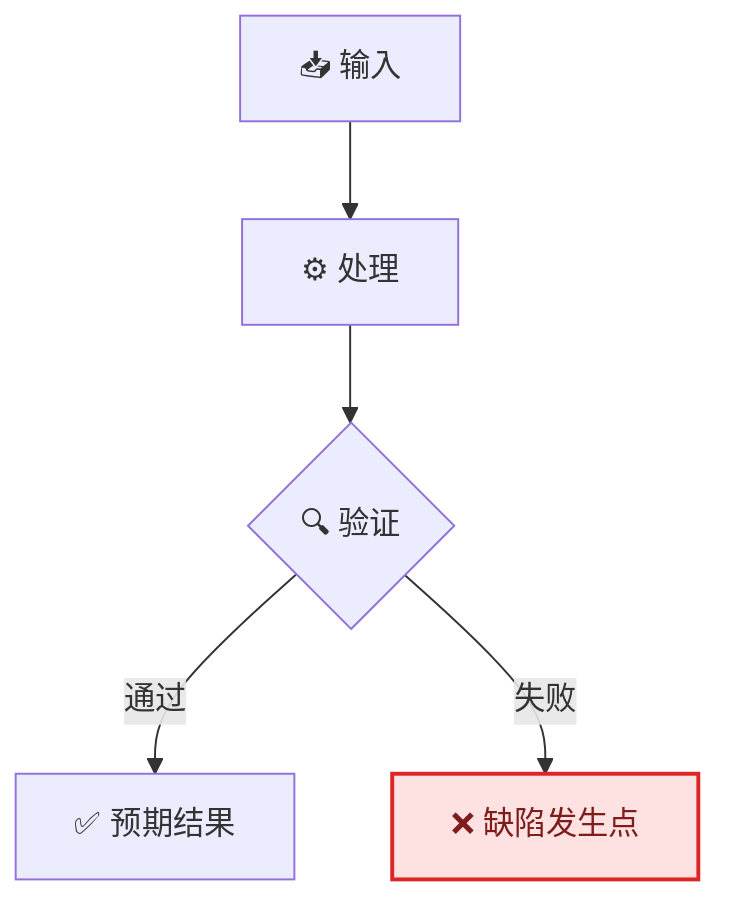
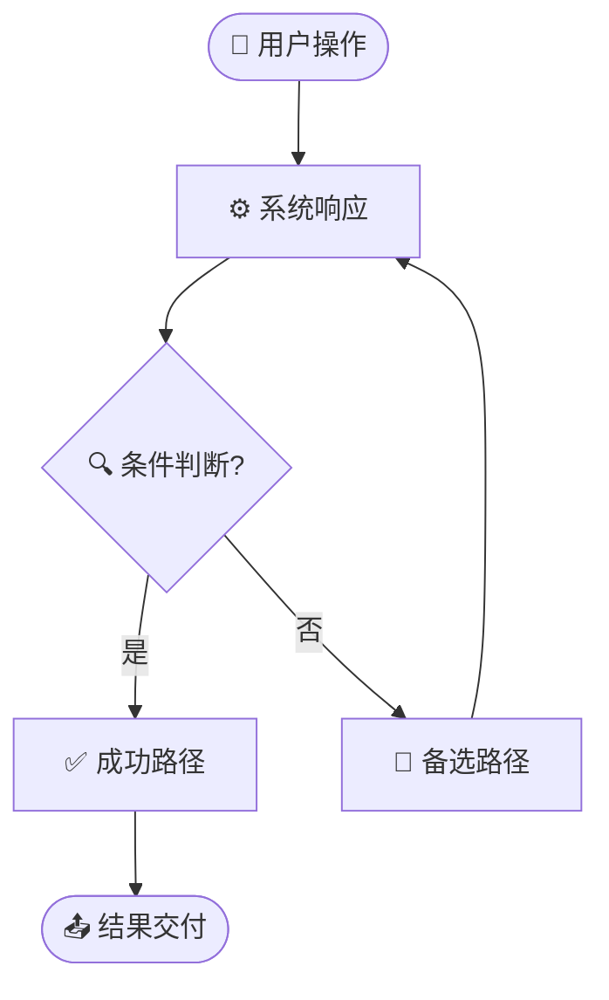

<!-- 来源：https://github.com/SuperiorByteWorks-LLC/agent-project | 许可证：Apache-2.0 | 作者：Clayton Young / Superior Byte Works, LLC (Boreal Bytes) -->

# 问题文档模板

> **返回 [Markdown 风格指南](../markdown_style_guide.md)** — 请先阅读风格指南了解格式、引用和表情符号规则。

**适用场景：** 用于记录缺陷、功能请求、改进提案、事故或任何可追踪的工作项作为持久化 Markdown 记录。此文件本身就是问题——包含从报告到调查、解决和经验教训的完整生命周期——采用可搜索、可移植且属于代码库的格式。

**核心特性：** 通过严重性/优先级分类、客户影响量化、预期与实际重现步骤、调查日志、根因解决方案、功能需求验收标准以及 SLA 跟踪。

**理念：** 此文件是问题的唯一事实来源——而非 GitHub Issues、Jira 或 Linear。这些平台仅是通知和评论层。完整生命周期（报告、调查、根因、修复和经验教训）都存储在此处，并提交至代码库。

问题报告是报告者与解决者之间的契约。模糊的问题得到模糊的修复。最优秀的问题文档应清晰到团队任何成员——或任何 AI 代理——都能接手、理解问题并立即开展工作而无需任何澄清。包含所有细节。假设阅读者毫无背景知识。

这体现了[万物皆代码](../markdown_style_guide.md#-everything-is-code)理念：任何代理或团队成员仅需文件访问权限即可查找、阅读和更新问题。无需 API、令牌或平台锁定。`grep docs/project/issues/` 永远优于 Jira 搜索。

---

## 文件规范

```
docs/project/issues/issue-00000456-fix-session-timeout-race.md
docs/project/issues/issue-00000457-add-csv-export-filtering.md
docs/project/issues/issue-00000458-improve-onboarding-copy.md
```

- **目录：** `docs/project/issues/`
- **命名：** `issue-` + 8位零填充编号 + `-` + 简短小写连字符描述
- **交叉引用：** 在元数据表中链接至实时问题跟踪器

---

## 模板变体

本模板包含两种变体——根据问题类型选用对应部分：

- **[缺陷报告模板](#bug-report-template)** — 功能异常、行为不符预期或系统崩溃
- **[功能请求模板](#feature-request-template)** — 需要实现的新功能

---

## 缺陷报告模板

---

# Issue-[编号]: [缺陷简述]

| 字段                 | 值                                                                                               |
| -------------------- | ------------------------------------------------------------------------------------------------ |
| **问题**             | `#编号` (若项目使用跟踪器请添加URL)                                                             |
| **类型**             | 🐛 缺陷                                                                                          |
| **严重性**           | 🟢 低 / 🟡 中 / 🔴 高 / 💀 严重                                                                 |
| **优先级**           | P0 / P1 / P2 / P3                                                                                |
| **报告人**           | [姓名]                                                                                           |
| **负责人**           | [姓名或未分配]                                                                                   |
| **报告日期**         | [YYYY-MM-DD]                                                                                     |
| **状态**             | [待处理 / 处理中 / 已解决 / 已关闭 / 不予修复]                                                   |
| **影响用户**         | [数量或群体——如"约2000名免费用户"/"所有API消费者"]                                               |
| **收入影响**         | [无 / 间接 / 直接——$N/天 或 N%交易量]                                                           |
| **解决于**           | [PR-#编号](../../docs/project/pr/pr-00000001-agentic-docs-and-monorepo-modernization.md) 或 N/A |
| **解决耗时**         | [N小时 / N天——从报告到修复部署]                                                                  |

---

## 📋 摘要

[一段话：问题现象、影响对象及严重程度。需具体——如"用户无法登录"而非"认证故障"]

### 客户影响

| 维度               | 评估                                                                 |
| ------------------ | -------------------------------------------------------------------- |
| **影响对象**       | [用户群体、账户类型、地区——需具体]                                   |
| **影响数量**       | [数量、百分比或预估——如"约500个企业账户"]                            |
| **业务影响**       | [收入损失、SLA违约、流失风险、声誉影响——尽可能量化]                  |
| **是否存在变通方案** | [是——简述方案 / 否]                                                  |

---

## 🔄 重现步骤

### 环境

| 详情               | 值                                              |
| ------------------ | ----------------------------------------------- |
| **版本/提交号**    | [应用版本、提交SHA或部署标签]                   |
| **环境**           | [生产环境 / 预发布环境 / 本地环境]              |
| **操作系统/浏览器** | [如 macOS 15.2, Chrome 122]                     |
| **账户类型**       | [管理员 / 标准用户 / 免费用户——若相关]          |

### 重现步骤

1. [精确步骤1——如"导航至 /settings/profile"]
2. [精确步骤2——如"点击'保存'按钮"]
3. [精确步骤3——如"观察错误"]

**重现率：** [100% / 偶现(~N%) / 仅一次]

### 预期行为

[执行上述步骤后应发生的正确行为]

### 实际行为

[实际发生的情况。包含具体错误信息、截图或日志输出]

```
[在此粘贴具体错误信息或日志]
```

截图占位：`docs/project/issues/images/issue-编号-screenshot.png`

### 变通方案

[若用户可临时规避此缺陷，请描述方法。若无则注明"无已知方案"。有助于支持团队在修复期间处理问题]

---

## 🔍 调查

### 根因

[缺陷的实际成因。调查阶段填写，非报告时]

[若涉及数据流或逻辑问题，可图示：]



### 调查日志

| 日期   | 调查人 | 发现内容           |
| ------ | ------ | ------------------ |
| [日期] | [姓名] | [发现的线索]       |
| [日期] | [姓名] | [后续发现]         |

<details>
<summary><strong>🔧 技术细节</strong></summary>

[堆栈跟踪、调试日志、数据库查询、配置差异——任何支持调查但过于冗长的内容]

</details>

---

## ✅ 解决方案

### 修复描述

[为修复所做的变更。链接至PR]

**修复于：** [PR-#编号](../../docs/project/pr/pr-00000001-agentic-docs-and-monorepo-modernization.md)

### 验证

- [ ] 在[环境]中验证修复
- [ ] 添加回归测试
- [ ] 未观察到副作用
- [ ] 报告人确认修复

### 经验总结

[应如何改进以避免同类缺陷？新增测试？加强验证？监控告警？流程调整？]

---

## 🔗 参考

- [关联问题](../../docs/project/issues/issue-00000001-agentic-documentation-system.md)
- [相关文档](https://example.com)
- [监控面板或告警](https://example.com)

---

_最后更新：[日期]_

---

---

## 功能请求模板

---

# Issue-[编号]: [功能标题——应实现的功能]

| 字段             | 值                                                                                               |
| ---------------- | ------------------------------------------------------------------------------------------------ |
| **问题**         | `#编号` (若项目使用跟踪器请添加URL)                                                             |
| **类型**         | ✨ 功能请求                                                                                      |
| **优先级**       | P0 / P1 / P2 / P3                                                                                |
| **需求方**       | [姓名或团队]                                                                                     |
| **负责人**       | [姓名或未分配]                                                                                   |
| **提出日期**     | [YYYY-MM-DD]                                                                                     |
| **状态**         | [提案中 / 已采纳 / 处理中 / 已发布 / 已拒绝]                                                    |
| **目标版本**     | [版本号、迭代或季度]                                                                             |
| **发布于**       | [PR-#编号](../../docs/project/pr/pr-00000001-agentic-docs-and-monorepo-modernization.md) 或 N/A |

---

## 📋 摘要

### 问题陈述

[此功能解决的用户痛点或业务需求？影响对象及频率？若有数据请包含]

### 提案方案

[功能的高层描述。聚焦于"做什么"和"为什么"，而非"如何做"——实现细节留给开发者]

### 用户故事

> 作为 **[角色]**，我需要 **[操作]**，以便 **[达成价值]**。

---

## 🎯 验收标准

功能完成需满足：

- [ ] [具体可测试标准——"用户可从仪表板导出CSV数据"]
- [ ] [另一标准——"导出包含全部筛选结果，非仅当前页"]
- [ ] [另一标准——"万行以下数据集导出在3秒内启动"]
- [ ] [非功能性——"支持移动端视口(375px+)"]
- [ ] [文档要求——"API端点写入项目文档"]

---

## 📐 设计

### 用户流程



### 原型/线框图

[若涉及界面，包含预期UI原型或截图。若非可视化，详细描述预期行为]

### 技术考量

- **[考量点1]:** [对现有架构、数据模型或API的影响]
- **[考量点2]:** [性能、扩展性或安全影响]
- **[考量点3]:** [对其他功能、服务或团队的依赖]

<details>
<summary><strong>📋 实现说明</strong></summary>

[给开发者的深度技术背景——建议方案、相关代码路径、数据库变更、API契约、迁移策略。节省开发者探索时间]

</details>

---

## 📊 影响

| 维度           | 评估                                      |
| -------------- | ----------------------------------------- |
| **影响用户**   | [用户数量/群体]                           |
| **收入影响**   | [直接/间接/无]                            |
| **工作量预估** | [T恤尺码: S / M / L / XL]                 |
| **依赖项**     | [所需其他功能、团队或服务]                |

### 成功指标

[功能发布后如何衡量成功？需具体可量化]

- **[指标1]:** [当前基线] → [目标值] 于 [时间段] 内
- **[指标2]:** [当前基线] → [目标值] 于 [时间段] 内

---

## 🔗 参考

- [用户反馈或支持工单](https://example.com)
- [竞品分析](https://example.com)
- [关联功能请求](../../docs/project/issues/issue-00000001-agentic-documentation-system.md)
- [设计文档或ADR](../adr/ADR-001-agent-optimized-documentation-system.md)

---

_最后更新：[日期]_
