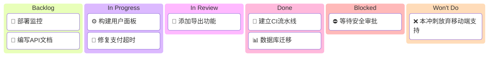

<!-- Source: https://github.com/SuperiorByteWorks-LLC/agent-project | License: Apache-2.0 | Author: Clayton Young / Superior Byte Works, LLC (Boreal Bytes) -->

# 看板板文档模板

> **返回 [Markdown 风格指南](../markdown_style_guide.md)** — 请先阅读风格指南了解格式、引用和表情符号规则。

**适用场景：** 跟踪工作项、冲刺看板、项目任务管理、发布计划，或任何需要基于 Markdown 的持久化工作状态视图的场景。此看板板即跟踪系统——它是随代码库演化的仓库文件。

**核心功能：** 可视化 Mermaid 看板图、带状态跟踪的工作项表格、在制品限制、阻塞项、明确"不做"决策、老化指标、流动效率指标和历史吞吐量。

**理念：** 此看板即文件。在分支中修改，随 PR 合并。看板与代码库共同演进——无需外部看板工具。任何仓库访问者（包括 AI 代理）均可查看。

看板板的职责是可视化工作流。此模板实现两个目标：(1) 随工作进展更新的动态看板，(2) 归档后的历史快照。Mermaid 图提供即时概览；表格提供细节。共同回答：当前工作？阻塞项？已完成项？后续计划？

归档后，看板成为工作历史记录——包含处理项、阻塞项和完成项，全部在 git 历史中可追溯，含完整归属和时间戳。体现[万物皆代码](../markdown_style_guide.md#-everything-is-code)理念：项目管理数据存于仓库，可版本化迁移。

---

## 文件规范

```
docs/project/kanban/sprint-2026-w07-agentic-template-modernization.md
docs/project/kanban/release-v2.3.0-launch-readiness.md
docs/project/kanban/project-auth-migration-phase-1.md
```

- **目录：** `docs/project/kanban/`
- **命名：** 前缀 + 标识符 + 小写短描述（连字符分隔）：`sprint-`、`release-`、`project-`
- **归档：** 看板完成后保留原处——成为历史记录

---

## 模板

以下为模板内容，从此处开始复制：

---

# [看板名称] — 看板板

_[范围：2026年第7周冲刺 / v2.3.0版本发布 / 项目：认证迁移]_
_[团队/负责人] · 最后更新：[YYYY-MM-DD HH:MM]_

---

## 📋 看板概览

**周期：** [开始日期] → [结束日期]
**目标：** [一句话描述"完成"标准]
**在制品限制：** [进行中"列最大项数——如每人3项，总计6项]

### 可视化看板

_展示待办、进行中、评审、完成、阻塞和"不做"列当前工作分布的看板：_



> ⚠️ 始终显示全部6列——即使某列为空也需占位符。这使看板结构明确，避免遗漏类别。空列使用占位符如[暂无事项]。

---

## 🚦 看板状态

| 列名               | 数量 | 在制品限制 | 状态                                         |
| ------------------ | ---- | ---------- | -------------------------------------------- |
| 📋 **待办**        | [N]  | —          | [备注]                                       |
| 🔄 **进行中**      | [N]  | [限制数]   | [🟢 未达限 / 🟡 达限 / 🔴 超限]              |
| 🔍 **评审中**      | [N]  | [限制数]   | [状态]                                       |
| ✅ **已完成**      | [N]  | —          | [本周期]                                     |
| 🚫 **阻塞**        | [N]  | —          | [见下方阻塞项]                               |
| 🚫 **不做**        | [N]  | —          | [附明确理由的主动弃项]                       |

> ⚠️ **始终包含全部6列**——每列代表工作流状态。即使数量为0也需显示，防止类别遗漏。

---

## 📋 待办项

_自上而下优先级排序。顶部项为待处理项。空时至少保留一个占位项。_

| #   | 工作项            | 优先级    | 预估   | 负责人 | 备注                   |
| --- | ----------------- | --------- | ------ | ------ | ---------------------- |
| 1   | [工作项标题]      | 🔴 高     | [S/M/L]| [人员] | [背景或依赖]           |
| 2   | [工作项标题]      | 🟡 中     | [规模] | [人员] | [备注]                 |
|     | _[暂无事项]_      |           |        |        |                        |

---

## 🔄 进行中

_当前处理项。空时至少保留一个占位项。_

| 工作项      | 负责人 | 开始日期 | 预期完成 | 停留天数 | 老化   | 状态             |
| ----------- | ------ | -------- | -------- | -------- | ------ | ---------------- |
| [工作项]    | [人员] | [日期]   | [日期]   | [N]      | 🟢     | 🟢 按计划        |
|             |        |          |          |          |        | _[暂无事项]_     |

> 💡 **老化指标：** 🟢 未超期 · 🟡 临界期 · 🔴 已超期——红色项需关注或调整范围。

> ⚠️ **在制品限制：** [N] / [限制数]。[未达限 / 达限——可拉取新工作 / 超限——先完成再新增]

---

## 🔍 评审中

_待评审或评审中项。空时至少保留一个占位项。_

| 工作项      | 作者   | 评审人 | PR                                                                                   | 评审天数 | 老化   | 状态                                       |
| ----------- | ------ | ------ | ------------------------------------------------------------------------------------ | -------- | ------ | ------------------------------------------ |
| [工作项]    | [人员] | [人员] | [#NNN](../../docs/project/pr/pr-00000001-agentic-docs-and-monorepo-modernization.md) | [N]      | 🟢     | [待评审 / 需修改 / 已批准]                 |
|             |        |        |                                                                                      |          |        | _[暂无事项]_                               |

---

## ✅ 已完成

_本周期完成项。空时至少保留一个占位项。_

| 工作项      | 负责人 | 完成日期 | 周期时间 | PR                                                                                   |
| ----------- | ------ | -------- | -------- | ------------------------------------------------------------------------------------ |
| [工作项]    | [人员] | [日期]   | [N 天]   | [#NNN](../../docs/project/pr/pr-00000001-agentic-docs-and-monorepo-modernization.md) |
|             |        |          |          | _[本周期无完成项]_                                                                   |

---

## 🚫 阻塞项

_无法推进项。必须保留占位符——阻塞项为高价值信号，绝不可隐藏。_

| 工作项      | 负责人 | 阻塞日期 | 阻塞原因                                          | 升级对象   | 解阻措施         |
| ----------- | ------ | -------- | ------------------------------------------------- | ---------- | ---------------- |
| [工作项]    | [人员] | [日期]   | [阻塞原因——依赖项、待决策、外部团队]              | [人员/团队]| [需采取的行动]   |
|             |        |          |                                                   |            | _[无阻塞项]_     |

> 🔴 **[N] 项阻塞。** [解阻需求摘要]

---

## 🚫 不做项

_本周期明确排除项。记录决策依据确保透明可审计。空时保留占位符。_

| 工作项      | 决策日期 | 决策人     | 依据                                          | 重议触发条件                |
| ----------- | -------- | ---------- | --------------------------------------------- | --------------------------- |
| [工作项]    | [日期]   | [人员/团队]| [当前排除的明确理由]                          | [导致重议的条件变化]        |
|             |          |            | _[无明确弃项]_                                |                             |

---

## 📊 指标

### 本周期

| 指标                             | 值       | 目标值   | 趋势     |
| -------------------------------- | -------- | -------- | -------- |
| **吞吐量** (完成项数)            | [N]      | [目标]   | [↑/→/↓]  |
| **平均周期时间** (开始→完成)     | [N 天]   | [目标]   | [↑/→/↓]  |
| **平均交付时间** (创建→完成)     | [N 天]   | [目标]   | [↑/→/↓]  |
| **平均评审时间**                 | [N 天]   | [目标]   | [↑/→/↓]  |
| **流动效率**                     | [N%]     | [目标]   | [↑/→/↓]  |
| **阻塞项数**                     | [N]      | 0        | [↑/→/↓]  |
| **在制品超限次数**               | [N]      | 0        | [↑/→/↓]  |
| **红色老化项数**                 | [N]      | 0        | [↑/→/↓]  |

> 💡 **流动效率** = 有效工作时间 ÷ 总周期时间 × 100。健康团队目标40%+。低于15%表明工作项多数时间处于等待状态。

<details>
<summary><strong>📊 历史吞吐量</strong></summary>

| 周期                | 完成项数 | 平均周期时间 | 阻塞天数 |
| ------------------- | -------- | ------------ | -------- |
| [前第3周期]         | [N]      | [N 天]       | [N]      |
| [前第2周期]         | [N]      | [N 天]       | [N]      |
| [前第1周期]         | [N]      | [N 天]       | [N]      |
| **当前**            | [N]      | [N 天]       | [N]      |

</details>

---

## 📝 看板备注

### 本周期决策

- **[日期]：** [决策及背景——如"为集中处理支付BUG推迟认证重构"]
- **[日期]：** [新增/更新"不做"项，含明确依据和重议条件]

### 上周期遗留项

- [遗留项] —— [未完成原因及现状]

### 即将依赖项

- [日期]：[影响本看板的外部依赖、发布或事件]

---

## 🔗 参考链接

- [实时项目看板](../../docs/project/kanban/sprint-2026-w08-crewai-review-hardening-and-memory.md) —— 动态跟踪
- [历史看板](../../docs/project/kanban/sprint-2026-w07-agentic-template-modernization.md) —— 上周期快照
- [状态报告](../../docs/project/pr/pr-00000001-agentic-docs-and-monorepo-modernization.md) —— 本周期执行摘要

---

_下次更新：[日期] · 看板负责人：[人员/团队]_
