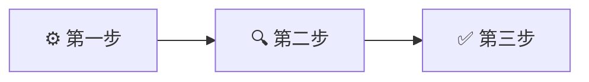

<!-- 来源：https://github.com/SuperiorByteWorks-LLC/agent-project | 许可协议：Apache-2.0 | 作者：Clayton Young / Superior Byte Works, LLC (Boreal Bytes) -->

# 演示文稿/简报模板

> **返回 [Markdown 风格指南](../markdown_style_guide.md)** — 请先阅读风格指南了解格式、引用和表情符号规则

**适用场景：** 幻灯片式文档、研究报告、简报、讲座、操作演示等传统上使用 PowerPoint 的场景。设计为既适合独立阅读，也可作为演讲者备稿。

**核心功能：** 每章节可折叠的演讲者备注，从背景到内容再到行动项的结构化流程，图表标题和脚注引用。

---

## 使用说明

1. 复制本文件到您的项目
2. 替换所有 `[方括号占位符]` 为实际内容
3. 删除不适用的章节（但保留核心流程）
4. 按需增删内容主题（📚 内容部分的 H3 标题）
5. 所有格式遵循 [Markdown 风格指南](../markdown_style_guide.md)
6. 在需要视觉辅助的概念处添加 [Mermaid 图表](../mermaid_style_guide.md)

---

## 模板结构

演示文稿遵循 6 部分流程。每部分包含带表情符号的 H2 标题、内容及可选折叠式演讲者备注。

```
1. 🏠 会务事项 — 后勤安排、背景说明、通知公告
2. 📍 议程安排 — 涵盖内容及时间预估
3. 🎯 目标设定 — 听众将获得的收获
4. 📚 主体内容 — 核心部分（多个 H3 主题）
5. ✍️ 行动项 — 后续步骤与责任人
6. 🔗 参考资料 — 引用文献、资源、延伸阅读
```

---

## 模板正文

以下为完整模板内容，请从此处开始复制：

---

# [演示文稿标题]

_[背景说明 — 项目、团队、日期或目的]_

---

## 🏠 会务事项

- [后勤事项或通知]
- [重要截止期限或提醒]
- [听众需知的背景信息]

<details>
<summary><strong>💬 演讲者备注</strong></summary>

- **时间控制：** 本节 2-3 分钟
- **语气语调：** 轻松对话式，引导听众进入状态
- [关于通知背景的具体说明]
- [过渡句示例]："以上事项确认后，我们来看今天的安排..."

</details>

---

## 📍 议程安排

- [x] 会务事项 (3 分钟)
- [ ] [主题 1 名称] (10 分钟)
- [ ] [主题 2 名称] (15 分钟)
- [ ] [主题 3 名称] (15 分钟)
- [ ] 行动项与问答环节 (10 分钟)

**总计：** [预估时间]

<details>
<summary><strong>💬 演讲者备注</strong></summary>

- 主题切换时参考此议程
- 若某主题超时，注明压缩内容
- "我们将在中途设置自然休息点"
- 根据听众参与度调整节奏 — 提问环节很重要

</details>

---

## 🎯 目标设定

完成本次演示后，您将能够：

- **[行动动词]** [具体可衡量的成果]
- **[行动动词]** [具体可衡量的成果]
- **[行动动词]** [具体可衡量的成果]

<details>
<summary><strong>💬 演讲者备注</strong></summary>

- 全程呼应这些目标
- "这部分关联我们的第一个目标..."
- 结束时回顾："检查是否达成全部三个目标？"
- **强效行动动词：** 识别、分析、比较、评估、设计、实施、解释、区分、创建、应用

</details>

---

## 📚 主体内容

### [主题 1 标题]

[开场背景 — 重要性及解决的问题]

**核心要点：**

- [要点 1 及简要说明]
- [要点 2 及简要说明]
- [要点 3 及简要说明]

图片占位：`images/slide-[文件名].png`
_图 1：[图片说明]_

> 💡 **关键洞见：** [听众需记住的一句话总结]

<details>
<summary><strong>💬 演讲者备注</strong></summary>

### 教学策略

- **开场提问：** "[引发思考的问题]？"
- 收集 2-3 个回答
- "很好，实际运作原理是..."

### 核心讲解 (3-5 分钟)

- 从定义/概念切入
- 逐步拆解说明
- 现实案例："[具体场景]"

### 常见误区

- **常见误解：** [错误观点]
- **实际情况：** [正确事实]
- **应对方法：** [纠正思路]

### 过渡引导

- "理解[概念]后，我们来看其应用场景..."

</details>

---

### [主题 2 标题]

[背景与解析]

**方案对比：**

| 方案       | 适用场景     | 权衡取舍     |
| ---------- | ------------ | ------------ |
| [选项 A]   | [场景]       | [优/缺点]    |
| [选项 B]   | [场景]       | [优/缺点]    |
| [选项 C]   | [场景]       | [优/缺点]    |



[图表解析及其重要性说明]

<details>
<summary><strong>💬 演讲者备注</strong></summary>

### 逐项解析 (5-6 分钟)

**选项 A：**

- "适用于[场景]"
- "优势：[收益]"
- "劣势：[弊端]"

**选项 B：**

- "适用于[场景]"
- "优势：[收益]"
- "劣势：[弊端]"

### 决策演练

- 提问："在[场景]下您会如何选择？"
- 讨论选择依据
- "实践中专业人士基于[标准]决策"

### 真实案例

- "[公司/项目]因[原因]选择选项 B"
- "最终取得[成果]"
- "这对我们的启示是[关联性]"[^1]

</details>

---

### [主题 3 标题]

[背景与解析]

**流程步骤：**

1. [第一步及说明]
2. [第二步及说明]
3. [第三步及说明]

> ⚠️ **常见陷阱：** [问题成因及规避方案]

[深度解析、案例或数据支撑]

<details>
<summary><strong>💬 演讲者备注</strong></summary>

### 互动环节

- 第二步暂停："接下来会发生什么？"
- 收集预测后揭示第三步
- "关键性在于[影响后果]"

### 进阶听众策略

- 跳过基础，切入："[高阶视角]"
- 挑战性问题："若[场景变化]该如何？"

### 初学听众策略

- 放慢节奏，重复类比
- "可理解为[简单比喻]"
- 预留问答环节深入探讨

### 时间管理

- 本节预计 [N] 分钟
- 若超时可压缩[具体部分]

</details>

---

## ✍️ 行动项

### 后续步骤

| 行动项                 | 责任人       | 截止日   |
| ---------------------- | ------------ | -------- |
| [具体行动]             | [人员/团队]  | [日期]   |
| [具体行动]             | [人员/团队]  | [日期]   |
| [具体行动]             | [人员/团队]  | [日期]   |

### 核心收获

1. **[收获 1]** — [一句话总结]
2. **[收获 2]** — [一句话总结]
3. **[收获 3]** — [一句话总结]

<details>
<summary><strong>💬 演讲者备注</strong></summary>

- 逐项说明行动项
- "责任人？截止时间？"
- "对任一项有疑问吗？"
- 回顾目标："是否达成全部目标？"
- "感谢参与，后续可通过[联系方式]与我沟通"

</details>

---

## 🔗 参考资料

### 引用文献

_演示文稿中所有脚注来源汇总：_

[^1]: [作者/机构]. ([年份]). "[标题]." _[出版物]_. <https://example.com>

### 延伸阅读

- [资源标题](https://example.com) — 推荐理由
- [资源标题](https://example.com) — 核心价值

### 工具索引

- [工具名称](https://example.com) — 功能说明及获取方式

<details>
<summary><strong>💬 演讲者备注</strong></summary>

- "资源详见共享文档"
- "建议从[特定资源]入手 — 最实用"
- "深入钻研推荐[特定资源] — 涵盖高阶主题"

</details>

---

_最后更新：[日期]_
