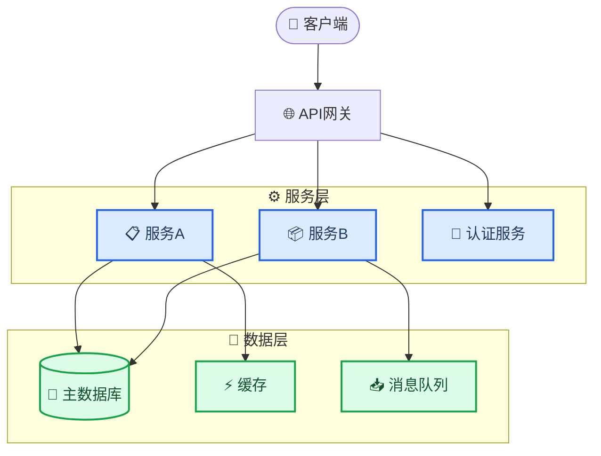
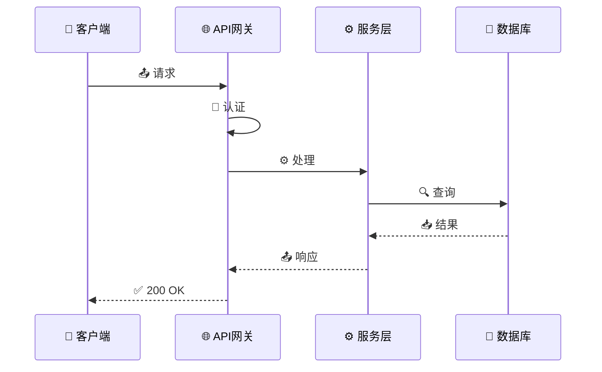

<!-- 来源：https://github.com/SuperiorByteWorks-LLC/agent-project | 许可证：Apache-2.0 | 作者：Clayton Young / Superior Byte Works, LLC (Boreal Bytes) -->

# 项目文档模板

> **返回 [Markdown 风格指南](../markdown_style_guide.md)** — 请先阅读风格指南了解格式、引用和表情符号规则。

**适用场景：** 软件项目、开源库、内部工具、API、平台或任何需要为用户和贡献者提供文档的产品。旨在让读者通过单篇文档实现从"这是什么？"到"我正在贡献"的跨越。

**核心特性：** 5分钟内快速上手指南、含Mermaid图解的架构概览、API参考结构、解决实际问题的故障排除章节以及贡献指南。

**理念：** 优秀的项目文档应消除阅读源码才能理解系统的需求。新成员应在数小时内而非数周内具备生产力。每个"这如何运作？"的问题都应在本文档中找到答案或一键直达。

---

## 使用说明

1. 复制本文件作为项目主文档 `README.md` 或 `docs/index.md`
2. 替换所有 `[方括号占位符]` 为实际内容
3. 删除不适用的章节（CLI工具可跳过API参考；库项目可跳过部署）
4. 添加 [Mermaid 图解](../mermaid_style_guide.md) —— 尤其用于架构、数据流和请求生命周期
5. 保持"快速开始"极致简洁 —— 若安装步骤超过5条命令，请简化

---

## 模板内容

以下为模板正文，从此处开始复制：

---

# [项目名称]

[一句话描述：项目功能及用户价值]

[一句话描述：核心差异化优势或价值主张]

[]() []()

---

## 📋 目录

- [快速开始](#-快速开始)
- [架构设计](#-架构设计)
- [配置说明](#-配置说明)
- [API参考](#-api参考)
- [部署指南](#-部署指南)
- [故障排除](#-故障排除)
- [贡献指南](#-贡献指南)
- [参考资料](#-参考资料)

---

## 🚀 快速开始

### 前置条件

| 需求项             | 版本要求     | 验证命令             |
| ------------------ | ----------- | --------------------- |
| [运行时/语言]     | ≥ [版本号]  | `[命令] --version`    |
| [数据库/服务]     | ≥ [版本号]  | `[命令] --version`    |
| [工具]            | ≥ [版本号]  | `[命令] --version`    |

### 安装与运行

```bash
# 克隆仓库
git clone https://github.com/[组织]/[仓库].git
cd [仓库]

# 安装依赖
[包管理器] install

# 配置环境
cp .env.example .env
# 编辑.env文件填入配置值

# 启动应用
[包管理器] run dev
```

**验证运行状态：**

```bash
curl http://localhost:[端口]/health
# 预期返回：{"status": "ok", "version": "[版本号]"}
```

> 💡 **首次安装问题？** 参见[故障排除](#-故障排除)解决常见问题

---

## 🏗️ 架构设计

### 系统概览

[2–3句话说明高层架构 —— 核心组件及其交互方式]



### 核心组件

| 组件          | 功能描述       | 技术栈         |
| ------------- | -------------- | -------------- |
| [组件1]       | [功能说明]     | [技术栈]       |
| [组件2]       | [功能说明]     | [技术栈]       |
| [组件3]       | [功能说明]     | [技术栈]       |

### 数据流

[描述典型请求的生命周期 —— 用户发起请求后的处理流程]



<details>
<summary><strong>📋 详细架构说明</strong></summary>

### 目录结构

```
[仓库]/
├── src/
│   ├── api/          # 路由处理器与中间件
│   ├── services/     # 业务逻辑
│   ├── models/       # 数据模型与结构
│   ├── config/       # 配置与环境变量
│   └── utils/        # 共享工具库
├── tests/
│   ├── unit/         # 单元测试
│   └── integration/  # 集成测试
├── docs/             # 补充文档
└── scripts/          # 构建、部署与维护脚本
```

### 设计决策

- **[决策1]:** [选择此方案的原因及替代方案对比。如有架构决策记录(ADR)请链接]
- **[决策2]:** [选择此方案的原因]

</details>

---

## ⚙️ 配置说明

### 环境变量

| 变量名           | 必填     | 默认值           | 描述                          |
| ---------------- | -------- | ---------------- | ----------------------------- |
| `DATABASE_URL`   | 是       | —                | PostgreSQL连接字符串          |
| `REDIS_URL`      | 否       | `localhost:6379` | Redis缓存连接                 |
| `LOG_LEVEL`      | 否       | `info`           | 日志级别：`debug`,`info`,`warn`,`error` |
| `PORT`           | 否       | `3000`           | HTTP服务端口                  |
| `[变量名]`       | [是/否]  | [默认值]         | [描述]                        |

### 配置文件

| 文件路径               | 用途                               |
| ---------------------- | ---------------------------------- |
| `.env`                 | 本地环境变量（禁止提交至仓库）     |
| `config/default.json`  | 全环境默认配置                     |
| `config/production.json` | 生产环境覆盖配置                 |

---

## 📡 API参考

### 认证机制

所有API请求需在`Authorization`头携带Bearer令牌：

```
Authorization: Bearer <令牌>
```

通过`POST /auth/login`获取令牌。令牌有效期：[时长]。

### 接口端点

#### `GET /api/[资源]`

**描述：** [接口功能说明]

**参数：**

| 参数      | 类型    | 必填     | 描述                      |
| --------- | ------- | -------- | ------------------------- |
| `limit`   | 整型    | 否       | 返回上限（默认20，最大100）|
| `offset`  | 整型    | 否       | 分页偏移量                |
| `[参数]`  | [类型]  | [是/否]  | [描述]                    |

**响应：**

```json
{
  "data": [
    {
      "id": "uuid",
      "name": "示例",
      "created_at": "2026-01-15T10:30:00Z"
    }
  ],
  "meta": {
    "total": 42,
    "limit": 20,
    "offset": 0
  }
}
```

**错误响应：**

| 状态码 | 含义         | 触发场景                     |
| ------ | ------------ | ---------------------------- |
| `401`  | 未授权       | 令牌缺失或无效               |
| `403`  | 禁止访问     | 权限不足                     |
| `404`  | 资源不存在   | 目标资源不存在               |
| `429`  | 请求限流     | 超过[N]次/分钟请求频率       |

<details>
<summary><strong>📡 扩展接口</strong></summary>

#### `POST /api/[资源]`

[请求体、参数、响应格式]

#### `PUT /api/[资源]/:id`

[请求体、参数、响应格式]

#### `DELETE /api/[资源]/:id`

[参数、响应格式]

</details>

---

## 🚀 部署指南

### 生产环境部署

```bash
# 构建
[包管理器] run build

# 执行数据库迁移
[包管理器] run migrate

# 启动生产服务
[包管理器] run start
```

### 环境要求

| 资源        | 生产环境   | 预发环境   |
| ----------- | ---------- | ---------- |
| CPU         | [规格]     | [规格]     |
| 内存        | [规格]     | [规格]     |
| 存储        | [规格]     | [规格]     |
| 数据库      | [规格]     | [规格]     |

### 健康检查

| 端点                 | 预期响应    | 用途                          |
| -------------------- | ----------- | ----------------------------- |
| `GET /health`        | `200 OK`    | 基础存活检查                  |
| `GET /health/ready`  | `200 OK`    | 完整就绪检查（DB/缓存/依赖项）|

<details>
<summary><strong>🔧 CI/CD流水线详情</strong></summary>

[描述部署流水线 —— 构建步骤、测试阶段、部署目标、回滚流程]

</details>

---

## 🔧 故障排除

### 常见问题

#### 启动时出现"Connection refused"

**原因：** 数据库未运行或连接字符串错误

**解决方案：**

1. 验证数据库运行状态：`[检查命令]`
2. 检查`.env`中的`DATABASE_URL`
3. 测试连接：`[测试命令]`

#### "[具体错误信息]"

**原因：** [错误触发条件]

**解决方案：**

1. [步骤1]
2. [步骤2]

#### 响应缓慢

**原因：** [常见原因 —— 索引缺失、缓存冷启动等]

**解决方案：**

1. 检查缓存连接：`[命令]`
2. 验证数据库索引：`[命令]`
3. 审查近期查询模式变更

### 获取帮助

- **缺陷报告：** [问题模板或流程链接]
- **技术咨询：** [讨论区/Slack频道/论坛链接]
- **安全问题：** [邮箱或私密披露流程]

---

## 🤝 贡献指南

### 开发环境配置

```bash
# Fork并克隆仓库
git clone https://github.com/[你的分支]/[仓库].git

# 安装开发依赖
[包管理器] install --dev

# 运行测试
[包管理器] test

# 执行代码检查
[包管理器] run lint
```

### 工作流程

1. 从`main`分支创建特性分支：`git checkout -b feature/你的特性`
2. 遵循代码规范进行修改（通过linter强制实施）
3. 为新功能编写测试用例
4. 运行完整测试套件：`[包管理器] test`
5. 提交包含清晰描述的Pull Request

### 代码标准

- [语言/框架风格指南或linter配置]
- [测试覆盖率要求]
- [PR审核流程]
- [新功能的文档要求]

---

## 🔗 参考资料

- [官方框架文档](https://example.com) — [适用版本及核心章节]
- [API规范](https://example.com) — [OpenAPI/Swagger链接]
- [架构决策记录](../adr/) — [关键决策背景]

---

_最后更新：[日期] · 维护者：[团队/负责人]_
