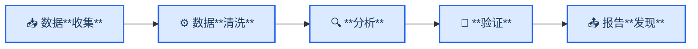
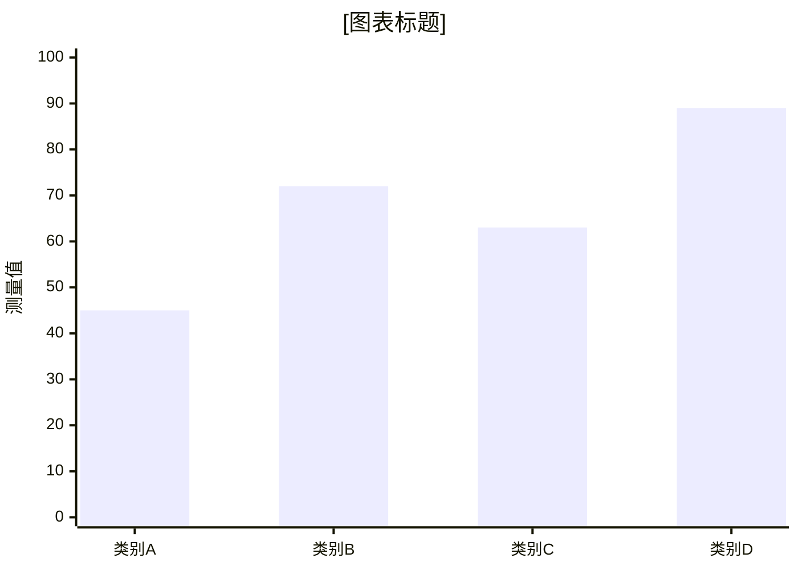

<!-- Source: https://github.com/SuperiorByteWorks-LLC/agent-project | License: Apache-2.0 | Author: Clayton Young / Superior Byte Works, LLC (Boreal Bytes) -->

# 研究论文/技术分析模板

> **返回 [Markdown 风格指南](../markdown_style_guide.md)** — 请先阅读风格指南了解格式、引用和表情符号规则

**适用场景：** 研究论文、技术分析、文献综述、数据驱动报告、竞品分析、市场调研或任何基于证据与方法论的文档。专为高频引用、结构化论证和可复现结论设计。

**核心特性：** 摘要快速评估、方法论增强可信度、数据/图表支撑的研究发现、全文档脚注引用、完整参考文献。

**核心理念：** 优秀的研究文档应让读者独立验证结论。展示推导过程。引用来源。呈现反方观点。读者信任你的发现是因为证据确凿——而非仅凭你的断言。

---

## 使用指南

1. 复制本文件至你的项目
2. 替换所有 `[方括号占位符]` 为实际内容
3. 调整章节——非每篇论文都需完整章节，但核心流程（摘要→引言→方法论→发现→结论）应保留
4. **严格引用**——每个论断、数据、外部方法参考均需添加 `[^N]` 脚注
5. 为流程/架构/数据流/对比添加 [Mermaid 图表](../mermaid_style_guide.md)

---

## 模板结构

```
1. 摘要 — 研究内容、核心发现、价值意义（150-300词）
2. 📋 引言 — 问题陈述、背景、范围、研究问题
3. 📚 背景 — 既有研究、文献综述、行业背景
4. 🔬 方法论 — 研究方法、数据来源、技术路线
5. 📊 发现 — 研究结论及证据图表
6. 💡 分析 — 发现的意义、影响、局限性
7. 🎯 结论 — 总结、建议、未来方向
8. 🔗 参考文献 — 完整引用来源及URL
```

---

## 模板正文

以下为完整模板内容：

---

# [论文标题：描述性且具体]

_[作者/团队] · [机构] · [日期]_

---

## 摘要

[150–300词结构化摘要：**背景**（1–2句问题领域）、**目标**（研究内容）、**方法**（研究过程）、**关键发现**（核心结果）、**意义**（价值与受众）]

**关键词：** [关键词1], [关键词2], [关键词3], [关键词4], [关键词5]

---

## 📋 引言

### 问题陈述

[存在什么问题？为何重要？影响哪些群体？需具体化——尽可能量化说明]

[问题范围，附引用][^1]

### 研究问题

本文探究：

1. **[RQ1]** — [具体可量化问题]
2. **[RQ2]** — [具体可量化问题]
3. **[RQ3]** — [具体可量化问题]

### 研究范围

- **研究范围：** [本文涵盖内容]
- **排除范围：** [本文排除内容及原因]
- **目标受众：** [研究成果的受益群体]

<details>
<summary><strong>💬 背景说明</strong></summary>

- 研究启动原因
- 组织背景或业务驱动
- 与前期工作的关联
- 影响研究范围的已知限制

</details>

---

## 📚 背景

### 行业背景

[领域现状。已知结论。主流方法。引用既有研究]

[前期研究关键发现][^2]。[相关研究发现][^3]

### 既有研究

| 研究/来源          | 核心发现         | 与本研究的关联     |
| ------------------ | ---------------- | ------------------ |
| [作者 (年份)][^4] | [研究发现]       | [关联说明]         |
| [作者 (年份)][^5] | [研究发现]       | [关联说明]         |
| [作者 (年份)][^6] | [研究发现]       | [关联说明]         |

### 知识缺口

[现有研究缺失什么？哪些问题尚未解答？本文旨在填补此缺口]

<details>
<summary><strong>📋 扩展文献综述</strong></summary>

[深度讨论相关研究、历史背景、方法演进及方法论对比。此部分增强可信度且避免干扰主线]

</details>

---

## 🔬 方法论

### 研究路径

[描述研究方法——定性/定量/混合/实验/观察/案例研究等]



### 数据来源

| 来源       | 类型                         | 规模/范围            | 收集周期       |
| ---------- | ---------------------------- | -------------------- | -------------- |
| [来源1]    | [问卷/API/数据库等]          | [N条记录/受访者]     | [日期范围]     |
| [来源2]    | [类型]                       | [规模]               | [日期范围]     |

### 工具与技术

- **[工具1]** — [用途及版本]
- **[工具2]** — [用途及版本]
- **[分析框架]** — [选用理由]

### 方法局限性

> ⚠️ **已知局限：** [明确说明可能影响结果有效性的因素——样本量、选择偏差、时间限制、数据质量问题。坦诚反而增强可信度]

<details>
<summary><strong>🔧 详细方法</strong></summary>

### 数据收集流程

[数据获取步骤说明]

### 清洗与预处理

[数据转换规则、剔除标准及原因]

### 统计方法

[具体检验方法、置信水平、使用软件]

### 可复现性

[他人复现研究的途径——数据获取、代码仓库、环境配置]

</details>

---

## 📊 发现

### 发现1：[描述性标题]

[清晰呈现结论，先结论后证据]

[支撑数据][^7]：

| 指标       | 前值    | 后值    | 变化率   |
| ---------- | ------- | ------- | -------- |
| [指标1]    | [数值]  | [数值]  | [+/- %]  |
| [指标2]    | [数值]  | [数值]  | [+/- %]  |

> 📌 **核心洞察：** [本发现的单句总结]

### 发现2：[描述性标题]

[呈现结论。若涉及关联/流程/对比需包含图表]



[数据解读及其意义说明]

### 发现3：[描述性标题]

[附证据呈现结论]

<details>
<summary><strong>📊 支撑数据表</strong></summary>

[详细数据表、原始数值、统计明细等支撑材料。展开阅读不影响行文流畅]

</details>

---

## 💡 分析

### 结论解读

[研究发现的意义？关联研究问题。阐释"价值点"]

- **RQ1：** [发现1如何解答研究问题1]
- **RQ2：** [发现2如何解答研究问题2]
- **RQ3：** [发现3如何解答研究问题3]

### 影响分析

**对[受众1]：**

- [对其影响及行动建议]

**对[受众2]：**

- [对其影响及行动建议]

### 与既有研究对比

[研究发现与背景章节文献的异同？是否验证/反驳/拓展了前期成果？]

### 局限性

[读者需注意哪些限制？哪些因素影响普适性？诚实说明反而增强可信度]

<details>
<summary><strong>💬 讨论要点</strong></summary>

- 数据的其他解读角度
- 观测到的边缘案例或异常值
- 可强化结论的数据补充方向
- 潜在混杂变量

</details>

---

## 🎯 结论

### 研究总结

[3–5句话。重述问题、归纳核心发现、提出首要建议。仅读此节即可理解全文价值]

### 行动建议

1. **[建议1]** — [具体可执行方案。执行内容/主体/预期效果]
2. **[建议2]** — [具体可执行方案]
3. **[建议3]** — [具体可执行方案]

### 未来方向

- [方向1] — [研究内容及价值]
- [方向2] — [研究内容及价值]

---

## 🔗 参考文献

_本文所有引用来源：_

[^1]: [作者/机构]. ([年份]). "[标题]." _[出版物]_. <https://example.com>

[^2]: [作者/机构]. ([年份]). "[标题]." _[出版物]_. <https://example.com>

[^3]: [作者/机构]. ([年份]). "[标题]." _[出版物]_. <https://example.com>

[^4]: [作者/机构]. ([年份]). "[标题]." _[出版物]_. <https://example.com>

[^5]: [作者/机构]. ([年份]). "[标题]." _[出版物]_. <https://example.com>

[^6]: [作者/机构]. ([年份]). "[标题]." _[出版物]_. <https://example.com>

[^7]: [作者/机构]. ([年份]). "[标题]." _[出版物]_. <https://example.com>

---

_最后更新：[日期]_
