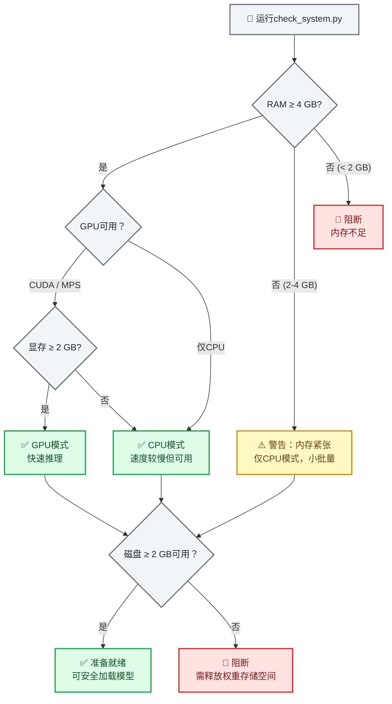
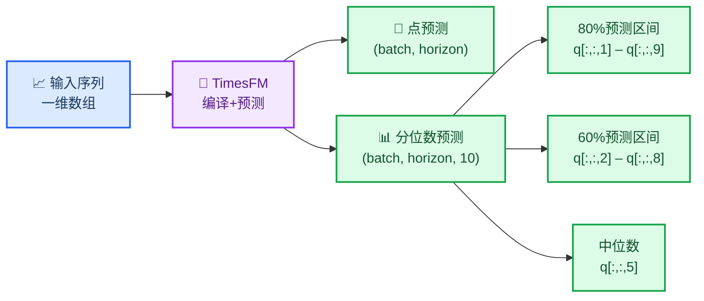
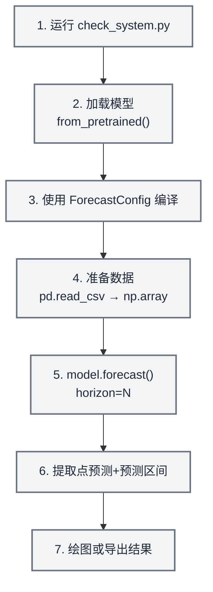
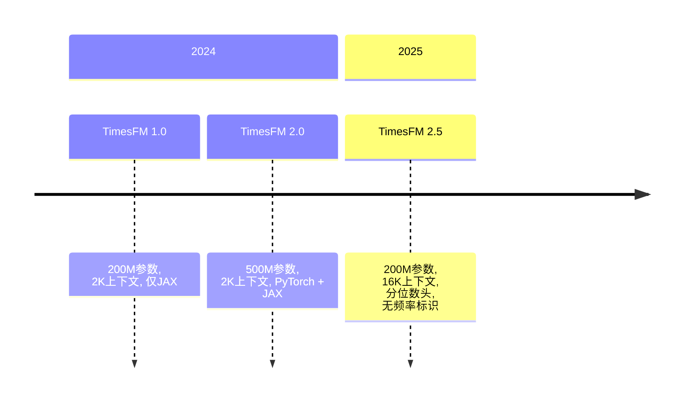

# TimesFM 时间序列预测

## 概述

TimesFM（时间序列基础模型）是谷歌研究院开发的预训练纯解码器基础模型，用于时间序列预测。它支持**零样本预测**——输入任意单变量时间序列即可返回点预测及校准的分位数预测区间，无需训练。

本技能封装TimesFM以实现安全、智能体友好的本地推理。包含**强制预检系统检查器**，在模型加载前验证RAM、GPU显存和磁盘空间，确保智能体不会导致用户机器崩溃。

> **关键数据**：TimesFM 2.5使用2亿参数（磁盘约800MB，CPU内存约1.5GB，GPU显存约1GB）。归档版v1/v2的5亿参数模型需约32GB内存。**务必先运行系统检查器**。

## 使用场景

在以下场景使用本技能：
- 预测**任意单变量时间序列**（销售、需求、传感器、生命体征、价格、天气）
- 需要**零样本预测**而无需训练定制模型
- 需要带校准预测区间（分位数）的**概率预测**
- 处理**任意长度**时间序列（模型支持1–16,384个上下文点）
- 需**批量预测**数百或数千条序列
- 希望采用**基础模型**而非手动调参ARIMA/ETS

**不要**在以下场景使用：
- 需要可解释系数的经典统计模型 → 使用`statsmodels`
- 需时间序列分类或聚类 → 使用`aeon`
- 需多元向量自回归或格兰杰因果检验 → 使用`statsmodels`
- 数据为表格型（非时序） → 使用`scikit-learn`

> **异常检测说明**：TimesFM无内置异常检测功能，但可通过**分位数预测区间**实现——超出90%置信区间（q10–q90）的值具有统计显著性异常。完整示例见`examples/anomaly-detection/`目录。

## ⚠️ 强制预检：系统要求检查

**关键步骤——首次加载模型前务必运行系统检查器。**

```bash
python scripts/check_system.py
```

该脚本检查：
1. **可用RAM**——低于4GB时警告，低于2GB时阻断
2. **GPU可用性**——检测CUDA/MPS设备及显存
3. **磁盘空间**——验证~800MB模型下载空间
4. **Python版本**——要求3.10+
5. **现有安装**——检查`timesfm`和`torch`是否安装

> **注意**：模型权重**不存储在此仓库**。TimesFM权重（~800MB）首次使用时从HuggingFace按需下载，缓存于`~/.cache/huggingface/`。预检器确保下载前资源充足。



### 各模型版本的硬件要求

| 模型 | 参数 | RAM (CPU) | 显存 (GPU) | 磁盘 | 上下文长度 |
| ----- | ---------- | --------- | ---------- | ---- | ------- |
| **TimesFM 2.5** (推荐) | 2亿 | ≥ 4 GB | ≥ 2 GB | ~800 MB | 最高16,384 |
| TimesFM 2.0 (归档) | 5亿 | ≥ 16 GB | ≥ 8 GB | ~2 GB | 最高2,048 |
| TimesFM 1.0 (归档) | 2亿 | ≥ 8 GB | ≥ 4 GB | ~800 MB | 最高2,048 |

> **建议**：除非有特殊需求，始终使用TimesFM 2.5。它更小、更快且支持8倍长上下文。

## 🔧 安装

### 步骤1：系统验证（始终优先执行）

```bash
python scripts/check_system.py
```

### 步骤2：安装TimesFM

```bash
# 使用uv（本仓库推荐）
uv pip install timesfm[torch]

# 或使用pip
pip install timesfm[torch]

# JAX/Flax后端（TPU/GPU更快）
uv pip install timesfm[flax]
```

### 步骤3：按硬件安装PyTorch

```bash
# CUDA 12.1 (NVIDIA GPU)
pip install torch>=2.0.0 --index-url https://download.pytorch.org/whl/cu121

# 仅CPU
pip install torch>=2.0.0 --index-url https://download.pytorch.org/whl/cpu

# Apple Silicon (MPS)
pip install torch>=2.0.0  # 内置MPS支持
```

### 步骤4：验证安装

```python
import timesfm
import numpy as np
print(f"TimesFM版本: {timesfm.__version__}")
print("安装成功")
```

## 🎯 快速开始

### 最小示例（5行代码）

```python
import torch, numpy as np, timesfm

torch.set_float32_matmul_precision("high")

model = timesfm.TimesFM_2p5_200M_torch.from_pretrained(
    "google/timesfm-2.5-200m-pytorch"
)
model.compile(timesfm.ForecastConfig(
    max_context=1024, max_horizon=256, normalize_inputs=True,
    use_continuous_quantile_head=True, force_flip_invariance=True,
    infer_is_positive=True, fix_quantile_crossing=True,
))

point, quantiles = model.forecast(horizon=24, inputs=[
    np.sin(np.linspace(0, 20, 200)),  # 任意一维数组
])
# point.shape == (1, 24)        — 中位数预测
# quantiles.shape == (1, 24, 10) — 10–90百分位区间
```

### 从CSV预测

```python
import pandas as pd, numpy as np

df = pd.read_csv("monthly_sales.csv", parse_dates=["date"], index_col="date")

# 每列转为数组列表
inputs = [df[col].dropna().values.astype(np.float32) for col in df.columns]

point, quantiles = model.forecast(horizon=12, inputs=inputs)

# 构建结果DataFrame
for i, col in enumerate(df.columns):
    last_date = df[col].dropna().index[-1]
    future_dates = pd.date_range(last_date, periods=13, freq="MS")[1:]
    forecast_df = pd.DataFrame({
        "date": future_dates,
        "forecast": point[i],
        "lower_80": quantiles[i, :, 2],  # 20百分位
        "upper_80": quantiles[i, :, 8],  # 80百分位
    })
    print(f"\n--- {col} ---")
    print(forecast_df.to_string(index=False))
```

### 协变量预测 (XReg)

TimesFM 2.5+通过`forecast_with_covariates()`支持外生变量，需安装`timesfm[xreg]`。

```python
# 需执行: uv pip install timesfm[xreg]
point, quantiles = model.forecast_with_covariates(
    inputs=inputs,
    dynamic_numerical_covariates={"price": price_arrays},
    dynamic_categorical_covariates={"holiday": holiday_arrays},
    static_categorical_covariates={"region": region_labels},
    xreg_mode="xreg + timesfm",  # 或 "timesfm + xreg"
)
```

| 协变量类型 | 描述 | 示例 |
| -------------- | ----------- | ------- |
| `dynamic_numerical` | 时变数值型 | 价格、温度、促销支出 |
| `dynamic_categorical` | 时变类别型 | 节假日标志、星期几 |
| `static_numerical` | 单序列数值型 | 店铺面积、账户年龄 |
| `static_categorical` | 单序列类别型 | 店铺类型、区域、产品类别 |

**XReg模式：**
- `"xreg + timesfm"` (默认)：TimesFM先预测，XReg调整残差
- `"timesfm + xreg"`：XReg先拟合，TimesFM预测残差

> 完整示例见`examples/covariates-forecasting/`中的合成零售数据案例。

### 异常检测（通过分位数区间）

TimesFM无内置异常检测，但**分位数预测天然提供可检测异常的预测区间**：

```python
point, q = model.forecast(horizon=H, inputs=[values])

# 90%预测区间
lower_90 = q[0, :, 1]  # 10百分位
upper_90 = q[0, :, 9]  # 90百分位

# 检测异常：超出90%置信区间的值
actual = test_values  # 预留测试数据
anomalies = (actual < lower_90) | (actual > upper_90)

# 严重等级
is_warning = (actual < q[0, :, 2]) | (actual > q[0, :, 8])  # 超出80%置信区间
is_critical = anomalies  # 超出90%置信区间
```

| 严重等级 | 条件 | 解释 |
| -------- | --------- | -------------- |
| **正常** | 80%置信区间内 | 预期行为 |
| **警告** | 超出80%置信区间 | 异常但可能发生 |
| **严重** | 超出90%置信区间 | 统计罕见（概率<10%） |

> 完整可视化示例见`examples/anomaly-detection/`。

```python
# 需执行: uv pip install timesfm[xreg]
point, quantiles = model.forecast_with_covariates(
    inputs=inputs,
    dynamic_numerical_covariates={"temperature": temp_arrays},
    dynamic_categorical_covariates={"day_of_week": dow_arrays},
    static_categorical_covariates={"region": region_labels},
    xreg_mode="xreg + timesfm",  # 或 "timesfm + xreg"
)
```

## 📊 理解输出

### 分位数预测结构

TimesFM返回`(点预测, 分位数预测)`：
- **`点预测`**：形状`(batch, horizon)`——中位数（0.5分位）
- **`分位数预测`**：形状`(batch, horizon, 10)`——十个分位切片：

| 索引 | 分位数 | 用途 |
| ----- | -------- | --- |
| 0 | 均值 | 平均预测值 |
| 1 | 0.1 | 80%预测区间下界 |
| 2 | 0.2 | 60%预测区间下界 |
| 3 | 0.3 | — |
| 4 | 0.4 | — |
| **5** | **0.5** | **中位数（同点预测）** |
| 6 | 0.6 | — |
| 7 | 0.7 | — |
| 8 | 0.8 | 60%预测区间上界 |
| 9 | 0.9 | 80%预测区间上界 |

### 提取预测区间

```python
point, q = model.forecast(horizon=H, inputs=data)

# 80%预测区间（最常用）
lower_80 = q[:, :, 1]  # 10百分位
upper_80 = q[:, :, 9]  # 90百分位

# 60%预测区间（更窄）
lower_60 = q[:, :, 2]  # 20百分位
upper_60 = q[:, :, 8]  # 80百分位

# 中位数（同点预测）
median = q[:, :, 5]
```



## 🔧 ForecastConfig参数参考

所有预测行为由`timesfm.ForecastConfig`控制：

```python
timesfm.ForecastConfig(
    max_context=1024,                    # 最大上下文窗口（截断较长序列）
    max_horizon=256,                     # 最大预测步长
    normalize_inputs=True,               # 标准化输入（推荐确保稳定性）
    per_core_batch_size=32,              # 单设备批大小（根据内存调整）
    use_continuous_quantile_head=True,   # 长步长分位数精度更优
    force_flip_invariance=True,          # 确保f(-x) = -f(x)（数学一致性）
    infer_is_positive=True,              # 当输入全>0时强制预测≥0
    fix_quantile_crossing=True,          # 确保q10 ≤ q20 ≤ ... ≤ q90
    return_backcast=False,               # 返回回测值（用于协变量工作流）
)
```

| 参数 | 默认值 | 调整场景 |
| --------- | ------- | -------------- |
| `max_context` | 0 | 设为最长历史窗口（如512/1024/4096） |
| `max_horizon` | 0 | 设为最大预测长度 |
| `normalize_inputs` | False | **始终设为True**——防止尺度依赖的不稳定性 |
| `per_core_batch_size` | 1 | 增大可提升吞吐量；内存不足时减小 |
| `use_continuous_quantile_head` | False | **设为True**获得校准预测区间 |
| `force_flip_invariance` | True | 性能分析显示有害前保持True |
| `infer_is_positive` | True | 序列可为负值时设为False（如温度、收益率）

| `fix_quantile_crossing` | False | **设为True**以保证分位数单调性 |

## 📋 常用工作流程

### 工作流程1：单序列预测



```python
import torch, numpy as np, pandas as pd, timesfm

# 1. 系统检查（运行一次）
# python scripts/check_system.py

# 2-3. 加载并编译
torch.set_float32_matmul_precision("high")
model = timesfm.TimesFM_2p5_200M_torch.from_pretrained(
    "google/timesfm-2.5-200m-pytorch"
)
model.compile(timesfm.ForecastConfig(
    max_context=512, max_horizon=52, normalize_inputs=True,
    use_continuous_quantile_head=True, fix_quantile_crossing=True,
))

# 4. 准备数据
df = pd.read_csv("weekly_demand.csv", parse_dates=["week"])
values = df["demand"].values.astype(np.float32)

# 5. 预测
point, quantiles = model.forecast(horizon=52, inputs=[values])

# 6. 提取预测区间
forecast_df = pd.DataFrame({
    "forecast": point[0],
    "lower_80": quantiles[0, :, 1],
    "upper_80": quantiles[0, :, 9],
})

# 7. 绘图
import matplotlib.pyplot as plt
fig, ax = plt.subplots(figsize=(12, 5))
ax.plot(values[-104:], label="历史数据")
x_fc = range(len(values[-104:]), len(values[-104:]) + 52)
ax.plot(x_fc, forecast_df["forecast"], label="预测值", color="tab:orange")
ax.fill_between(x_fc, forecast_df["lower_80"], forecast_df["upper_80"],
                alpha=0.2, color="tab:orange", label="80%预测区间")
ax.legend()
ax.set_title("52周需求预测")
plt.tight_layout()
plt.savefig("forecast.png", dpi=150)
print("已保存 forecast.png")
```

### 工作流程2：批量预测（多序列）

```python
import pandas as pd, numpy as np

# 加载宽格式CSV（每列一个序列）
df = pd.read_csv("all_stores.csv", parse_dates=["date"], index_col="date")
inputs = [df[col].dropna().values.astype(np.float32) for col in df.columns]

# 一次性预测所有序列（内部批处理）
point, quantiles = model.forecast(horizon=30, inputs=inputs)

# 收集结果
results = {}
for i, col in enumerate(df.columns):
    results[col] = {
        "forecast": point[i].tolist(),
        "lower_80": quantiles[i, :, 1].tolist(),
        "upper_80": quantiles[i, :, 9].tolist(),
    }

# 导出
import json
with open("batch_forecasts.json", "w") as f:
    json.dump(results, f, indent=2)
print(f"已预测 {len(results)} 个序列 → batch_forecasts.json")
```

### 工作流程3：评估预测准确率

```python
import numpy as np

# 保留最后H个点用于评估
H = 24
train = values[:-H]
actual = values[-H:]

point, quantiles = model.forecast(horizon=H, inputs=[train])
pred = point[0]

# 指标计算
mae = np.mean(np.abs(actual - pred))
rmse = np.sqrt(np.mean((actual - pred) ** 2))
mape = np.mean(np.abs((actual - pred) / actual)) * 100

# 预测区间覆盖率
lower = quantiles[0, :, 1]
upper = quantiles[0, :, 9]
coverage = np.mean((actual >= lower) & (actual <= upper)) * 100

print(f"MAE:  {mae:.2f}")
print(f"RMSE: {rmse:.2f}")
print(f"MAPE: {mape:.1f}%")
print(f"80%预测区间覆盖率: {coverage:.1f}% (目标值: 80%)")
```

## ⚙️ 性能调优

### GPU加速

```python
import torch

# 检查GPU可用性
if torch.cuda.is_available():
    print(f"GPU: {torch.cuda.get_device_name(0)}")
    print(f"显存: {torch.cuda.get_device_properties(0).total_mem / 1e9:.1f} GB")
elif hasattr(torch.backends, "mps") and torch.backends.mps.is_available():
    print("Apple Silicon MPS可用")
else:
    print("仅CPU - 推理速度较慢但仍可运行")

# 为Ampere+架构GPU设置（A100, RTX 3090等）
torch.set_float32_matmul_precision("high")
```

### 批处理大小调优

```python
# 从保守值开始，逐步增加直到内存溢出
# 8GB显存GPU: per_core_batch_size=64
# 16GB显存GPU: per_core_batch_size=128
# 24GB显存GPU: per_core_batch_size=256
# 8GB内存CPU: per_core_batch_size=8
# 16GB内存CPU: per_core_batch_size=32
# 32GB内存CPU: per_core_batch_size=64

model.compile(timesfm.ForecastConfig(
    max_context=1024,
    max_horizon=256,
    per_core_batch_size=32,  # <-- 调整此项
    normalize_inputs=True,
    use_continuous_quantile_head=True,
    fix_quantile_crossing=True,
))
```

### 内存受限环境

```python
import gc, torch

# 加载前强制垃圾回收
gc.collect()
if torch.cuda.is_available():
    torch.cuda.empty_cache()

# 加载模型
model = timesfm.TimesFM_2p5_200M_torch.from_pretrained(
    "google/timesfm-2.5-200m-pytorch"
)

# 在低内存机器上使用小批量
model.compile(timesfm.ForecastConfig(
    max_context=512,        # 必要时减小上下文长度
    max_horizon=128,        # 必要时减小预测范围
    per_core_batch_size=4,  # 小批量处理
    normalize_inputs=True,
    use_continuous_quantile_head=True,
    fix_quantile_crossing=True,
))

# 分块处理序列避免内存溢出
CHUNK = 50
all_results = []
for i in range(0, len(inputs), CHUNK):
    chunk = inputs[i:i+CHUNK]
    p, q = model.forecast(horizon=H, inputs=chunk)
    all_results.append((p, q))
    gc.collect()  # 块间清理
```

## 🔗 与其他工具集成

### 结合 `statsmodels`

使用 `statsmodels` 的经典模型（ARIMA, SARIMAX）作为**对比基准**：

```python
# TimesFM预测
tfm_point, tfm_q = model.forecast(horizon=H, inputs=[values])

# statsmodels ARIMA预测
from statsmodels.tsa.arima.model import ARIMA
arima = ARIMA(values, order=(1,1,1)).fit()
arima_forecast = arima.forecast(steps=H)

# 对比结果
print(f"TimesFM MAE: {np.mean(np.abs(actual - tfm_point[0])):.2f}")
print(f"ARIMA MAE:   {np.mean(np.abs(actual - arima_forecast)):.2f}")
```

### 结合 `matplotlib` / `scientific-visualization`

绘制具有预测区间的出版物级质量图表。

### 结合 `exploratory-data-analysis`

预测前对时间序列进行探索性数据分析，理解趋势、季节性和平稳性。

## 📚 可用脚本

### `scripts/check_system.py`

**强制预检工具。** 首次加载模型前运行。

```bash
python scripts/check_system.py
```

输出示例：
```
=== TimesFM系统需求检查 ===

[内存]      总量: 32.0 GB | 可用: 24.3 GB  ✅ 通过
[GPU]       NVIDIA RTX 4090 | 显存: 24.0 GB      ✅ 通过
[磁盘]      空闲: 142.5 GB                        ✅ 通过
[Python]    3.12.1                                 ✅ 通过
[timesfm]   已安装 (2.5.0)                      ✅ 通过
[torch]     已安装 (2.4.1+cu121)                ✅ 通过

结论: ✅ 系统已准备好运行TimesFM 2.5 (GPU模式)
推荐: per_core_batch_size=128
```

### `scripts/forecast_csv.py`

端到端CSV预测，带自动系统检查。

```bash
python scripts/forecast_csv.py input.csv \
    --horizon 24 \
    --date-col date \
    --value-cols sales,revenue \
    --output forecasts.csv
```

## 📖 参考文档

`references/`目录中的详细指南：

| 文件 | 内容 |
| ---- | -------- |
| `references/system_requirements.md` | 硬件层级、GPU/CPU选择、内存估算公式 |
| `references/api_reference.md` | 完整`ForecastConfig`文档、`from_pretrained`选项、输出形状 |
| `references/data_preparation.md` | 输入格式、NaN处理、CSV加载、协变量设置 |

## 常见陷阱

1. **未运行系统检查** → 低内存机器上模型加载崩溃。始终先运行`check_system.py`。
2. **忘记`model.compile()`** → `RuntimeError: Model is not compiled`。调用`forecast()`前必须执行`compile()`。
3. **未设置`normalize_inputs=True`** → 大数值序列的预测结果不稳定。
4. **在<32GB内存机器上使用v1/v2版本** → 改用TimesFM 2.5 (200M参数)。
5. **未设置`fix_quantile_crossing=True`** → 分位数可能非单调（q10 > q50）。
6. **小GPU上设置超大`per_core_batch_size`** → CUDA内存溢出。从小值开始逐步增加。
7. **传入二维数组** → TimesFM需要**一维数组列表**，而非二维矩阵。
8. **忘记`torch.set_float32_matmul_precision("high")`** → Ampere+架构GPU上推理速度降低。
9. **未处理输出中的NaN** → 极短序列的边缘情况。始终检查`np.isnan(point).any()`。
10. **对可能为负的序列使用`infer_is_positive=True`** → 预测值被限制在零以上。对温度、回报率等数据设为False。

## 模型版本



| 版本 | 参数 | 上下文 | 分位数头 | 频率标识 | 状态 |
| ------- | ------ | ------- | ------------- | -------------- | ------ |
| **2.5** | 200M | 16,384 | ✅ 连续型 (30M) | ❌ 已移除 | **最新** |
| 2.0 | 500M | 2,048 | ✅ 固定分桶 | ✅ 必需 | 已归档 |
| 1.0 | 200M | 2,048 | ✅ 固定分桶 | ✅ 必需 | 已归档 |

**Hugging Face模型库:**

- `google/timesfm-2.5-200m-pytorch` (推荐)
- `google/timesfm-2.5-200m-flax`
- `google/timesfm-2.0-500m-pytorch` (已归档)
- `google/timesfm-1.0-200m-pytorch` (已归档)

## 资源

- **论文**: [A Decoder-Only Foundation Model for Time-Series Forecasting](https://arxiv.org/abs/2310.10688) (ICML 2024)
- **代码仓库**: https://github.com/google-research/timesfm
- **Hugging Face**: https://huggingface.co/collections/google/timesfm-release-66e4be5fdb56e960c1e482a6
- **Google博客**: https://research.google/blog/a-decoder-only-foundation-model-for-time-series-forecasting/
- **BigQuery集成**: https://cloud.google.com/bigquery/docs/timesfm-model

## 示例

`examples/`目录包含三个完整可运行的参考示例。可作为API正确用法和预期输出形状的基准。

| 示例 | 目录 | 演示内容 | 适用场景 |
| ------- | --------- | -------------------- | -------------- |
| **全球温度预测** | `examples/global-temperature/` | 基础`model.forecast()`调用，CSV→PNG→GIF流程，36个月NOAA上下文 | 入门模板；任何单变量序列的复制基线 |
| **异常检测** | `examples/anomaly-detection/` | 两阶段检测：线性去趋势+上下文Z分数，预测分位数区间；双面板可视化 | 需要历史+预测数据异常检测的任务 |
|

- [ ] **`infer_is_positive`** -- 对于温度异常值、金融收益率或任何可能为负值的序列，请设置为 `False`。

## 常见错误

这些错误曾在该技能的示例中出现过。请引以为戒：

1. **分位数索引偏移错误** -- 最常见错误。`quant_fc[..., 0]` 表示**均值**而非 q0。q10 对应索引 1，q90 对应索引 9。始终使用命名常量：`IDX_Q10, IDX_Q20, IDX_Q80, IDX_Q90 = 1, 2, 8, 9`。

2. **推导式中的变量遮蔽** -- 若在循环内构建每序列协变量字典，切勿将循环变量用作推导变量。应在循环外累积到单独的 `dict[str, ndarray]` 中再赋值。
   ```python
   # 错误写法——外部 `store_id` 被遮蔽：
   covariates = {store_id: arr[store_id] for store_id in stores}  # 位于外部 store_id 循环内
   # 正确写法——使用不同变量名或预先累积：
   prices_by_store: dict[str, np.ndarray] = {}
   for store_id, config in stores.items():
       prices_by_store[store_id] = compute_price(config)
   ```

3. **错误的 CSV 列名** -- 全球温度 CSV 使用 `anomaly_c` 而非 `anomaly`。访问前务必执行 `print(df.columns)`。

4. **`sharex=True` 时出现 `tight_layout()` 警告** -- 无害；可通过 `plt.tight_layout(rect=[0, 0, 1, 0.97])` 消除或忽略。

5. **`forecast_with_covariates()` 需 TimesFM 2.5** -- TimesFM 1.0 无此方法。请安装 `pip install timesfm[xreg]` 并使用检查点 `google/timesfm-2.5-200m-pytorch`。

6. **未来协变量必须覆盖完整预测范围** -- 动态协变量（价格、促销、节假日）必须同时包含上下文和预测时域的值。不可仅传递上下文数组。

7. **异常阈值必须一次性定义** -- 将 `CRITICAL_Z = 3.0`、`WARNING_Z = 2.0` 定义为模块级常量。切勿在代码中硬写 `3` 或 `2`。

8. **上下文异常检测使用残差而非原始值** -- 始终先进行去趋势处理（`np.polyfit` 线性拟合或季节分解），再对残差进行 Z 值标准化。原始值的 Z 值在趋势数据上具有误导性。

## 验证与确认

将示例输出作为回归基线。若修改预测逻辑，请验证：

```bash
# 异常检测回归检查：
python -c "
import json
d = json.load(open('examples/anomaly-detection/output/anomaly_detection.json'))
ctx = d['context_summary']
assert ctx['critical'] >= 1, '2023年9月必须是CRITICAL'
assert any(r['date'] == '2023-09' and r['severity'] == 'CRITICAL'
           for r in d['context_detections']), '未找到2023年9月记录'
print('异常检测回归检查：通过')"

# 协变量回归检查：
python -c "
import pandas as pd
df = pd.read_csv('examples/covariates-forecasting/output/sales_with_covariates.csv')
assert len(df) == 108, f'预期108行，实际{len(df)}行'
prices = df.groupby('store_id')['price'].mean()
assert prices['store_A'] > prices['store_B'] > prices['store_C'], '店铺价格排序错误'
print('协变量回归检查：通过')"
```
